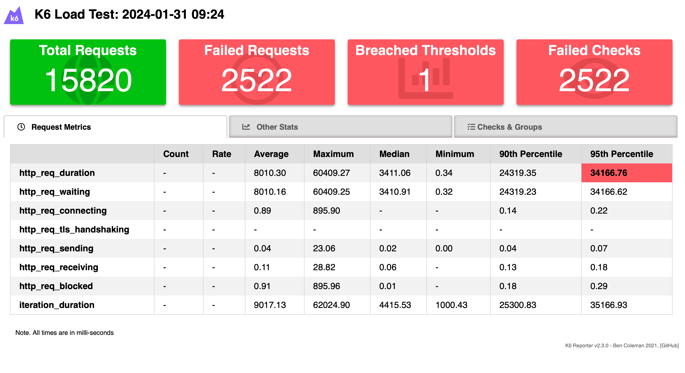
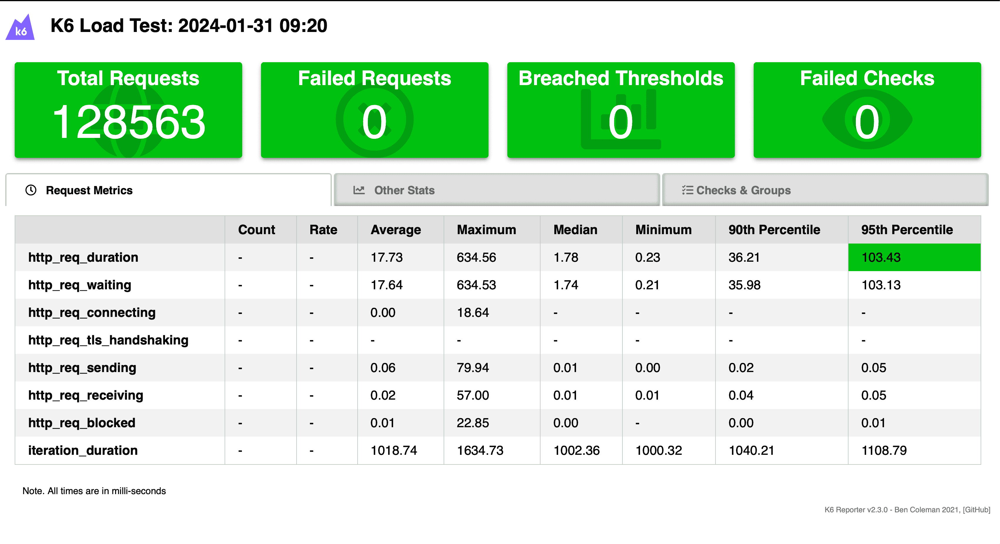



<!-- more -->

## DB Schema

### User Table

| Field | Type   | GORM Options                   | JSON Key | Description                                             |
|-------|--------|--------------------------------|----------|---------------------------------------------------------|
| ID    | string | `type:varchar(36);primary_key` | `id`     | The unique identifier for the user. (from line account) |
| Name  | string | `type:varchar(255);index`      | `name`   | The name of the user. (from line account)               |

### User-Event Table

| Field    | Type        | Description                                 |
|----------|-------------|---------------------------------------------|
| user_id  | varchar(36) | The ID of the user, linking to `User.ID`.   |
| event_id | varchar(36) | The ID of the event, linking to `Event.ID`. |

### Event Table

| Field          | Type       | GORM Options                   | JSON Key           | Redis Key          | Description                                                                                                         |
|----------------|------------|--------------------------------|--------------------|--------------------|---------------------------------------------------------------------------------------------------------------------|
| ID             | *string    | `type:varchar(36);primary_key` | `id`               | `id`               | The event ID defined at the frontend. If not provided, it is calculated by the hash of event detail and event time. |
| EventTimeStart | *time.Time | `type:timestamp`               | `event_time_start` | `event_time_start` | The start time of the event.                                                                                        |
| EventTimeEnd   | *time.Time | `type:timestamp`               | `event_time_end`   | `event_time_end`   | The end time of the event.                                                                                          |
| EventDetail    | *string    | `type:varchar(1024)`           | `event_detail`     | `event_detail`     | The details of the event, stored in JSON format. This is parsed when sending to the line message API.               |

### 心理測驗統計

* 結果種類儲存
* 統計趴數

| Field | Type   | GORM Options               | Description                         |
|-------|--------|----------------------------|-------------------------------------|
| Type  | string | `type:varchar(255);unique` | The unique type of the psycho test. |
| Count | int    | `type:int`                 | The count associated with the test. |

#### API

* Add type
* Retrieve statistic result

## Line

### Official Document

* [line messaging github](https://github.com/line/line-bot-sdk-go)

* [integrate line login](https://developers.line.biz/en/docs/line-login/integrate-line-login/)

### Tutorial

Line Login Integration Tutorial

* [[Golang][LINE][教學] 將你的 chatbot 透過 account link 連接你的服務](https://www.evanlin.com/line-accountlink/)

* [[Golang][LINE][教學] 導入 LINE Login 到你的商業網站之中，並且加入官方帳號為好友](https://www.evanlin.com/line-login/)

* [github](https://github.com/kkdai/line-login-go)

* [Official Document for Linking a LINE Official Account when Login](https://developers.line.biz/en/docs/line-login/link-a-bot/#link-a-line-official-account)

### Push Line `Flex Message`

* [bike-festival-2024-backend/pkg/worker/event.go at main · gdsc-ncku/bike-festival-2024-backend (github.com)](https://github.com/gdsc-ncku/bike-festival-2024-backend/blob/main/pkg/worker/event.go#L41-L64)
* [bike-festival-2024-backend/pkg/line_utils/flex.go at main · gdsc-ncku/bike-festival-2024-backend (github.com)](https://github.com/gdsc-ncku/bike-festival-2024-backend/blob/main/pkg/line_utils/flex.go#L10-L141)

## Asynq

* [hibiken/asynq: Simple, reliable, and efficient distributed task queue in Go (github.com)](https://github.com/hibiken/asynq)
* [hibiken/asynqmon: Web UI for Asynq task queue (github.com)](https://github.com/hibiken/asynqmon)

## Add Scheduled Task

* [bike-festival-2024-backend/pkg/service/notify.go at main · gdsc-ncku/bike-festival-2024-backend (github.com)](https://github.com/gdsc-ncku/bike-festival-2024-backend/blob/main/pkg/service/notify.go#L56-L77)

### Cancel Scheduled Task

* [asynq/inspector.go at master · hibiken/asynq (github.com)](https://github.com/hibiken/asynq/blob/master/inspector.go)
* [bike-festival-2024-backend/pkg/service/notify.go at main · gdsc-ncku/bike-festival-2024-backend (github.com)](https://github.com/gdsc-ncku/bike-festival-2024-backend/blob/main/pkg/service/notify.go#L43-L54)

## Optimization

### Get Event By EventID

#### DB only

(2000 virtual users, for 1 mins)



#### Redis Cache + DB

(2000 virtual users, for 1 mins)



```go
type EventCache struct {
    ID             string    `json:"id" redis:"id"`
    EventTimeStart time.Time `json:"event_time_start" redis:"event_time_start"`
    EventTimeEnd   time.Time `json:"event_time_end" redis:"event_time_end"`
    EventDetail    string    `json:"event_detail" redis:"event_detail"`
    CreatedAt      time.Time `json:"created_at" redis:"created_at"`
    UpdatedAt      time.Time `json:"updated_at" redis:"updated_at"`
}
```

## 部署

### Nginx Setup

 Nginx Reverse Proxy

> [!note]
>
> 要把 `ssl_certificate & ssl_certificate_key`   那邊的 domain 改成你自己的 （for Certbot)

```c
server {
    listen 443 ssl http2;
    listen [::]:443 ssl http2;

    server_name nckubikefestival.ncku.edu.tw;

    ssl_certificate /etc/letsencrypt/live/nckubikefestival.ncku.edu.tw/fullchain.pem; # managed by Certbot
    ssl_certificate_key /etc/letsencrypt/live/nckubikefestival.ncku.edu.tw/privkey.pem; # managed by Certbot
    ssl_ecdh_curve X25519:secp384r1;
    ssl_session_cache shared:SSL:50m;
    ssl_session_timeout 1440m;
    ssl_session_tickets off;
    ssl_protocols TLSv1.2 TLSv1.3;
    ssl_ciphers TLS13-AES-256-GCM-SHA384:TLS13-CHACHA20-POLY1305-SHA256:TLS13-AES-128-GCM-SHA256:TLS13-AES-128-CCM-8-SHA256:TLS13-AES-128-CCM-SHA256:EECDH+CHACHA20:EECDH+CHACHA20-draft:EECDH+ECDSA+AES128:EECDH+aRSA+AES128:RSA+AES128:EECDH+ECDSA+AES256:EECDH+aRSA+AES256:RSA+AES256:EECDH+ECDSA+3DES:EECDH+aRSA+3DES:RSA+3DES:!MD5;
    ssl_prefer_server_ciphers on;
    ssl_stapling on;
    ssl_stapling_verify on;
    ssl_trusted_certificate /etc/letsencrypt/live/nckubikefestival.ncku.edu.tw/chain.pem;
    add_header Strict-Transport-Security "max-age=31536000; preload";


    # Forward https://nckubikefestival.ncku.edu.tw/api/<path> to http://localhost:8000/<path>
    # For Golang Backend

    location /api/ {
        proxy_pass http://localhost:8000/;
        proxy_set_header Host $host;
        proxy_set_header X-Real-IP $remote_addr;
        proxy_set_header X-Forwarded-For $proxy_add_x_forwarded_for;
        proxy_set_header X-Forwarded-Proto $scheme;
    }

    # Forward https://nckubikefestival.ncku.edu.tw/* to http://localhost:5173/*
    # For Vue Frontend

    location / {
        proxy_pass http://localhost:5173/;
        proxy_set_header Host $host;
        proxy_set_header X-Real-IP $remote_addr;
        proxy_set_header X-Forwarded-For $proxy_add_x_forwarded_for;
        proxy_set_header X-Forwarded-Proto $scheme;
    }
}
```

#### CertBot

```shell
sudo apt  install certbot
sudo apt-get install python3-certbot-nginx

# 申請憑證
sudo certbot --nginx --email peterxcli@gmail.com --agree-tos -d nckubikefestival.ncku.edu.tw

# 安裝憑證 ( cert-name 要跟 nginx的 config 檔的 server_name 一樣)
sudo certbot install --cert-name nckubikefestival.ncku.edu.tw
```

## Bug

### Line login redirect

> [!warning]
> the bug is due to the `referer-policy`
> the default policy is `strict-origin-when-cross-origin`
>
> In my case, I use the additional redirect_path(which is set in query string ``) to compose the frontend redirect path:
> 
>
> It works fine when I am developing at my local computer, but in the production environment, it always redirect user to the page with duplicate path, like: `/bikefest/main-stagebikefest/main-stage/`
>
> Then I discover that in my local development environment, the request referer only contain the domain name(`localhost:5173`), but the production send its full path and query string to the backend server.
>
> And that the reason is: in dev env, the frontend is at `localhost:5173` and the backend is at `localhost:8000`, the trigger the default referer policy `strict-origin-when-cross-origin`  only send the `localhost:8000` as the referer value. In prod env, the frontend and backend have the same domain but only differ at the path, so the refer default policy send `origin`, `path`, `query` as the referer value, and frontend also send its `windows.location.path` as `redirected_path` query string, then backend compose the `referer`, `redirect_path`, and the result would be like `https://<domain>/windows.location.path/windows.location.path. And that is the main reason why the production appear the page with duplicate path.
>
> To resolve this problem, we only needs to set the referer policy in the nginx configuration, and let the referer only include `origin` to prevent the above issue:
>
> ```c
> server {
>   ...
>
>  # Set the Referrer-Policy header
>  add_header Referrer-Policy "origin";
> 
>   ...
> }
> ```
>
> * [【Chrome 85 更新】淺談 Referer-Policy 和更新影響 - Max行銷誌 (maxlist.xyz)](https://www.maxlist.xyz/2020/08/03/chrome-85-referer-policy/)
> * [Referrer-Policy - HTTP | MDN (mozilla.org)](https://developer.mozilla.org/en-US/docs/Web/HTTP/Headers/Referrer-Policy)

## Reference

* [Debian/Ubuntu 環境申請和套用 Let's Encrypt 免費​ SSL ​​憑證教學 | KJie Notes (kjnotes.com)](https://www.kjnotes.com/devtools/62)
