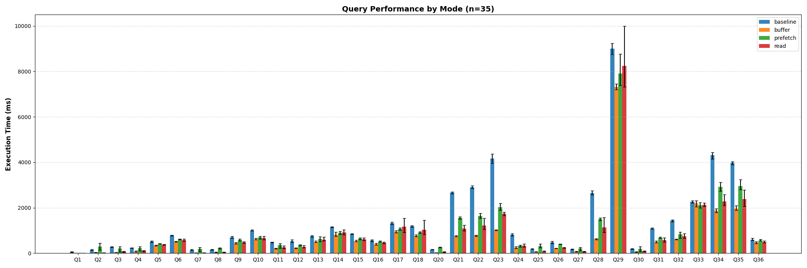



**TL;DR:** We built the `cache_prewarm` extension for DuckDB to eliminate cold-start query latency. It preloads table blocks into the buffer pool or OS page cache for local data, and integrates with [`duck-read-cache-fs`](https://github.com/dentiny/duck-read-cache-fs) to prewarm remote files from S3/HTTP.

## The Problem: The Cold Cache Penalty

When you restart a database or query a large dataset for the first time, DuckDB has to fetch data blocks from disk (or over the network) into its buffer pool. This results in unpredictable query latency and a frustrating "first-query penalty" that can bottleneck data pipelines and dashboards.

In traditional systems like PostgreSQL, DBAs use extensions like `pg_prewarm` to load table data into memory before serving traffic. We needed exactly this capability for DuckDB, not just for local analytical workloads, but also for data lakes querying remote object storage.

## The Solution: Explicit Cache Control

We built the DuckDB `cache_prewarm` extension to give developers explicit control over what data lives in memory. It supports local table prewarming and dedicated features for remote object storage.

### Local Prewarming Modes
We implemented three strategies to balance memory usage and IO performance:

#### 1. Buffer Mode (Default)
Loads blocks directly into DuckDB's internal buffer pool. The blocks stay pinned until evicted by normal buffer management.


flowchart TD
    subgraph DuckDB Process
        Query[Query Engine]
        BufferPool[Buffer Pool]
        Prewarm[cache_prewarm]
    end
    subgraph Operating System
        PageCache[OS Page Cache]
    end
    Disk[(Local Disk)]

    Prewarm -->|1. Request Blocks| Disk
    Disk -->|2. Read Data| PageCache
    PageCache -->|3. Load Data| BufferPool
    BufferPool -->|4. Pin Blocks| BufferPool
    Query -->|Fast Query| BufferPool


#### 2. Read Mode
Synchronously reads blocks from disk into temporary process memory. This warms the OS page cache without polluting DuckDB's buffer pool, allowing DuckDB to decide later which blocks to pull into its own memory.


flowchart TD
    subgraph DuckDB Process
        Query[Query Engine]
        BufferPool[Buffer Pool]
        Prewarm[cache_prewarm]
        Temp[Temporary Memory]
    end
    subgraph Operating System
        PageCache[OS Page Cache]
    end
    Disk[(Local Disk)]

    Prewarm -->|1. Synchronous Read| Disk
    Disk -->|2. Cache Data| PageCache
    PageCache -->|3. Copy Data| Temp
    Prewarm -->|4. Discard| Temp
    Query -->|Cache Hit| PageCache
    PageCache -->|Load| BufferPool


#### 3. Prefetch Mode
Issues OS-specific prefetch hints (like `posix_fadvise`) to asynchronously warm the OS page cache. This leverages the operating system's IO scheduler.


flowchart TD
    subgraph DuckDB Process
        Query[Query Engine]
        BufferPool[Buffer Pool]
        Prewarm[cache_prewarm]
    end
    subgraph Operating System
        PageCache[OS Page Cache]
        OS[OS Kernel]
    end
    Disk[(Local Disk)]

    Prewarm -->|1. posix_fadvise| OS
    OS -.->|2. Async Fetch| Disk
    Disk -.->|3. Populate| PageCache
    Query -->|Cache Hit| PageCache
    PageCache -->|Load| BufferPool


### Remote Prewarming with `duck-read-cache-fs`
Warming local SSDs is helpful, but the cold-start penalty is drastically worse over a network. To solve this, we integrated with `duck-read-cache-fs` (`cache_httpfs`), an extension that acts as a caching layer for DuckDB's remote filesystem.

By using the `prewarm_remote` function, we can pull remote Parquet or CSV files into a local disk cache before executing analytical queries, effectively transforming a remote network read into a local SSD read.

Here is how the Virtual File System (VFS) handles remote prewarming under the hood:


flowchart TD
    subgraph DuckDB
        Prewarm[prewarm_remote]
        Query[Query Engine]

        subgraph VFS Layer
            OpenerFS[OpenerFileSystem]
            VFS[VFS]
            CacheFS[CacheHttpfsFileSystem]
        end
    end

    LocalCache[(Local Disk Cache)]
    RemoteStorage[(Remote S3/HTTP)]

    Prewarm -->|1. Read Request| OpenerFS
    Query -->|Future Queries| OpenerFS
    OpenerFS --> VFS
    VFS --> CacheFS

    CacheFS -->|2. Cache Miss: Fetch| RemoteStorage
    RemoteStorage -->|3. Save Data| LocalCache
    CacheFS -->|4. Cache Hit: Read| LocalCache


## How to Use It

Here is how you can set it up and start prewarming your data.

### Step 1: Installation

```sql
-- Install and load the extension
FORCE INSTALL cache_prewarm FROM community;
LOAD cache_prewarm;
```

### Step 2: Local Prewarm

You can prewarm an entire table, specify the strategy, and even set safety limits on memory consumption.

```sql
-- 1. Buffer mode (default)
SELECT prewarm('events');

-- 2. Read mode (Warms OS page cache, saves DuckDB memory)
SELECT prewarm('events', 'read');

-- 3. Prewarm with a size limit to avoid memory exhaustion
SELECT prewarm('events', 'buffer', '1GB');
```

### Step 3: Remote Prewarm

To cache remote files, you need to configure the `cache_httpfs` extension to define your caching backend.

```sql
-- Configure the caching layer to use local disk
SET cache_httpfs_type='on_disk';
SET cache_httpfs_cache_directory='/tmp/duckdb_cache';

-- Prewarm a specific remote dataset
SELECT prewarm_remote('https://example.com/data/clickstream.parquet');

-- You can also prewarm using glob patterns
SELECT prewarm_remote('s3://my-bucket/events_*.parquet');
```

## Results and Benchmarks

We ran the standard ClickBench benchmark suite to measure the impact of our local prewarm modes. If you're curious about reproducing these results, our complete benchmark suite is available in the [`bench/`](https://github.com/dentiny/duckdb-cache-prewarm/tree/main/bench) directory of the repository.

**Setup:** AMD EPYC 7282 16-Core Processor, 31 GB RAM, 16 cores.



The results were extremely positive: across all local modes (`buffer`, `prefetch`, and `read`), prewarming drastically reduced the latency of initial queries. The `read` and `prefetch` modes proved particularly effective when we wanted to leverage available OS-level memory without forcing DuckDB to manage every block internally.

## Conclusion

If your analytical workloads suffer from cold starts or you're tired of slow initial queries against S3, give the `cache_prewarm` extension a try. It brings the predictability of traditional database warm-ups to DuckDB's modern, embeddable engine.

## Further Reading

*   [DuckDB Cache Prewarm Repository](https://github.com/dentiny/duckdb-cache-prewarm)
*   [duck-read-cache-fs Repository](https://github.com/dentiny/duck-read-cache-fs)
*   [PostgreSQL pg_prewarm documentation](https://www.postgresql.org/docs/current/pgprewarm.html)
