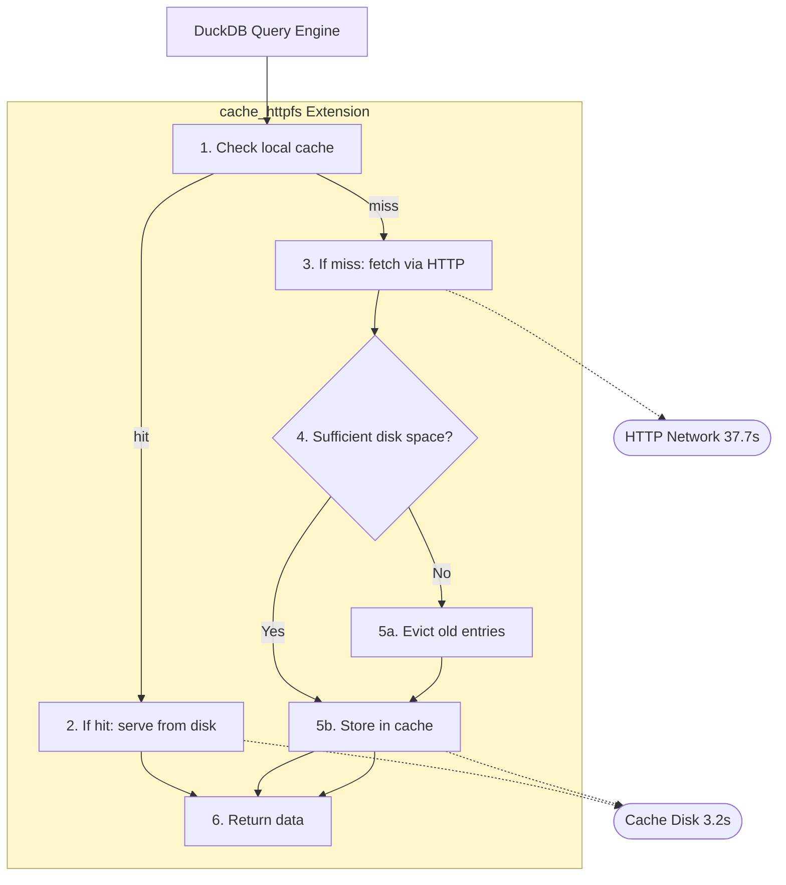

## Introduction

DuckDB’s `EXPLAIN` offers valuable plan details and a rough sense of HTTP activity, but it stops short of revealing I/O timing, latency distributions, and per‑operation(eg. `READ`, `OPEN`, and `LIST`) behavior. For remote data access, that blind spot matters.

The observefs extension fills this gap by turning filesystem activity into actionable metrics—operation counts, latency histograms, and per‑operation stats. Paired with cache_httpfs, you can both understand and accelerate remote reads through local caching.

This post walks through filesystem observability in DuckDB and a practical caching scenario, demonstrating a measured 11.6x speedup on repeated queries.

## The Problem: Invisible I/O Operations

Consider:

```sql
SELECT COUNT(*), AVG(fare_amount)
FROM read_parquet('https://example.com/data.parquet')
WHERE fare_amount > 0;
```

Behind the scenes:
- Metadata fetches
- Range reads of data chunks
- Decompression/decoding
- Network latency

Key questions:
- How many requests?
- What do P50/P90/P99 IO latencies look like?
- Is caching effective?

## Enter observefs

The community **observefs** extension wraps DuckDB filesystems (HTTP, S3, Azure Blob, etc.) to report:
- Operation-specific metrics (READ, OPEN, LIST)
- Latency histograms and percentiles (P50–P99)
- Min/max/mean statistics
- Per-bucket breakdowns

### Installation

```sql
FORCE INSTALL observefs FROM community;
LOAD observefs;
```

### Core Functions

1. `observefs_list_registered_filesystems()` — list filesystems
2. `observefs_wrap_filesystem(name)` — observefs auto-registers HTTPFileSystem, so monitoring starts immediately on load.
3. `observefs_get_profile()` — fetch metrics
4. `observefs_clear()` — reset metrics

### Basic Usage

```sql
FORCE INSTALL observefs FROM community;
LOAD observefs;

-- Query remote data (monitored automatically)
SELECT count(*) FROM 'https://huggingface.co/datasets/open-r1/OpenR1-Math-220k/resolve/main/data/train-00003-of-00010.parquet';

-- Export metrics
COPY (SELECT observefs_get_profile()) TO '/tmp/output.txt';

-- Reset
SELECT observefs_clear();

-- Discover filesystems
SELECT observefs_list_registered_filesystems();

-- Wrap a filesystem (load provider first, e.g., LOAD azure;)
SELECT observefs_wrap_filesystem('AzureBlobStorageFileSystem');
```

### What observefs_get_profile() Shows

Includes filesystem status, operation counts, and latency distributions:

```
Current filesystem: observability-HTTPFileSystem
Overall latency:

open operation histogram is Max latency = 348.000000 millisec
Min latency = 0.000000 millisec
Mean latency = 116.000000 millisec
Count = 3
Distribution latency [0.000000, 10.000000) millisec: 66.666667 %
Distribution latency [340.000000, 350.000000) millisec: 33.333333 %

open operation quantile is
P50 latency 0.000000 millisec
P75 latency 174.000000 millisec
P90 latency 278.399994 millisec
P95 latency 313.199982 millisec
P99 latency 341.040009 millisec
```

## A Real-World Use Case: Measuring Cache Impact

### Experiment Setup

- Dataset: DuckDB job_movie_info benchmark  
- File: `https://github.com/duckdb/duckdb-data/releases/download/v1.0/job_movie_info.parquet`  
- Query: `SELECT SUM(LENGTH(info)) AS total_info_chars FROM read_parquet(...)`  
- Result: 626,355,125 total characters  
- DuckDB: v1.4.0  

### Scenario 1: Baseline (No Cache)

```sql
.mode line
.timer on
FORCE INSTALL observefs FROM community;
LOAD observefs;
SELECT observefs_clear();

SELECT SUM(LENGTH(info)) AS total_info_chars
FROM read_parquet('https://github.com/duckdb/duckdb-data/releases/download/v1.0/job_movie_info.parquet');

SELECT observefs_get_profile();
```

Results:
```
total_info_chars = 626355125
Run Time: 37.742 seconds
```

Observefs highlights:
- 5 open operations
- One notable connection delay (~3.5s)
- Most opens complete <10ms

### Scenario 2: Warm Cache

```sql
.mode line
.timer on
FORCE INSTALL observefs FROM community;
LOAD observefs;
FORCE INSTALL cache_httpfs FROM community;
LOAD cache_httpfs;
SET cache_httpfs_profile_type='temp';
SELECT observefs_wrap_filesystem('cache_httpfs with HTTPFileSystem');

SELECT observefs_clear();
SELECT SUM(LENGTH(info)) AS total_info_chars
FROM read_parquet('https://github.com/duckdb/duckdb-data/releases/download/v1.0/job_movie_info.parquet');

SELECT observefs_get_profile();
SELECT * FROM cache_httpfs_cache_access_info_query();
```

Results:
```
total_info_chars = 626355125
Run Time: 3.241 seconds
```

Highlights:
- 11.64x faster than baseline (37.7s → 3.2s)
- 659 chunks served from local disk
- 91.4% latency reduction

### Performance Comparison

| Scenario | Query Time | Cached Chunks | Speedup vs Baseline |
|----------|------------|---------------|---------------------|
| No Cache | 37.742s    | N/A           | 1.00x               |
| Warm Cache | 3.241s   | 659           | 11.64x              |


*Query time: baseline 37.7s vs warm cache 3.2s*


*Speedup vs baseline: 11.64x*

### Why It’s Faster

Without cache:
```
Network latency → HTTP requests → Data transfer → Processing
└────────────── 37.7 seconds ────────────────┘
```

With warm cache:
```
Disk I/O (345 MB) → Processing
└──── 3.2 seconds ────┘
```

### Observability Insights

1. Open operations include an initial connection delay.
2. Most operations are sub‑10ms; long-tail latency exists on first contact.
3. The file is partitioned into 659 chunks (≈345 MB).
4. Repeated queries benefit by serving chunks locally.

## Practical Use Cases for cache_httpfs

- Interactive exploration: fast iterations after first read
- Cost-sensitive analytics: minimize remote reads on repeated queries
- Unreliable networks: stable performance once cached

## Implementation Details

### How cache_httpfs Works

```
DuckDB → cache_httpfs (Extension)
  1) Check local cache
  2) If hit → serve from disk → return data  (≈ Cache Disk 3.2s)
  3) If miss → fetch via HTTP  (≈ HTTP Network 37.7s)
  4) Check disk space
     • If insufficient → evict old entries
  5) Store object in cache → return data
```




Above is on-disk cache mode (the extension supports in-memory cache mode as well), which would shows different perf characteristics

### Cache Management

**Location**
- Linux/macOS: `/tmp/duckdb_cache_httpfs_cache`

**Eviction**
- In-memory: LRU
- On-disk: LRU or deadline-based

**Monitoring**
```sql
SELECT COUNT(*) AS cached_chunks FROM cache_httpfs_cache_status_query();
SELECT * FROM cache_httpfs_cache_access_info_query();
SELECT cache_httpfs_get_ondisk_data_cache_size();
```

**Maintenance**
```sql
-- Clear when needed
SELECT cache_httpfs_clear_cache();
```

## Conclusion

With **observefs**, DuckDB’s I/O becomes transparent. Combined with **cache_httpfs**, repeated queries on remote data see dramatic acceleration—measured **11.6x faster** with local cache and **91.4% lower latency**—while observability verifies the behavior and impact end-to-end.

### When to Use These Extensions

Use `cache_httpfs` when:
- Access Cloud-hosted datasets(Parallel IO)
- Repeated queries(Cache)
    - You can also disable caching by directory via regex
- Working in bandwidth-constrained environments
- Optimizing for cost and performance

Use `observefs` when:
- Debugging slow queries (identify the 3.5s connection outlier)
- Understanding I/O patterns (see the 5 open operations, 659 data chunks)
- Measuring cache effectiveness (quantify the 24.4s write penalty)
- Learning about system behavior and latency distributions (P50/P95/P99)

## Resources

- [observefs Extension](https://duckdb.org/community_extensions/extensions/observefs.html) - Filesystem observability
- [observefs GitHub](https://github.com/dentiny/duckdb-filesystem-observability) - Source code and examples
- [cache_httpfs Extension](https://duckdb.org/community_extensions/extensions/cache_httpfs.html) - HTTP caching
- [cache_httpfs GitHub](https://github.com/dentiny/duck-read-cache-fs) - Implementation details
- [DuckDB Community Extensions](https://duckdb.org/community_extensions) - Full extension catalog
