## First of all…

Ozone is written in **Java**.
My own Java résumé? Basically just Prof. [Hsin-Chieh Lee](https://www.csie.ncku.edu.tw/zh-hant/members/3)’s class at NCKU, plus a tiny end-of-term project—a little stress-testing tool—built with legends [Zhe-You Liu](https://www.linkedin.com/in/zhe-you-liu/) and [Henry Chang](https://www.linkedin.com/in/henrychang2026): [https://github.com/NCKU-CSIE-Union/Japybara-CLI](https://github.com/NCKU-CSIE-Union/Japybara-CLI).

I’m telling you this because **if I can jump into Ozone with *that* background, so can you!** 🚀

## Self-intro

Hi, I’m **Peter Lee (李緒成)**, a third-year CS undergrad at [NCKU](https://www.csie.ncku.edu.tw/en/).

*Obsessed with open source, distributed systems, and storage tech*—probably a childhood trauma from using potato-grade PCs. My dream is to duct-tape a bunch of crummy machines into one awesome super-computer.

* GitHub: [https://github.com/peterxcli](https://github.com/peterxcli)
* LinkedIn: [https://www.linkedin.com/in/peterxcli/](https://www.linkedin.com/in/peterxcli/)

Fun fact: before contributing, I had **never** touched Ozone in real life. I’d only spun up MinIO in Docker for kicks, and at my internship we use GCS. Ozone’s S3 compatibility? Zero connection. 🤷‍♂️

## Why Ozone?

### The spark

Early 2025 I stumbled across Ozone, skimmed the architecture blog posts, went “hey this is cool,” and boom—cloned the repo, read the docs, started squashing Jira tickets. No ten-year master plan, just vibes.

### Why it’s cool

1. **Protocols galore**—HTTP, S3, HDFS. Plays nice with everything.
2. Fixes HDFS’s scaling pain and loves small files.
3. Containers give SCM centralized placement control *without* killing performance—arguably higher availability than Ceph/MinIO.
4. Big names running Ozone: Tencent, LYC, Shopee, Preferred Networks. (Search GitHub—you’ll see more secret admirers.)
5. Jesse (Ozone PMC) says Shopee’s cluster holds **4 billion keys**—10× a maxed-out HDFS NameNode.
6. Didi’s engineers claim *tens* of billions of keys and *hundreds* of PB. Blog post coming soon.
7. Apache 2.0 license. Totally free. That alone is unbeatable.

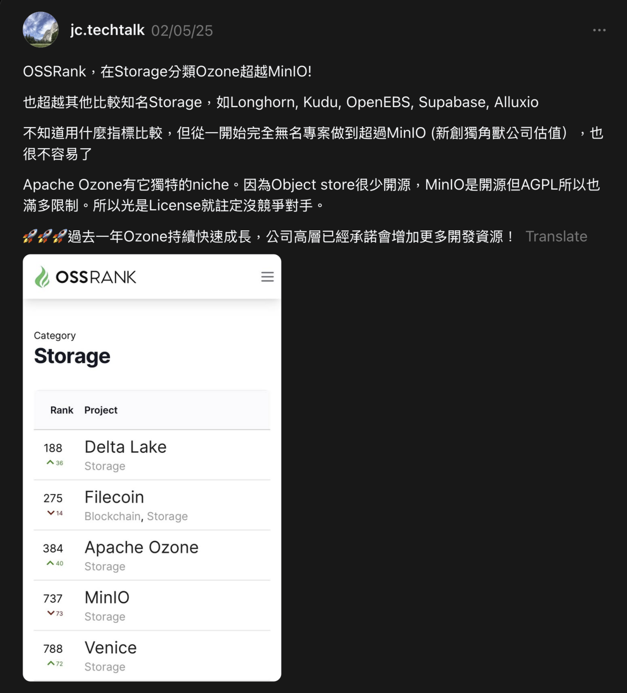

## What I got out of it

### Tech chops

* Compare architectures of Ceph, MinIO, DeepSeek 3FS, etc.—see each one’s trade-offs.
* Ozone feels micro-service-ish: each component with clear boundaries. Eye-opening design study.
* Lots of RocksDB deep dives—compaction, iterators, checkpoints, key I/O bottlenecks.

### Perspective

* **Collaborate with engineers way above my pay grade.** Their knowledge just floods in like a typhoon.
* Real users show up in Jira/Slack long before a shiny blog post appears on LinkedIn.

### Communication

* Most discussion happens on design docs, PRs, Jira—async, different time zones. Say things *once* and make them crystal. (I’m still learning. If you have resources, hit me up!)

## Some numbers

### PRs & Reviews

* \~**50 merged PRs** → [https://github.com/apache/ozone/pulls?q=is\:pr+is\:merged+author\:peterxcli](https://github.com/apache/ozone/pulls?q=is:pr+is:merged+author:peterxcli)
* \~**40 reviews** (excluding my own) → [https://github.com/apache/ozone/pulls?q=is\:pr+is\:open+reviewed-by\:peterxcli+-author\:peterxcli](https://github.com/apache/ozone/pulls?q=is:pr+is:open+reviewed-by:peterxcli+-author:peterxcli)
* Currently **#46** on Ozone GitHub contributor leaderboard.

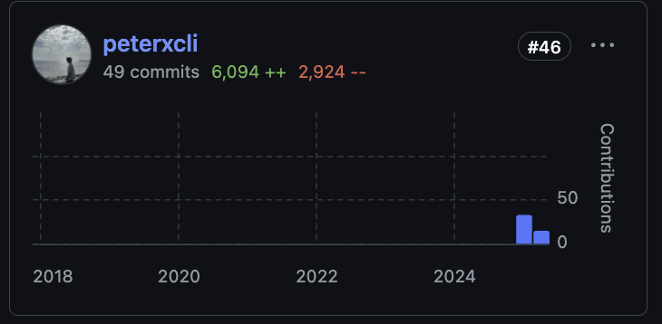

### Third-party stats

1. **OSS Rank**
   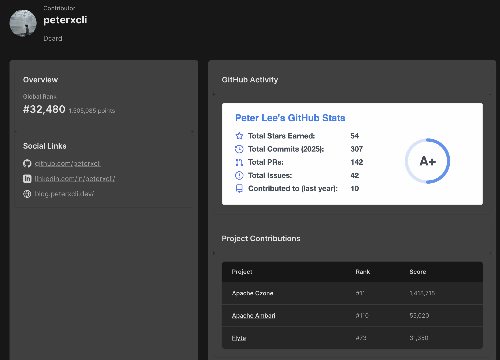
   I’m #11… plus another me at #60 because the site duped my account. 🧬
   

2. **OSS Insight**
   Often swings into the top-2 for activity. Forgot to screenshot the pinnacle though.
   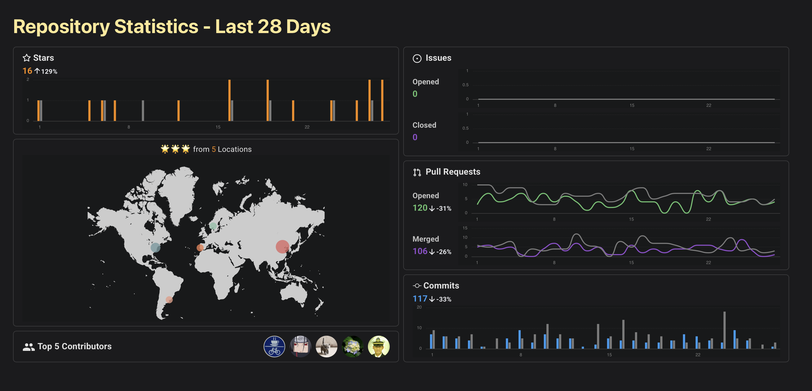

None of this matters—just dopamine for self-care.

## I got the Apache Ozone **Committer** badge!

Huge thanks to Jesse for shouting it out on his socials—professors reposted it, Taiwanese tech morale soared, and I had literally *just* binge-watched all five seasons of Breaking Bad the night before. Perfect timing.

| 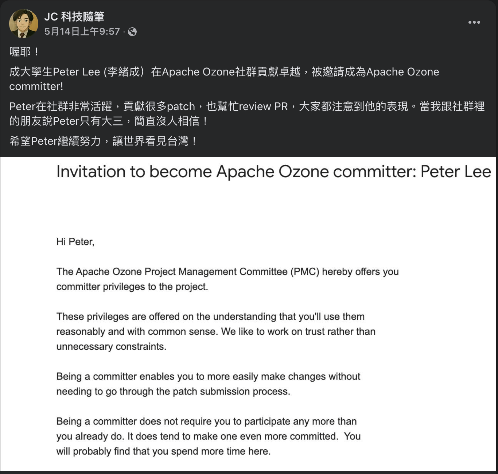 | 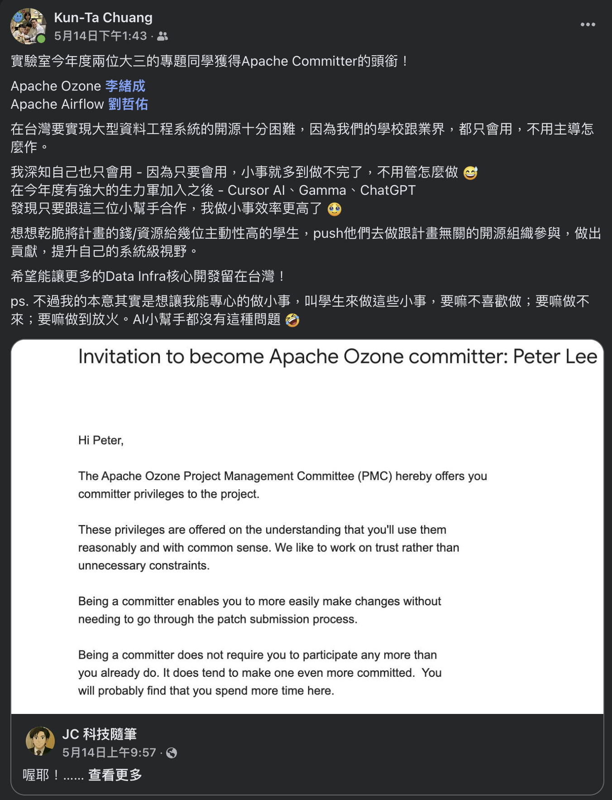 |
| -------------------------------------------------------------------------- | --------------------------------------------------------------------------- |
| 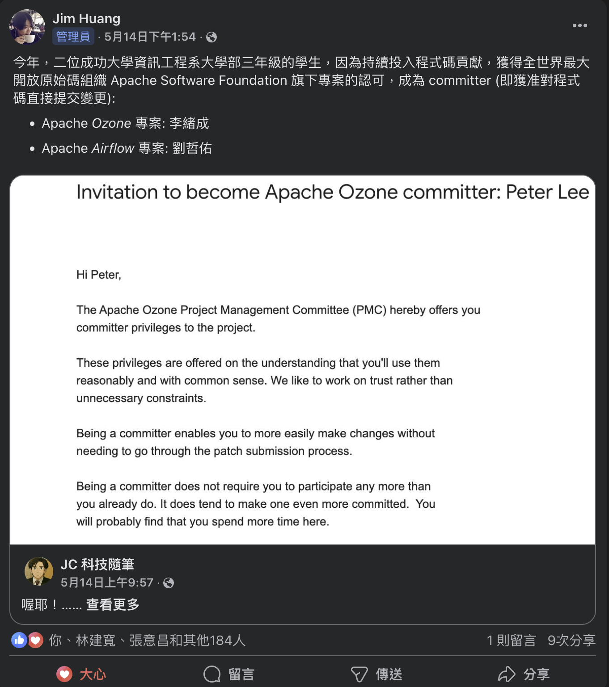 | 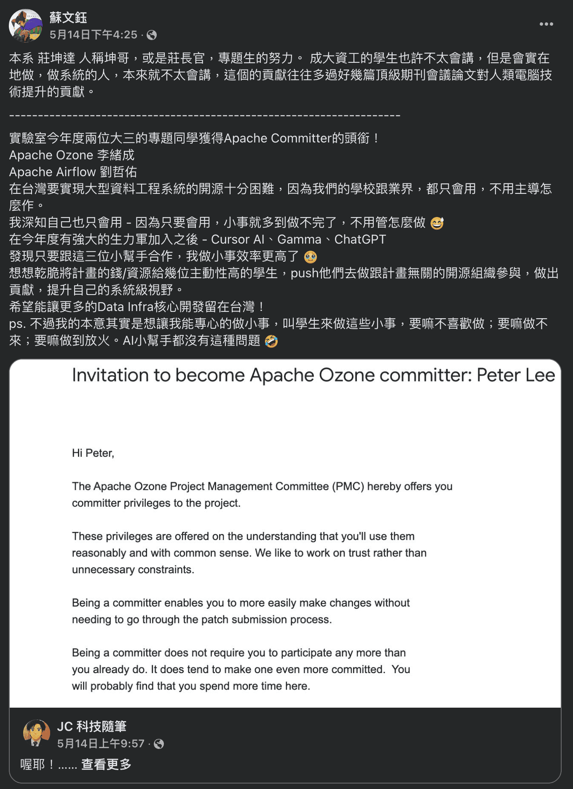 |

## “源來適你” (OpenSource4You) community

Quoting [Zhe-You Liu](https://blog.zhu424.dev/open-source-contribution/becoming-an-apache-airflow-committer-from-0/#%E6%BA%90%E4%BE%86%E9%81%A9%E4%BD%A0):

> **OpenSource4You** is a Taiwan-based non-profit community for real-world OSS contributions.
> Mentors guide projects like Apache Airflow, Kafka, YuniKorn, etc.
> It’s Chinese-friendly, ask away!
>
> * [Project list with mentors](https://github.com/opensource4you/readme?tab=readme-ov-file#%E7%9B%AE%E5%89%8D%E6%9C%89-mentor-%E5%B8%B6%E7%9A%84%E5%B0%88%E6%A1%88)
> * Deep dive article: **“Kafka Community Spotlight: TAIWAN 🇹🇼”** on *Stanislav’s Big Data Stream*.

Recently there was a “Committers under 30” meetup at Dcard’s 14F public area!

## My Apache Ozone journey

### Early days → “mid-game”

#### 1 . Refactoring tests

* **Include AWS request ID in S3G audit logs** [#7725](https://github.com/apache/ozone/pull/7725)
* **Add tests for `SnapshotChainRepair`** [#7741](https://github.com/apache/ozone/pull/7741)
* **Create endpoint builders for S3G tests** [#7753](https://github.com/apache/ozone/pull/7753)

#### 2 . Pagination for **`listMultipartUploads`** in S3G & OM

Main PR: [#7817](https://github.com/apache/ozone/pull/7817)

Follow-ups that popped up while I was knee-deep in the code:

| Follow-up                                                                                                                                        | What it fixes / improves                                                                                                                                 |
| ------------------------------------------------------------------------------------------------------------------------------------------------ | -------------------------------------------------------------------------------------------------------------------------------------------------------- |
| **Sort multipart uploads on response**   [#7929](https://github.com/apache/ozone/pull/7929)               | Switched to **UUID v7** (time-based) for upload IDs so OM no longer has to sort in memory; also matches the S3 spec’s “time-based ordering” requirement. |
| **Duplicated key scanning on `multipartInfo` table**   [#7937](https://github.com/apache/ozone/pull/7937) |

#### 3 . **ReplicationManager** turbo-charge [#7997](https://github.com/apache/ozone/pull/7997)
`ReplicationManager` (inside SCM) tracks container replicas across DataNodes. The patch lets it detect DataNode state changes *much* faster, cutting reaction latency from **minutes to seconds**.

#### 4 . SCM Safemode refactors

| Area                                     | PR                                                                                     | What changed                                                                                                                     |
| ---------------------------------------- | -------------------------------------------------------------------------------------- | -------------------------------------------------------------------------------------------------------------------------------- |
| **EC vs. Ratis containers**              | [#7951](https://github.com/apache/ozone/pull/7951) | Split the one-size-fits-all rule into **two** rules, because EC and Ratis have different replica-count logic.                    |
| **DataNode safemode**                    | [#7998](https://github.com/apache/ozone/pull/7998) | Instead of keeping its own copy of node status, the rule now asks **`NodeManager`** directly—single source of truth, fewer bugs. |
| **Pipeline availability check property** | [#8095](https://github.com/apache/ozone/pull/8095) | Deleted an obsolete `hdds.scm.safemode.pipeline-availability.check` flag.                                                        |

#### 5 . CI speed-ups (with [Attila](https://github.com/adoroszlai))

Maven no longer compiles every module for flaky-test checks—only the modules that matter.

| PR                                                                                                                                      |  |
| --------------------------------------------------------------------------------------------------------------------------------------- | ------- |
| **Script to find modules by test classes** [https://github.com/apache/ozone/pull/8062](https://github.com/apache/ozone/pull/8062)       |         |
| **Detect test class module in flaky-test-check** [https://github.com/apache/ozone/pull/8162](https://github.com/apache/ozone/pull/8162) |         |
| **Limit flaky-test-check to a sub-module** [https://github.com/apache/ozone/pull/8194](https://github.com/apache/ozone/pull/8194)       |         |

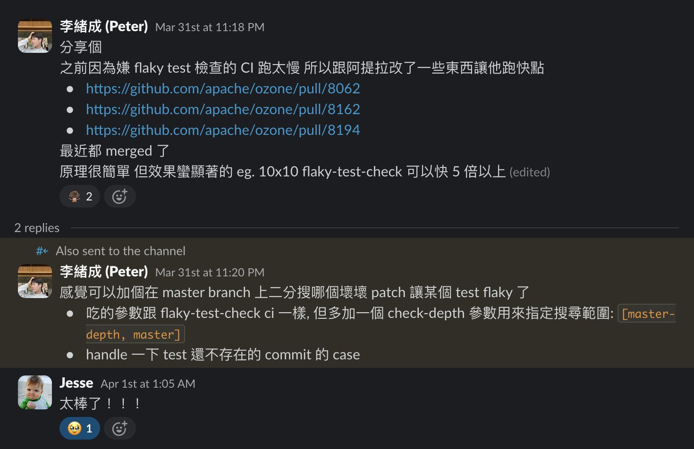

### Recent & current work

#### 1 . DataNode improvements

DataNode is the Ozone component that physically stores every container’s files.\
Because it deals with disk space directly, even tiny mis-calculations can snowball into outages—especially when multiple threads are creating or importing containers at the same time.

> Import container?\
> That’s the act of pulling a fully-formed container from another DataNode (usually during recovery or data-rebalancing) and “installing” it locally. It happens in parallel with regular container creation, which means two different code paths might race to grab the same disk space.
>
If ten threads each try to put a 10 GB container onto a volume that only has 11 GB free, and they all check “hey, space looks fine!” before actually reserving it, you end up “allocating” 100 GB into thin air. Oops.

| Topic                                           | PR(s)                                                                                                                                                                          | TL;DR                                                                                                                                                                                                                                                                                                       |
| ----------------------------------------------- | ------------------------------------------------------------------------------------------------------------------------------------------------------------------------------ | ----------------------------------------------------------------------------------------------------------------------------------------------------------------------------------------------------------------------------------------------------------------------------------------------------------- |
| **Disk-space accounting**                       | [#8086](https://github.com/apache/ozone/pull/8086)                                                                                         | Treats `volumeFreeSpaceToSpare` as genuinely *reserved* space when computing usage.                                                                                                                                                                                                                         |
| **Atomic volume selection & space reservation** | [#8090](https://github.com/apache/ozone/pull/8090) & [#8360](https://github.com/apache/ozone/pull/8360) | VolumeChoosingPolicy is now **synchronized**: choose a volume *and* reserve its space in one atomic step, preventing over-allocation in highly parallel container creates/imports. Bonus: thread-local RNG + atomic counters actually **boosted perf 2–3 ×** (see two images below) |

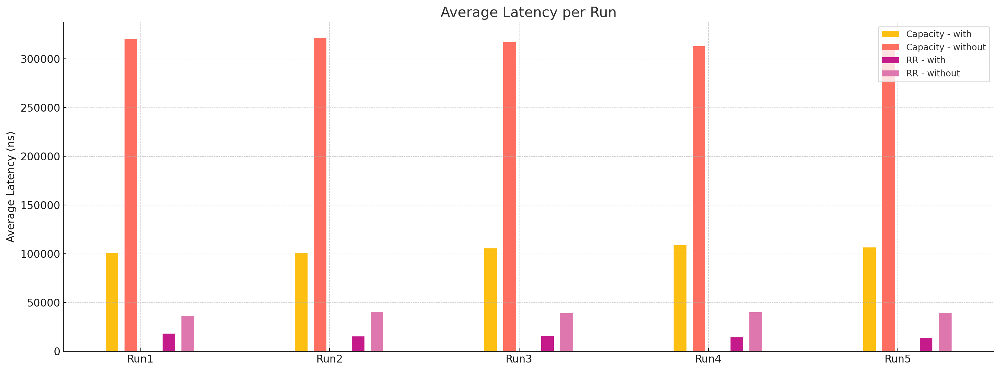
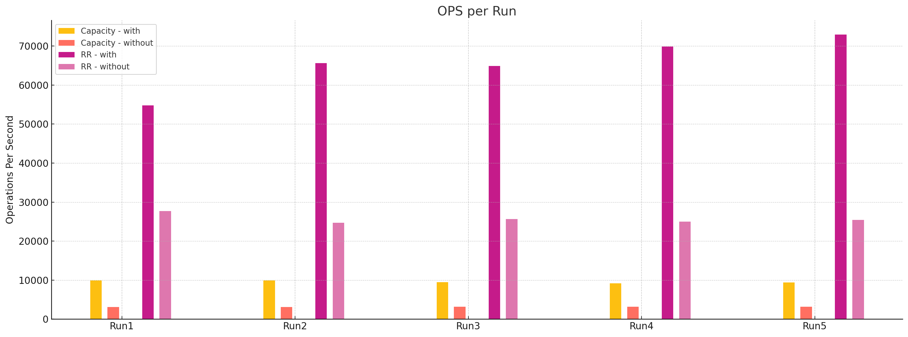

#### 2 . Snapshot work

* **Limit the number of snapshots per bucket** [#8157](https://github.com/apache/ozone/pull/8157)

  Ozone snapshots piggy-back on RocksDB checkpoints (hard-links). ext4 caps hard-links at \~65 000, so OM now enforces a snapshot limit at the application layer. Looked trivial, turned into a 70-comment marathon thanks to OM’s double-buffer concurrency corner cases.

#### 3 . OM RocksDB compaction

* **Aggressive DB Compaction with Minimal Degradation** [#8178](https://github.com/apache/ozone/pull/8178)

  **Problem:** tombstones pile up; iterator scans die a slow death.
  **Idea:** slice the key space by *volume*, *bucket*, *folder* prefixes, keep per-range tombstone stats, and compact *small* ranges whose tombstone ratio blows past a threshold—so you whittle tombstones away in the background *without* nuking the whole table during peak traffic.

  Related community efforts worth noting:

  | PR                                                                                                                                  | Angle                         |
  | ----------------------------------------------------------------------------------------------------------------------------------- | ----------------------------- |
  | **Auto-compact big tables at intervals** [#8260](https://github.com/apache/ozone/pull/8260)     | Periodic compaction. |
  | **Online repair command: manual compaction** [#7957](https://github.com/apache/ozone/pull/7957) | Admin tool to compact a table asynchronously.  |

#### 4 . Miscellaneous

* **EventExecutorMetrics** instead of hacky reflection-based tweaks [#8371](https://github.com/apache/ozone/pull/8371)

  Those ugly `InaccessibleObjectException` warnings in test logs? Gone. Re-implemented the metric renaming trick safely—log output is squeaky clean now.

  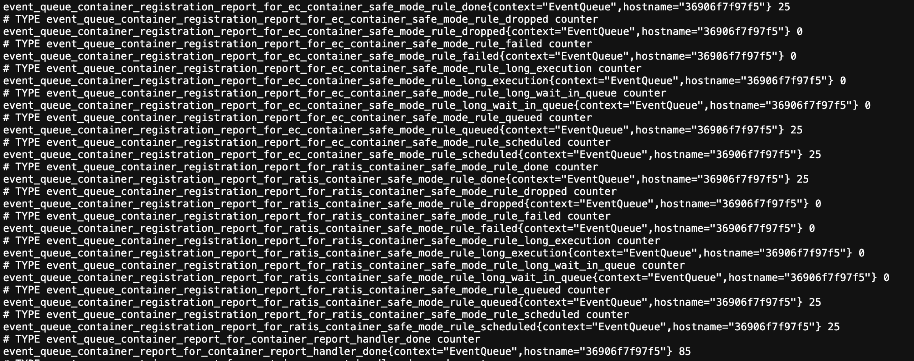

## So I’m a Committer… now what?

* **Reality check:** Committer ≠ omniscient. I probably grok 15 % of the codebase. Haven’t even mastered the DataNode read/write path—like a chef who can’t turn on the stove.
* **More reviews & design discussions**—container reconciliation, snapshot scaling, S3 lifecycle… I need to keep up.
* **Big-impact features** someday. Still a long grind ahead.

## How *you* can start contributing

1. **Fork Ozone, clone it, and run `mvn install`.**\
   (Confession: this step alone took me two days… newcomers these days blaze through it in hours. You’ve got this!)

2. **Read the docs.**

   * Official docs: [https://ozone.apache.org/docs/](https://ozone.apache.org/docs/)
   * My personal cheat-sheet: [Ozone Introduction](../ozone-introduction/)

3. **Pick an issue from the newbie dashboards or task lists.**

   **Dashboards**

    * **Ozone Newbie Dashboard** (curated starter issues)
      [https://issues.apache.org/jira/secure/Dashboard.jspa?selectPageId=12337728](https://issues.apache.org/jira/secure/Dashboard.jspa?selectPageId=12337728)
    * **General Ozone Dashboard** (all open work)
      [https://issues.apache.org/jira/secure/Dashboard.jspa?selectPageId=12337030](https://issues.apache.org/jira/secure/Dashboard.jspa?selectPageId=12337030)

   **Foundation projects (good first picks)**

    * **Code style & security cleanup** – check SonarCloud for warnings:
      [https://sonarcloud.io/project/overview?id=hadoop-ozone](https://sonarcloud.io/project/overview?id=hadoop-ozone)
    * **Website & user docs revamp** – Jira issue [**HDDS-9225**](https://issues.apache.org/jira/browse/HDDS-9225)
    * **Recon UI refresh** – Jira issue [**HDDS-11153**](https://issues.apache.org/jira/browse/HDDS-11153)
    * **Ozone 2.0 release prep** – Jira issue [**HDDS-11516**](https://issues.apache.org/jira/browse/HDDS-11516)

   **Advanced projects (when you’re ready for a deeper dive)**

    * **Apache Ratis** (Raft protocol implementation used by Ozone) – [https://github.com/apache/ratis](https://github.com/apache/ratis)
    * **HBase-on-Ozone** support – Jira issue [**HDDS-11445**](https://issues.apache.org/jira/browse/HDDS-11445)
    * **Storage Container Reconciliation** – Jira issue [**HDDS-10239**](https://issues.apache.org/jira/browse/HDDS-10239)
    * **S3 Gateway Phase 4** – Jira issue [**HDDS-12716**](https://issues.apache.org/jira/browse/HDDS-12716)

### Task management

I bounce between Microsoft To Do and Obsidian Kanban, but **find whatever clicks for you**.\
Pro tip from Zhe-You: [How to manage tasks](https://blog.zhu424.dev/open-source-contribution/becoming-an-apache-airflow-committer-from-0/#how-to-manage-tasks)

---

## TL;DR / Quick start

Too long; didn’t read? Just hop into the [Apache Ozone Slack channel](https://opensource4you.slack.com/archives/C07PLV9QNLF). Take that *first* step—dig deeper whenever the mood strikes. Everyone’s super nice. 💪\
(If you haven’t joined the [OpenSource4You Slack channel](https://opensource4you.slack.com/archives/C07PLV9QNLF), you can use [this invite](https://join.slack.com/t/opensource4you/shared_invite/zt-3585ed66a-8XzY9sjynGFFrkIyK9EbLw) to join.)

---

## Shout-outs

1. **[Chia-Ping Tsai](https://www.linkedin.com/in/chia7712/)** — founded **OpenSource4You**, plugged me into Ozone *and* a ton of awesome people, mentored my early Kafka dabbling, and—most crucially—kept my motivation bar full with endless emotional support. The whole channel crew chats, debates, and drops advice whenever I’m stuck—huge boost on every front!

2. **[Wei-Chiu Chuang](https://www.linkedin.com/in/weichiuchuang/)** — spun up and runs the Ozone Slack channel, spends ridiculous amounts of time answering my newbie questions, **and** nominated me for Committer.
   **[Chung-En Lee](https://www.linkedin.com/in/chung-en-lee-ab7995225)** hosts the weekly calls. Both of them flood the channel with pure gold—couldn’t keep up without their brain dumps.

3. **[Attila](https://github.com/adoroszlai)** (project gatekeeper extraordinaire), **[Semmi Chen](https://github.com/ChenSammi)** (APAC community call host), **[Ethan](https://github.com/errose28)** (NA community call host), plus **[Jesse](https://github.com/jojochuang), [Cheng-En](https://github.com/chungen0126), [Ivan](https://github.com/ivandika3), [Swami](https://github.com/swamirishi)**—and a gazillion other PMC/Committers—review my patches, spot hidden land-mines, and patiently answer even my silliest questions. Couldn’t ask for a kinder gauntlet.

4. [**Prof. Kun-Da Chuang**](https://www.csie.ncku.edu.tw/en/members/41) — invited [Wei-Chiu](https://www.linkedin.com/in/weichiuchuang/) to give a talk at NCKU on literally my *second* day of contributing (talk about timing!) and nudged my thesis toward Ozone. Massive guidance on research, networking, everything. Fun fact: after that talk I cornered Jesse with a truckload of rookie questions. 😆

5. **Roomies** — [**Eric**](https://www.linkedin.com/in/erichung0906/), [**Jason**](https://www.linkedin.com/in/zhe-you-liu/), [**Owen**](https://www.linkedin.com/in/youcheng-lin/): your relentless grind stops me from turning into a slacker. I used to day-dream you guys would found a startup and hire me for life—but hey, don’t put all the eggs in one basket, so I’d better hustle before you dump me. 😭\
   *Next Committer badge is yours, [Owen](https://www.linkedin.com/in/youcheng-lin/)!*

6. **[Dcard](https://www.linkedin.com/company/dcard) internship** — bullet-proof CI/CD, a strict code-review culture, full test coverage, stellar teammates and leads, and a beefy [codebase](https://github.com/Dcard). All of that shaved weeks off my OSS ramp-up time. Immense gratitude!

---

## Resources

### Apache Ozone

* [Official site](https://ozone.apache.org/)
* [Jira](https://issues.apache.org/jira/projects/HDDS)
* [Dev mailing list](https://lists.apache.org/list.html?dev@ozone.apache.org)

### OpenSource4You

* [GitHub](https://github.com/opensource4you)
* [Slack](https://opensource4you.slack.com/) ([Apache Ozone channel](https://opensource4you.slack.com/archives/C07PLV9QNLF) is public, or if you haven’t joined the [OpenSource4You Slack channel](https://opensource4you.slack.com/archives/C07PLV9QNLF), you can use [this invite](https://join.slack.com/t/opensource4you/shared_invite/zt-3585ed66a-8XzY9sjynGFFrkIyK9EbLw) to join.)
* [Facebook](https://www.facebook.com/opensource4you/)
