先說, Ozone 是用 Java 寫的, 然後我學過 Java 的經驗是只有上過成大[李信杰教授](https://www.csie.ncku.edu.tw/zh-hant/members/3)的課, 然後跟[劉哲佑](https://www.linkedin.com/in/zhe-you-liu/)跟[張百鴻](https://www.linkedin.com/in/henrychang2026)寫了一個[小期末 project](https://github.com/NCKU-CSIE-Union/Japybara-CLI), 一個壓力測試的小工具.
但講這個只是要說, **你看我只有這樣的經驗都可以了, 所以你/妳一定也可以！**

## 自我介紹

我是 李緒成 (Peter)，目前大三就讀 [成大資工](https://www.csie.ncku.edu.tw/en/)

專注在貢獻開源，對 Distributed System 和 Storage 技術有興趣(**對 DS & Storage 有興趣很可能是小時候用的電腦都太爛造成的童年陰影, 希望能把很多爛電腦黏再一起變成一台很厲害的電腦**)
- GitHub: https://github.com/peterxcli
- LinkedIn: https://www.linkedin.com/in/peterxcli/

其實在開始貢獻前跟劉大哥一樣是沒有碰過自己在貢獻的專案的, 我以前只有用 docker 跑過 MinIO 玩玩, 最近實習的公司用的也是 GCS, 跟 Ozone 支援的 S3 protocol 也沒有半毛關係

## 為什麼要貢獻 Ozone

### 動機

老實講一開始沒想那麼多, 當初大概 2025 年初知道 Ozone 的時候, 就去看看他的架構跟一些介紹文章, 就覺得蠻不錯的, 然後就開始 build 環境, 看文件, 解 Jira issue.

Ozone 有幾個不錯的點
1. Ozone 支援多種 Protocol, 像是 HTTP, S3 and HDFS, 讓他能夠與多種生態系統整合
2. Ozone 可以解決 HDFS 的擴展性問題, 可以處理更大的資料量, 也更適合小檔案的儲存需求
3. Ozone 透過 Container 這個抽象概念讓 SCM 可以中心化的控制資料的分布又不失效能, 
   在資料或是節點搬移或是下線的時候能夠以最快且優化的策略去恢復資料的可用性, 
   相比於其他有名的去中心化資料分布的分散式檔案系統, 像是 Ceph, MinIO 來說, 整體會有更高的可用性
4. 騰訊, LYC, 蝦皮, Preferred Network 等公司有在使用 Ozone, 也算是替 Ozone 背書. 
   應該還有一些公司有在用, 只是沒有公開而已, 去 github 上搜尋 ozone 搞不好就可以看到還有哪些公司有在用ㄡ
5. Jesse(Ozone PMC): 新加坡蝦皮的 Ozone cluster 有 **4 billion keys** 非常多, 
   一般 HDFS 到 **400 million** 就是 NameNode 極限了, 所以他們的 Ozone 已經是 HDFS 的**十倍規模**
6. Jesse: 滴滴的工程師說他們 Ozone cluster 已經在幾**十 billion keys** 規模，幾**百 PB** 使用空間, 
   他們最近會發布 blog 寫他們使用心得
7. Ozone 應該是目前唯一一個完全自由的 license(Apache License 2.0) 的分散式檔案系統, 光是這點就無敵了

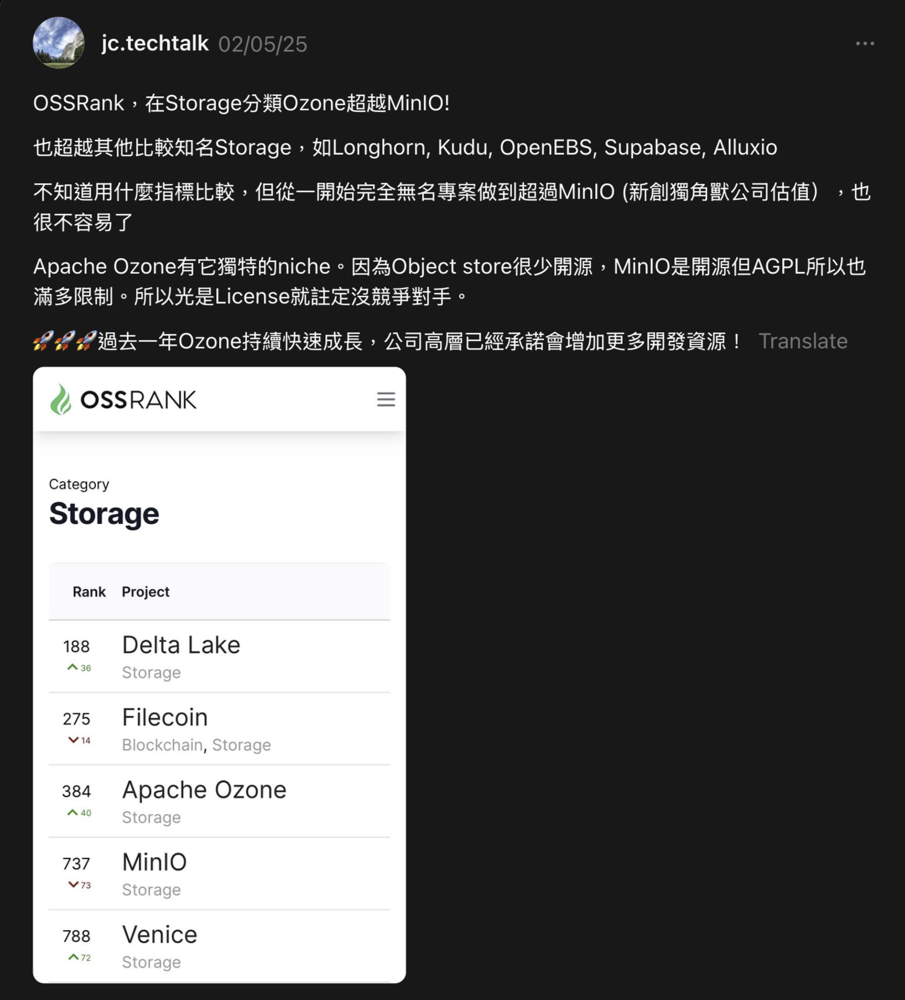 

### 收穫

1. 技術
    
    - 因為 Ozone 是分散式檔案系統, 現在也有很多同質的產品, 像是 Ceph, MinIO 及 Deepseek 3FS 等系統, 可以藉由學習不同系統的架構, 知道他們各自的 Pros & Cons or Trade-off

    - Ozone 的設計有點微服務的概念, 每個 Component 都有自己的責任, 可以去觀察及反思不同的情境下各個 Component 之間的互動的設計

    - 還有就是可能會學到一點點 RocksDB 的相關知識, 因為 Ozone 把 RocksDB 作為 persistent storage engine, 所以會遇到諸如 Compaction, Iterator, Checkpoint 或是 Key Read/Write 瓶頸等議題

2. 視野

    - **可以和你原本接觸不到的 level 的工程師來回協作** 原本不該屬於你腦袋的知識與經驗像颱風來了一樣直接灌了進來
    
    - 還可以看到那些有 adopt ozone 的公司的工程師直接來回報 Issue 或是在討論區問問題, 你不需要等到他們在 LinkedIn 上發布 blog 你才知道他們有在用以及是怎麼用 Ozone 的

3. 溝通

    - 因為討論通常是發生在 Design Document, Github PR, Jira Issue 上, 跟 Discord 或是 Slack 的形式不太一樣, 
      而且會回你的人他們的時區通常也都跟你不一樣, 最主要是要讓對話來回的次數越少越好, 能讓別人一次理解你的意思最好, 
      但也沒這麼絕對啦, 如果真的很需要討論或是雙方真的有哪裡不懂的話, 再產生更多的對話當然也沒關係, 最重要的是不要過很久都不回.

    - 但我覺得我也還不是很會溝通啦, 如果有人有推薦的資源可以分享的話也歡迎跟我說, 我再來好好學學. 或是覺得我上面的說法有什麼不對的話, 也歡迎跟我說XD

## 一些數據

### PR & Review

大概 50 個 [merged PR](https://github.com/apache/ozone/pulls?q=is:pr+is:merged+author:peterxcli), 40 個左右的 [review PR](https://github.com/apache/ozone/pulls?q=is:pr+is:open+reviewed-by:peterxcli+-author:peterxcli) (扣掉自己的)

在 Apache Ozone 的 Github 貢獻排名至今是第 46 名

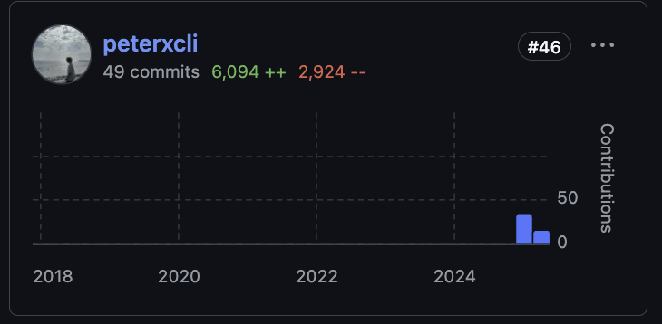

### Third Party Stats

如果想多知道一些自己的數據, 可以看看

1. [OSS Rank](https://ossrank.com/c/995859-peterxcli-dcard)
    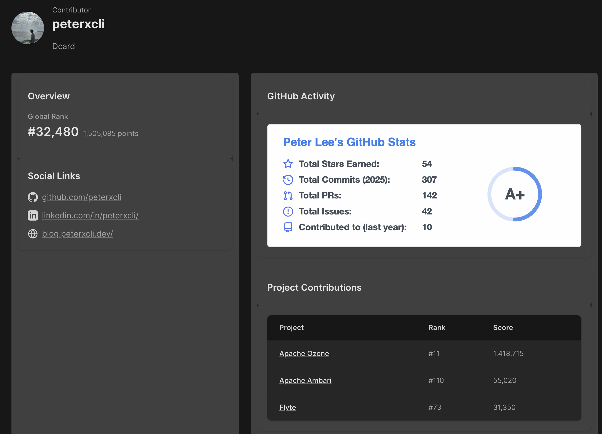
    在 Ozone 的 OSS Rank 上排第 11 名, 但還有一個 60 名的 peterxcli... 他們系統不知道為什麼沒把兩個我合在一起
    
    
2. [OSS Insight](https://ossinsight.io/analyze/apache/ozone)
    
    我活躍度算蠻高, 我之前還有到第二名過, 但我忘記截圖了ㄏㄏ
    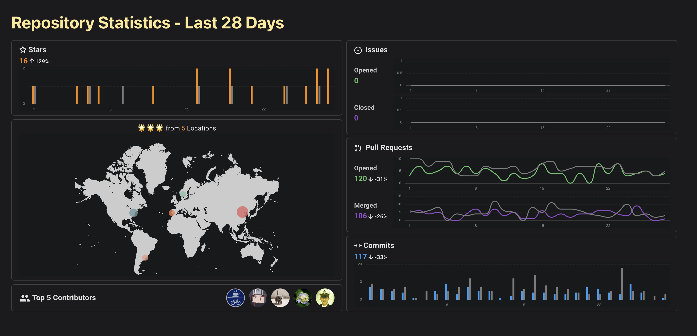

不過不是很重要就是了 自己看看開心就好

## 拿到 Apche Ozone Committer Title

謝謝 Jesse 把邀請我成為 Committer 的事放在他的粉專上, 還有很多成大有名的教授轉貼, 讓大家對成大及台灣更有信心. 
而且我前一天晚上才剛看完絕命毒師共 5 季, 真的謝謝 Cloudera 的 Jesse 還有 BB 的 Jesse.

| 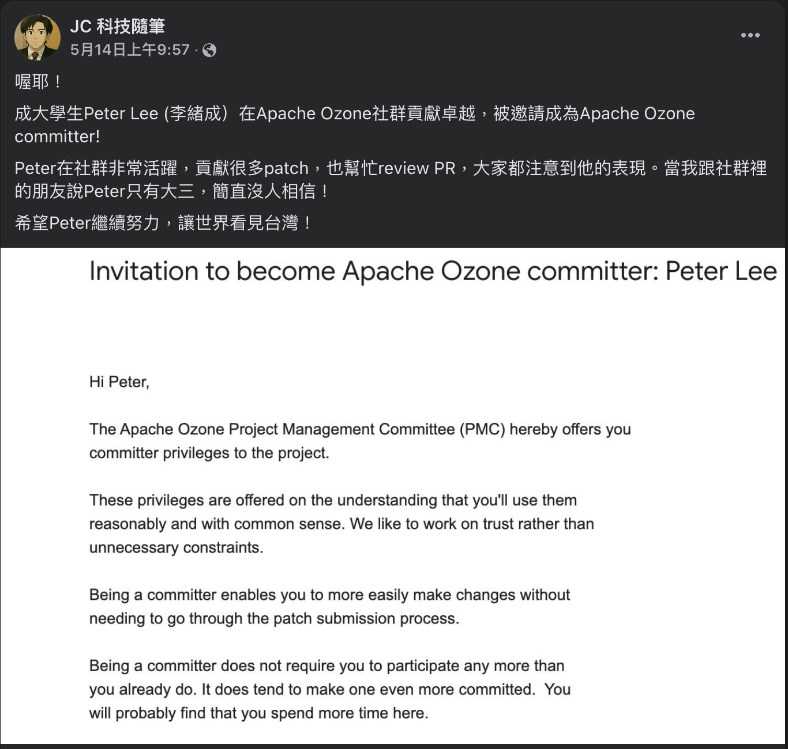  | 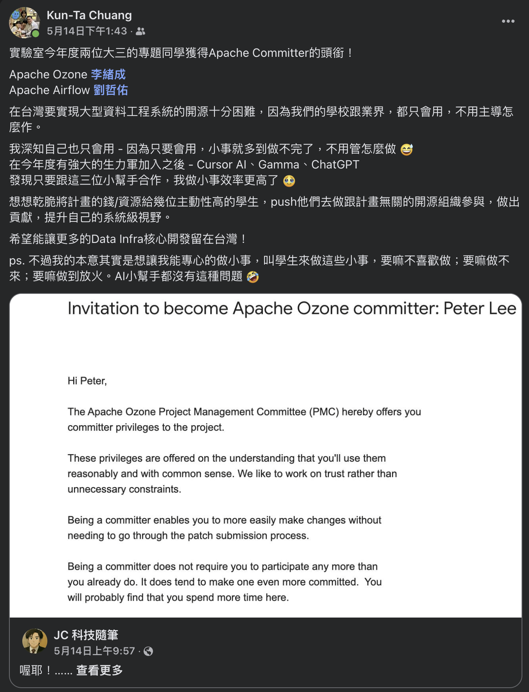  |
|---|---|
| 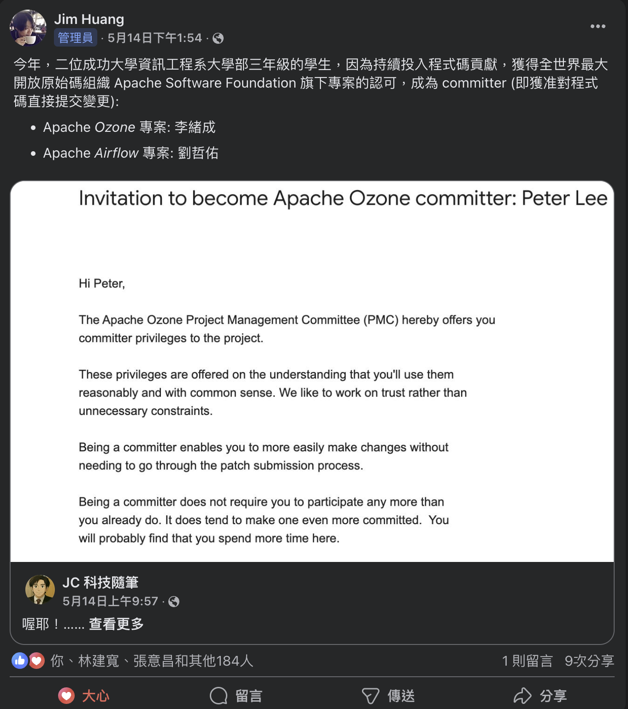  | 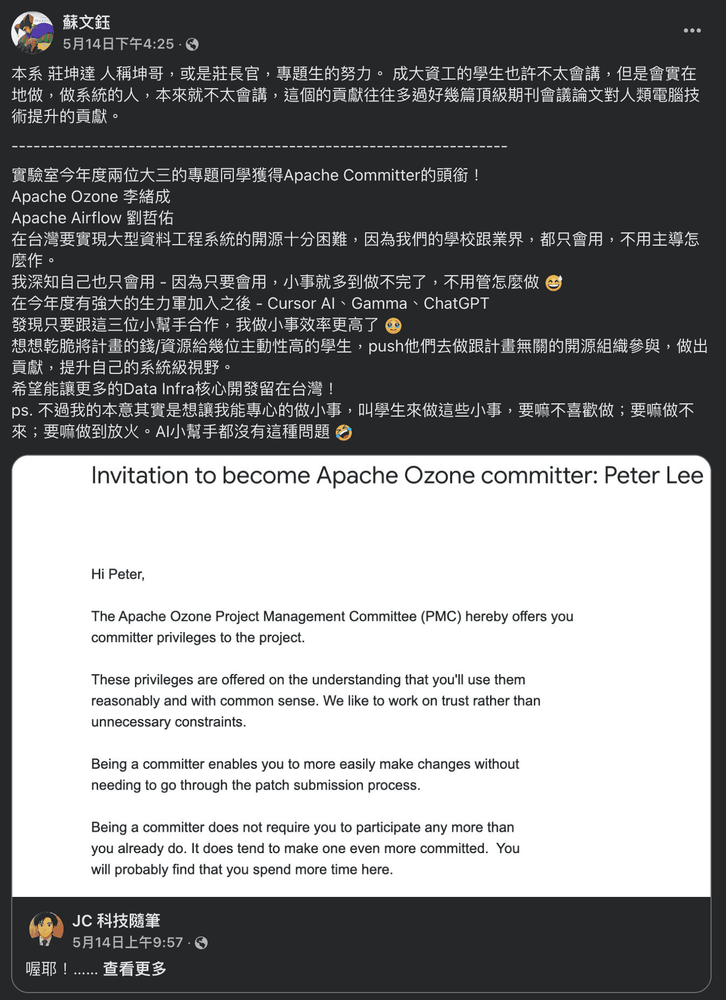  |

<!-- 
    
    
    
    
 -->

## 源來適你 社群

引用劉大哥的[敘述](https://blog.zhu424.dev/zh-tw/open-source-contribution/becoming-an-apache-airflow-committer-from-0/#%E6%BA%90%E4%BE%86%E9%81%A9%E4%BD%A0)
> [源來適你](https://github.com/opensource4you/readme)是一個在台灣實際貢獻開源的非營利組織\
> 裡面有許多 Mentor 帶你實際貢獻開源專案，包括 Apache Airflow, Apache Kafka, Apache YuniKorn 等等\
> 這邊都是以中文溝通，如果有問題可以更自在的用中文提問
> - [「源來適你」目前有 Mentor 帶的專案列表](https://github.com/opensource4you/readme?tab=readme-ov-file#%E7%9B%AE%E5%89%8D%E6%9C%89-mentor-%E5%B8%B6%E7%9A%84%E5%B0%88%E6%A1%88)
> - 關於源來適你更深入的介紹 [Kafka Community Spotlight: TAIWAN 🇹🇼](https://bigdata.2minutestreaming.com/p/kafka-community-spotlight-taiwan) by [Stanislav’s Big Data Stream](https://bigdata.2minutestreaming.com/)

最近很多 Committer, 源來適你也在 Dcard 14 樓 iKea 區辦了一個座談會, 劉大哥也在裡面... (他被放在最右邊大概是無人出其右的意思吧, 真的很羨慕...) 開個小玩笑而已, 他們就真的都超厲害的！！

## 我在 Apache Ozone 的貢獻

### 一開始 ~ 中期

#### Test 的 Refactor

一開始我是先做一些 Test 的 Refactor:
- [Include AWS request ID in S3G audit logs](https://github.com/apache/ozone/pull/7725)
- [Add tests for SnapshotChainRepair](https://github.com/apache/ozone/pull/7741)
- [Create endpoint builders for S3G tests](https://github.com/apache/ozone/pull/7753)

#### Support Pagination for `listMultipartUploads` in S3G & OM

再來就是幫 `listMultipartUploads` 這個 API 加上 Pagination: https://github.com/apache/ozone/pull/7817 還有根據在改的過程中發現的一些問題開了其他的 follow up 做修正:
- [Sort multipart uploads on ListMultipartUploads response](https://github.com/apache/ozone/pull/7929)
    
    直接用 UUIDv7 (time based) 來生成 multipart 的 upload id, 避免在 OM Metadata 還需要額外排序, 並且也能符合 S3 的規範
    https://docs.aws.amazon.com/AmazonS3/latest/API/API_ListMultipartUploads.html
    > Time-based sorting - For uploads that share the same object key, 
    > they are further sorted in ascending order based on the upload initiation time. 
    > Among uploads with the same key, the one that was initiated first will appear before the ones that were initiated later.
- [Duplicated key scanning on multipartInfo table when listing multipart uploads](https://github.com/apache/ozone/pull/7937)

    原本 OM 在處理 `listMultipartUploads` 讀請求的時候, 在 list multipart table 的時會需要 Iterate Keys 兩次,
    但其實能簡化成掃一次就好, 應該只是原本沒注意到, 但你看, 這樣直接讓 read request **快了 200%**.

#### ReplicationManager

再接下來就是做 [ReplicationManager 的改進](https://github.com/apache/ozone/pull/7997), `ReplicationManager` 是在 SCM 中負責管理 
Container 副本分布的服務. 這個 PR 是為了讓 `ReplicationManager` 在節點(DataNode)狀態發生變更的時候能夠更快德感知到, 並且做出相對應的 
re-distribute 的動作, 這個優化可以讓 `ReplicationManager` 的**延遲從分鐘級降到秒級**.

#### SCM Safemode

還有 SCM Safemode 的一些 refactor, context 大概是 safemode 以後要拿掉基於 report process 的邏輯, 
改成直接從 `ContainerManager`, `NodeManager` 或 `PipelineManager` 等 single source of truth 來獲取資訊
- [Split Container Safemode Rule into Ratis & EC Container Safemode Rules](https://github.com/apache/ozone/pull/7951)

    原本 EC & Ratis Container 是透過同個 ContainerSafemodeRule 來處理, 但因為他們的 safemode 的邏輯(最小副本數及 report processing)不太一樣, 所以拆成兩個, 讓各自的責任更明確
- [Refactor DataNodeSafeModeRule to use NodeManager](https://github.com/apache/ozone/pull/7998)

    把 `DataNodeSafeModeRule` 在 validate 的時候的邏輯改成從 `NodeManager` 獲取資訊然後再去判斷有沒有符合退出 safemode 的條件(意即該 SCM 可以開始正常服務), 
    這樣可以避免他自己在需要額外維護一份節點狀態的資訊
- [Remove hdds.scm.safemode.pipeline-availability.check property](https://github.com/apache/ozone/pull/8095)

#### CI Improvement

Meanwhile 也跟 Attlia 做了 CI 的一些小優化, 讓 flaky-test-check 能夠快 **2~5 倍**

主要原理就是讓 maven build 他該 build 的 module 就好, 不要每次都 build 全部
- [Add script to find modules by test classes](https://github.com/apache/ozone/pull/8062)
- [Detect test class module in flaky-test-check](https://github.com/apache/ozone/pull/8162)
- [Allow limiting flaky-test-check to specific submodule](https://github.com/apache/ozone/pull/8194)

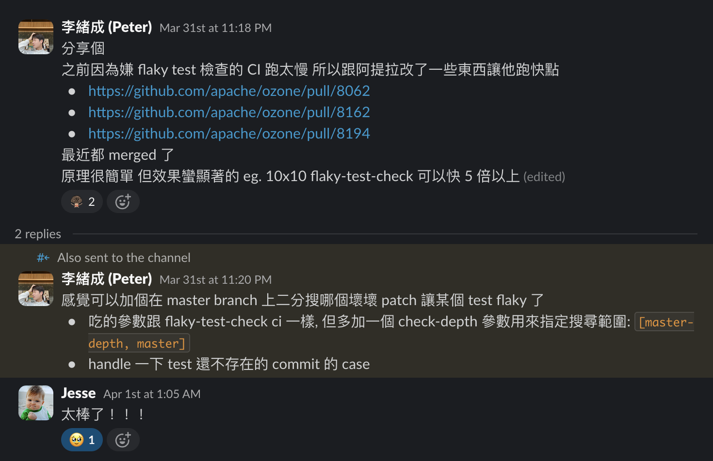

### 最近 & 現在

#### DataNode 上的改進

DataNode 因為是 Ozone 中負責儲存真實檔案資料的元件, 所以對於儲存空間的管理上會需要更謹慎的思考與設計,
比方說 Concurrently 創建 Container 或是 Import Container 的時候有可能會 over-allocate disk space

註: Import container 是指 DataNode 之間互相 push/pull 整個 Container 的資料時, 接收端的 DataNode **引入 Container 的這個動作**, 通常在集群資料復原或是搬遷的時候會發生

- [Treat volumeFreeSpaceToSpare as reserved space](https://github.com/apache/ozone/pull/8086)
    
    DataNode 上計算一些 Disk Volume Usage 的計算方式的調整

- [Container creation and import use the same VolumeChoosingPolicy](https://github.com/apache/ozone/pull/8090) & [Check and reserve space atomically in VolumeChoosingPolicy](https://github.com/apache/ozone/pull/8360)

    在 Create/Import Container 的時候, 會透過 VolumeChoosingPolicy (有 RoundRobin, Random 兩種策略)來決定要選擇哪個 Disk Volume 來把 Container 放進去,
    原本的做法是, VolumeChoosingPolicy 在做選擇前會先檢查 Volume 空間是不是夠用, 但這樣還不夠, 因為所有動作都是 concurrent 的, 不引入 lock 之類的機制的話非常容易 over-allocate, 
    想像 Volume 有 11GB, 但有 10 個 10 GB 容量的 Container 同時在創建, 大家都覺得夠用所以都 allocate 空間, 直接 10 乘 10 變成 100GB...

    那這兩隻 PR 主要就是讓選擇 Volume 這個動作變成 synchronized 的, 再選出 volume 同時也把空間預留. 
    除此之外, Create/Import container 時除了選擇 volume 外, 還有很多額外步驟要處理, 那些步驟中都可能會有 exception 發生,
    所以**選出 volume 和預留空間這兩個動作需要是 atomic 的**, 如果有失敗的話就需要 rollback 回到原本的狀態

    另一個有趣的點是, 原本以為改成 synchronized 的話, 效能會下降很多, 但實際上, 因為同時在 patch 中也做了 Thread Local Random 和 Atomic Integer 的優化, 結果整體效能甚至**提升了 200%~300%** 左右

    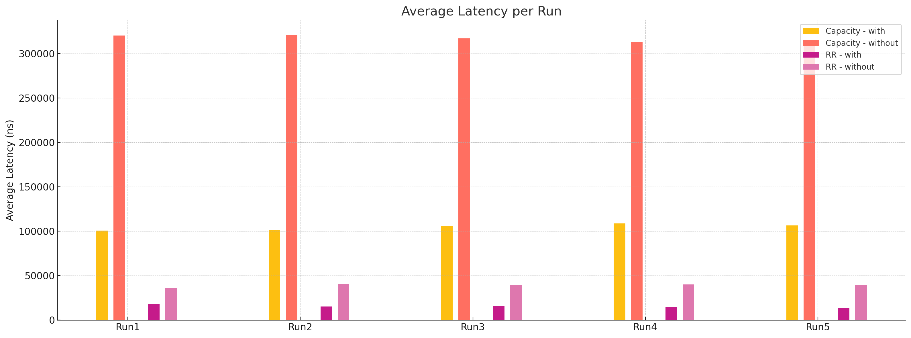
    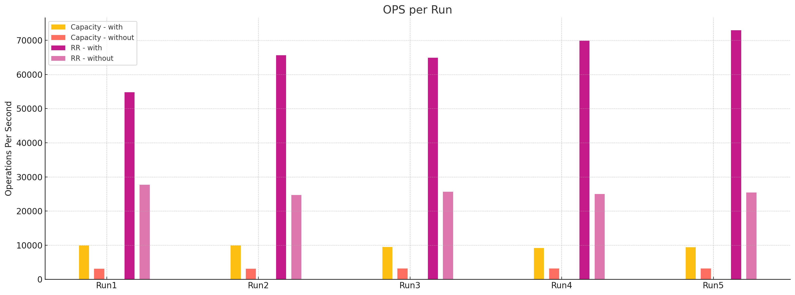

#### Snapshot 相關

Snapshot 功能是一個基於 RocksDB checkpoint 做出的進階功能, 可以算兩個不同時間點之間 key 的變化

RocksDB checkpoint 的實現是透過 Linux file system hard link, 每次 snapshot 如果 rocksdb 的 SST file 沒有變動，就會建 hard link 連到 snapshot 的 SST file 去.
ext4 最多允許 65535 個 hard link to same file(但好像 linux 把 limit 設成稍低的 65000), 所以如果完全沒有變動，一個 bucket 最多同時可以有 65000 snapshots.

https://en.wikipedia.org/wiki/Hard_link#Limitations
> The maximum number of hard links to a single file on a particular type of file system is limited by the size of the that type of file system's reference counter and the size of the copy of the reference counter in the operating system's in-memory per-file data structure;
> it may also be limited by a policy choice in the operating system code. Exceeding the permitted number of links results in an error. In AT&T Unix System 6, released in 1975, the number of hard links allowed was 127.[6][7] On Unix-like systems the in-memory counter is 4,294,967,295 (on 32-bit machines) or 18,446,744,073,709,551,615 (on 64-bit machines). In some file systems, the number of hard links is limited more strictly by their on-disk format. For example, as of Linux 3.11, the ext4 file system limits the number of hard links on a file to 65,000.[8] Windows limits enforces a limit of 1024 hard links to a file on NTFS volumes.

- [OM fs snapshot max limit is not enforced](https://github.com/apache/ozone/pull/8157)

    因為上述原因, 作業系統本身對 hard link 的數量有限制, 所以我們應該在 application 層面做限制, 避免一些難以正確 handle 的 exception 出現

    原本還以為是 straight forward 的 change, 但後來發現因為 OM double buffer 設計的關係, 所以需要額外處理一些 concurrency 還有節點變更的問題, 來來回回也到了 70 幾個 comments

我在 Snapshot 相關功能上還沒做很多事, 希望以後能多做一些

#### OM RocksDB Compaction

- [Aggressive DB Compaction with Minimal Degradation](https://github.com/apache/ozone/pull/8178)

    Ozone 是用 RocksDB 當作底層儲存引擎, 然後 LSM-Tree based DB 因為都是 append-only 的操作, 所以如果有 key 被刪除的話, 只能夠過 tombstone 來標記, 
    然後如果我們需要用 `Iterator` 做一些 total order scan 的話, 如果遇到 tombstone 還要往下層翻, key 數量一多就會變成效能瓶頸

    RocksDB 的效能調教一直以來都是個難題, 就連 RocksDB 團隊可能也很難給到很準確的建議, 除了對底層引擎運作原理有了解外, 還需要對上層服務的 workload 類型有深度了解, 才能夠做出適合的調整

    社群上也有加上可以設定定期 full compaction 的機制, 但我覺得單純過一陣子就直接無情 compact 整個 table(CF) 的話很可能不小心在掏寶雙11的正中午不小心給他跑下去, 就蠻危險的

    所以這個 Design 就是透過對原本 table 裡的所有 key 根據邏輯做切分, 不同的 volume, bucket, folder id 在某些層面是互不影響的, 所以根據切細的 key range 上的統計數據(tombstone ratio)去判斷他們有沒有需要做 compaction, 理論上來說可以讓 tombstone 數量在背景慢慢減少,
    並且因為每次都是對小範圍的 key 做 compaction, 所以對 online service 不會有太大的效能影響

    也有幾個試著解決關於 RocksDB Compaction 的問題的 PR, 但也是很是很多要改善的, 
    比方說只在特定條件, 如 cpu 使用率低于某個值, 才會進行 compaction, 或是支援更彈性的 schedule 等

    - [Auto-compact tables which can tend to be large in size at intervals](https://github.com/apache/ozone/pull/8260)
    - [Online repair command to perform compaction on om.db](https://github.com/apache/ozone/pull/7957)

#### 其他

- [Introduce EventExecutorMetrics instead of setting the metrics props unsafely](https://github.com/apache/ozone/pull/8371)

    之前看 Test Log 的時候, 裡面都會噴出一堆 `InaccessibleObjectException`, 雖然是不影響運行, 但多多少少還是會影響到 debug 的體驗, 
    後來發現 root cause 是有人加了 MetricsUtils 用來改寫 hadoop metrics class 的屬性, 讓多個 event queue instances 可以共用同個 metrics class 但是保有各自的名字, 
    後來用跟原有的 [VolumeInfoMetrics](https://github.com/apache/ozone/blob/8ceb5c319/hadoop-hdds/container-service/src/main/java/org/apache/hadoop/ozone/container/common/volume/VolumeInfoMetrics.java) 類似的作法就解決了, 
    Test Log 現在很乾淨、、、
    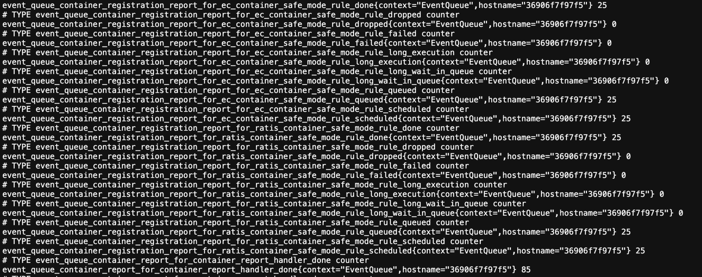

## 拿到 Committer 了 然後呢?

### 我自己對於 Ozone 的了解

成為 Committer != 能夠 100% 掌握整個專案, 就像 linux source code 也有切分 Code Owner (雖然他們 Codebase 是真的大...)

我感覺我自己最多只了解了 15% 的 Codebase, 而且我現在對 Datanode Server/Client 的 Data read/write path 還不是很熟, 基本上就像是你說你是廚師但不會開火一樣

### More Review & Discussion

社群裡很多 ongoing 的子專案在進行 container reconciliation, scaling snapshot, S3 LifeCycle... 等, 我都還沒有一個 full picture, 我真的要花更多時間在 Review 他們上並參與設計討論, 能更好跟上大家的腳步

### Big Feature, Big Impact

希望之後有機會的話能提出比較系統級的 feature 的 design, 並且實作出來, 應該能提升不少在專案及社群的影響力. 不過... 還有很大一段路要走呢...

## 如何開始貢獻 Apache Ozone

1. 一開始就先 fork ozone 然後把他把 clone 下來, 然後跑 maven install, 嗯雖然我這步搞了兩天...

    我看到很多新的人都上手很快 qq 他們一定可以比我做得更好

2. 讀一下[官網 document](https://ozone.apache.org/docs/) 或是我之前整理的 [ozone introduction](../ozone-introduction/)

3. 在源來適你 apache-ozone [頻道概述](https://opensource4you.slack.com/docs/T050YKMG1BK/F07Q5BAUF47)裡有很詳細寫有哪些 issue 可以貢獻:

    - [Ozone Newbie Dashboard](https://issues.apache.org/jira/secure/Dashboard.jspa?selectPageId=12337728)
    - [Ozone Dashboard](https://issues.apache.org/jira/secure/Dashboard.jspa?selectPageId=12337030)
    - 基礎專案
      - Code style & 安全性漏洞
          SonarCloud: https://sonarcloud.io/project/overview?id=hadoop-ozone
      - [HDDS-9225 Website and user doc. We’re revamping the website.](https://issues.apache.org/jira/browse/HDDS-9225)
      - [HDDS-11153 Recon UI](https://issues.apache.org/jira/browse/HDDS-11153)
      - [HDDS-11516 Ozone 2.0 release](https://issues.apache.org/jira/browse/HDDS-11516)

    - 進階專案
      - [Apache Ratis Raft protocol implementation](https://github.com/apache/ratis)
      - [HDDS-11445 HBase support](https://issues.apache.org/jira/browse/HDDS-11445)
      - [HDDS-10239 Storage Container Reconciliation](https://issues.apache.org/jira/browse/HDDS-10239)
      - [HDDS-12716 Ozone S3 gateway Phase 4](https://issues.apache.org/jira/browse/HDDS-12716)

### Task Management

可以參考劉大哥的講法: [管理 tasks 的方式](https://blog.zhu424.dev/zh-tw/open-source-contribution/becoming-an-apache-airflow-committer-from-0/#%E7%AE%A1%E7%90%86-tasks-%E7%9A%84%E6%96%B9%E5%BC%8F)

找到自己用的習慣的方式比較重要, 我有用過 Microsoft To Do, Obsidian Kanban

## 字很多誒 不想讀完 想貢獻有沒有 quick start?

反正就先進來 [apache-ozone slack 頻道](https://opensource4you.slack.com/archives/C07PLV9QNLF)就對了, 踏出第一步之後只要等你/妳以後哪天感覺對了, 隨時都可以更深入的了解\
(還沒加入過源來適你 slack 頻道可以透過[邀請連結](https://join.slack.com/t/opensource4you/shared_invite/zt-3585ed66a-8XzY9sjynGFFrkIyK9EbLw)加入)

大家人都很好的～

## 想感謝的人們～～～

1. [蔡嘉平](https://www.linkedin.com/in/chia7712/)創辦源來適你社群讓我能接觸到很多人還有 Ozone 這個專案, 還有原本我在貢獻 Kafka 時的照顧, 也一直提供情緒價值, 讓我維持動力！
  還有頻道裡也有很多人陪我講話、討論、給予建議, 讓我在各個方面都受到不少幫助！
2. [莊偉赳](https://www.linkedin.com/in/weichiuchuang/)創立及主持 [apache-ozone 的 Slack 頻道](https://opensource4you.slack.com/archives/C07PLV9QNLF)讓我能接觸到大家也常常花時間回答我的問題和提名我成為 Committer！\
   [李仲恩](https://www.linkedin.com/in/chung-en-lee-ab7995225) host 頻道的會議, 他們都常常在頻道裡面跟大家互動, 提供很有價值的資訊
3. [Attlia](https://github.com/adoroszlai) 花了很多的 effort 在維護 Ozone 的品質, [SemmiChen](https://github.com/ChenSammi) host APAC 的會議, 
   [Ethan](https://github.com/errose28) host NA 的會議, 感謝 [Jesse](https://github.com/jojochuang), [Cheng En](https://github.com/chungen0126), 
   [Attlia](https://github.com/adoroszlai), [SemmiChen](https://github.com/ChenSammi), 
   [Ivan](https://github.com/ivandika3), [Swami](https://github.com/swamirishi) 等列不完全部的所有 PMC/Committer 們的 Review & Discussion, 
   不厭其煩地指出潛在問題也很耐心的回答我的問題
4. 我的指導教授[莊坤達](https://www.csie.ncku.edu.tw/zh-hant/members/41)邀請[莊偉赳](https://www.linkedin.com/in/weichiuchuang/)來成大演講, 以及讓我的專題可以 Focus on Ozone, 在各方面都給予我很大的幫助！ (而且演講那天剛好那天是我第二天開始貢獻 Ozone, 超巧的, 我還在演講結束找 Jesse 問了一堆問題)
5. 謝謝我的室友們([Eric](https://www.linkedin.com/in/erichung0906/), [Jason](https://www.linkedin.com/in/zhe-you-liu/), [Owen](https://www.linkedin.com/in/youcheng-lin/))都很努力, 讓我沒有廢掉. 雖然我原本是期待他們以後開公司養我,
   但把雞蛋都放在同個籃子的話可以放冰箱, 所以我自己還是需要努力一下, 以免他們以後不要我了😭\
   BTW, 下一個 Committer 就是你了 [Owen](https://www.linkedin.com/in/youcheng-lin/)!
6. 還有, 不得不說, 在 [Dcard](https://www.linkedin.com/company/dcard) 實習對於我參與貢獻開源專案有很大的幫助, Dcard 的 CI/CD, Code Review 的流程, 
   完整的 test coverage, 很厲害的同事們及主管, 以及 [Codebase](https://github.com/Dcard) 的規模都讓我在貢獻 Ozone 的時候更快上手.

## 相關資源

### Apache Ozone

- [Apache Ozone](https://ozone.apache.org/)
- [Apache Ozone Jira](https://issues.apache.org/jira/projects/HDDS)
- [Apache Ozone Dev Mail](https://lists.apache.org/list.html?dev@ozone.apache.org)

### 源來適你

- [GitHub](https://github.com/opensource4you)
- [Slack](https://opensource4you.slack.com/) ([apache-ozone 頻道](https://opensource4you.slack.com/archives/C07PLV9QNLF)是公開的, 如果還沒加入過源來適你可以透過[邀請連結](https://join.slack.com/t/opensource4you/shared_invite/zt-3585ed66a-8XzY9sjynGFFrkIyK9EbLw)加入)
- [Facebook](https://www.facebook.com/opensource4you/)
