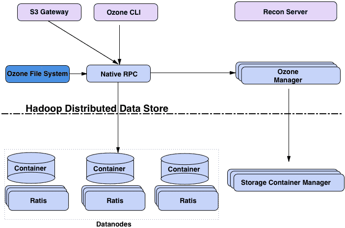
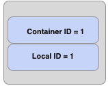

## Overview




## Ratis

- https://github.com/apache/ratis
	Java Raft Implementation
	- DataAPI - for data intensive application

It was initially written for Ozone.

## Ozone Manager (OM)

https://ozone.apache.org/docs/edge/concept/ozonemanager.html

## Storage Container Manager (SCM)

https://ozone.apache.org/docs/edge/concept/storagecontainermanager.html

## Containers

Containers are the fundamental replication unit of Ozone/HDDS, they are managed by the Storage Container Manager (SCM) service.

Containers are big binary units (5Gb by default) which can contain multiple blocks:


Blocks are local information and not managed by SCM. Therefore even if billions of small files are created in the system (which means billions of blocks are created), only of the status of the containers will be reported by the Datanodes and containers will be replicated.

When Ozone Manager requests a new Block allocation from the SCM, SCM will identify the suitable container and generate a block id which contains `ContainerId` + `LocalId`. Client will connect to the Datanode which stores the Container, and datanode can manage the separated block based on the `LocalId`.

### Open vs. Closed containers

When a container is created it starts in an OPEN state. When it's full (~5GB data is written), container will be closed and becomes a CLOSED container.

The fundamental differences between OPEN and CLOSED containers:

| OPEN                                | CLOSED                               |
| ----------------------------------- | ------------------------------------ |
| mutable                             | immutable                            |
| replicated with RAFT (Ratis)        | Replicated with async container copy |
| Raft leader is used to READ / WRITE | All the nodes can be used to READ    |

## DataNodes

When a client wants to read a key from Ozone, the client sends the name of the key to the Ozone Manager. Ozone manager returns the list of Ozone blocks that make up that key.

An Ozone block contains the container ID and a local ID. The figure below shows the logical layout of the Ozone block.



The container ID lets the clients discover the location of the container. The authoritative information about where a container is located is with the Storage Container Manager (SCM). In most cases, the container location will be cached by Ozone Manager and will be returned along with the Ozone blocks.

Once the client is able to locate the container, that is, understand which data nodes contain this container, the client will connect to the datanode and read the data stream specified by _Container ID:Local ID_. In other words, the local ID serves as index into the container which describes what data stream we want to read from.

https://ozone.apache.org/docs/edge/concept/datanodes.html

## Components

### Ozone Manager (OM)

Metadata store in rocksdb

### Double Buffer


- `preExecute()`
	executed at RPC context level. Generate a OMRequest object with all the
required information, which will be passed through RatisClient by calling sendAsync(). All the
object information that will eventually be persisted to RocksDB and returned to the user must be
generated in this step.
- `validateAndCreateResponse() ``
	Executed in stateMachine applyTransaction. This should be an idempotent operation. This is a very light weight operation which will be executed on leader and follower OM. In general the following steps will be done in this method.
	1. Acquire lock.
	2. Validate the request can be executed E.g. check that the target volume and bucket exist, perform authorization checks.
	3. Create a response object for the request to be added to double buffer.
	4. Add the response information to TableCache. This makes the result of the operation visible to subsequent requests.
	5. Release lock.

### Leader side Execution (to replace Double Buffer)


> [!Note]
> volume/bucket level lock -> key prefix lock

- Sumit shared the design of leader side execution(new OM HA architecture) - JIRA.
 - [https://issues.apache.org/jira/browse/HDDS-11898](https://issues.apache.org/jira/browse/HDDS-11898)
 - Define: https://github.com/apache/ozone/pull/7583
 - POC performance: https://github.com/apache/ozone/blob/4377612909344adc13894539e94e89086a0f0d2d/hadoop-hdds/docs/content/design/leader-execution/performance-prototype-result.pdf 
 - Session record
	 https://cloudera.zoom.us/rec/share/mn_TID3GmR0yxATCKH36X8plej9ZtPxqDbdygdD0h9DCU0fid0gUcJJ002a3Hurr.3aKpbT6xyoYeIm1G 
	Passcode: `zQFb+6d7`

### Storage Container Manager (SCM)

#### Architecture

What does SCM manage?


How does it manage?


#### Metadata

##### SCM RocksDB Tables

Pipeline Table

```shell
ozone debug ldb --db=/data/metadata/scm.db value-schema --cf=pipelines | jq '.Pipeline |  keys'
```

Container Table

```shell
ozone debug ldb --db=/data/metadata/scm.db value-schema --cf=containers | jq '.ContainerInfo |  keys'
```

Deleted Blocks Table

```shell
ozone debug ldb --db=/data/metadata/scm.db value-schema --cf=deletedBlocks | jq '.DeletedBlocksTransaction |  keys'
```
#### Services


##### Node Lifecycle

|  |  |
| ------------------------------------ | ------------------------------------ |

> [!Note]
> This setup has the following configuration changes
> 
> ```shell
> ozone.scm.stale.node.interval is 1m
> ozone.scm.dead.node.interval is 2m
> ```
> 
> You can check the configs in [http://127.0.0.1:9876/#!/config](http://127.0.0.1:9876/#!/config)
> 
> - What is `HEALTHY_READONLY` state?
>     
>     - Used during upgrade
>     - The datanodes are moved to this state when SCM is finalized but the datanodes are yet to be finalized.
> - What happens when a datanode is marked as stale?
>     
> - What happens when a datanode is marked as dead?
>     

###### Operational State?

- `IN_SERVICE`
- `ENTERING_MAINTENANCE`
- `IN_MAINTENANCE`
- `DECOMMISSIONING`
- `DECOMMISSIONED`

**Operational State along with Health State will give the overall state of the datanode.**

##### Pipeline Lifecycle


Types of Pipelines

- Ratis
- EC
- Standalone

Standalone Pipeline is used for reads (on Ratis Containers).

Pipelines creation is a costly operation, so they are created in background and are reused.

Pipeline will be closed only if

- there is a write failure on the Pipeline.
- there is a slow follower in the Pipeline Ratis group.
- one of the datanode in the pipeline is marked as stale.
- the pipeline close command is executed by admin.

###### Pipeline Creation Flow

- Based on the Rack Awareness logic, the datanodes are picked for the Pipeline creation
- The Pipeline is created on SCM and it's moved to `ALLOCATED` state
- The SCM will send the Pipeline creation request to the datanodes that are part of the pipeline
- The datanodes will create the pipeline and send the response (Pipeline report) back to SCM via heartbeat
- The SCM will move the Pipeline to `OPEN` state once it received the Pipeline report
- Now the Pipeline can be used for Container allocation.
- The Pipelines which are in `ALLOCATED` state for a long time will be deleted by the scrubber.

Following are the ways in which Pipelines can be created

- Background Pipeline Creator
- We will also created a Pipeline if there is a write request and we don't have any open Pipelines
- Using create Pipeline command

```shell
ozone admin pipeline create
```

###### Pipeline Scrubber

Pipelines in allocated state for long time will be removed by scrubber The timeout can be configued using `ozone.scm.pipeline.allocated.timeout`, the default value is 5 minutes.

###### Pipeline Close Flow

- The Pipeline is moved to `CLOSED` state
- We give some time for containers to get gracefully close before we delete the Pipeline.
    - This is done to avoid moving the containers to `QUASI_CLOSED` state.
- After `ozone.scm.pipeline.destroy.timeout` the Pipeline is deleted from SCM and Delete Pipeline Comands are sent to Datanodes.

Pipeline Action from Datanode Log to grep for in Datanode

```java
LOG.error("pipeline Action {} on pipeline {}.Reason : {}",
           action.getAction(), pipelineID,
           action.getClosePipeline().getDetailedReason());
```

###### What is `DORMANT` state?

- This state is introduced for troubleshooting and debugging purposes.
- If you close a Pipeline, the datanodes that were part of the Pipeline becomes available and the Background Pipeline Creator will try to create a new Pipeline.
- In situations where you want to restrict your container writes to a specific set of datanodes (Pipelines), you can deactivate the other Pipelines in the cluster.
- Deactivating a Pipeline will move the Pipeline to `DORMANT` state.
- Pipelines in `DORMANT` state will not be closed or deleted, at the same time they are not used for writes.
- Once you're done with your troubleshooting, you can activate the Pipeline and it will be moved to `OPEN` state.

##### Container Lifecycle

###### Container State Transition


###### Container State Flow


Container creation logic Clients create the container. The containers are directly moved to OPEN state in SCM upon creation. There is no allocated state for containers.

The number of `OPEN` containers in a pipeline is controlled by `ozone.scm.pipeline.owner.container.count`.

###### `QUASI_CLOSED` state?

- When the container is not closed via Ratis, one of the replica could be lagging behind.

###### How are `QUASI_CLOSED` containers closed?

Replication Manager will try to retain at least one replica per unique Origin Node ID.

##### Block Management

###### Block Allocation

- On Open Containers
- Sequence ID generator
- Only done on leader

###### Block Deletion

- Sent only for closed containers
- The datanode marks the block for deletion and sends the ack
- Deletion ack should be received from all the replicas (three datanodes)

Note: Recent improvement is to send block delete command only if the contianer has three healthy replicas.

There is a delete Block retry count. If the retry count exceeds the configured value, SCM will not retry the block deletion.

##### Replication Manager

By default, it runs every 5 minutes, checking which Containers are under-replicated or over-replicated based on node operation state & health state, and then performs corresponding container replica copy/delete operations accordingly.

The current drawback is that when node state changes occur, it takes 5 minutes before they can be detected. [PR: HDDS-8660. Notify ReplicationManager when nodes go dead or out of service](https://github.com/apache/ozone/pull/7997) may solve this problem.

#### SafeMode Behaviour

##### OM Operations

|**Client Operation**|**Expected Behaviour**|
|---|---|
|Volume Create|Should Succeed.|
|Bucket Create|Should Succeed.|
|Volume List|Should Succeed.|
|Bucket List|Should Succeed.|
|Key/File List|Should Succeed.|
|Key/File Write|Should fail with Safemode Exception|
|Key/File Read|It should succeed if at least one DN holding the replica is registered.|

##### SCM Admin Operations

|**Admin Command**|**Expected Behaviour**|
|---|---|
|Close Container|Should Succeed. The container will be moved to Closing state|
|CreatePipeline|Should fail with Safemode Exception|
|GetPipeline|Should Succeed.|

```shell
ozone admin safemode status --verbose
```

Check SCM Web UI for details.

##### Problem

- Try to put cluster into safemode and verify the client commands.

#### Disk Layout


The version file

```shell
cat /data/metadata/scm/current/VERSION
```

Parse Raft Log file

```shell
ozone debug ratislogparser scm -s=/<Ratis Dir>/<Raft Group ID>/current/log_inprogress_1
```

#### High Availability


#### Datanode Heartbeat Protocol

```protobuf
/**
* This message is send by data node to indicate that it is alive or it is
* registering with the node manager.
*/
message SCMHeartbeatRequestProto {
  required DatanodeDetailsProto datanodeDetails = 1;

  optional NodeReportProto nodeReport = 2;
  optional ContainerReportsProto containerReport = 3;
  repeated IncrementalContainerReportProto incrementalContainerReport = 4;
  repeated CommandStatusReportsProto commandStatusReports = 5;
  optional ContainerActionsProto containerActions = 6;
  optional PipelineActionsProto pipelineActions = 7;
  optional PipelineReportsProto pipelineReports = 8;
  optional LayoutVersionProto dataNodeLayoutVersion = 9;
  optional CommandQueueReportProto commandQueueReport = 10;
}
```

## Some Features

## Streaming write with Pipeline

For the datanode-side, the ContainerStateMachine in Ozone already has implemented all the methods for the Ratis Async API. For Ratis Streaming, ContainerStateMachine should also implement the `stream(..)` method and the `link(..)` method in Ratis StateMachine.DataApi.

The `stream(..)` method is to create a StateMachine.DataStream for receiving incoming stream data from the client. Ozone should implement StateMachine.DataChannel, which extends WritableByteChannel, for writing incoming stream data to its local storage.

The `link(..)` method is to link the incoming stream with a Ratis log entry. Since the ContainerStateMachine already can handle WriteChunk requests for the Async API, the link(..) should use similar code to implement.

Note that the Ratis RaftServer handles the incoming network traffic. No change is required for receiving the Ratis Streaming requests.

- https://issues.apache.org/jira/browse/HDDS-4454
- https://issues.apache.org/jira/secure/attachment/13026623/Ozone%20Write%20Pipeline%20with%20Ratis%20Streaming20210609.pdf
- https://issues.apache.org/jira/secure/attachment/13015193/Ozone%20Write%20Streaming.pdf
- https://medium.com/engineering-cloudera/ozone-write-pipeline-v2-with-ratis-streaming-c47c0ec06693
- [Ozone Write Pipeline with Ratis Streaming - 20210609](Ozone%20Write%20Pipeline%20with%20Ratis%20Streaming%20-%2020210609.pdf)
- [Ozone Write Streaming Pipeline](Ozone%20Write%20Streaming%20Pipeline.pdf)
- [Ratis Streaming](Ratis%20Streaming.pdf)

### Routing Table

topology aware


## Ozone Realtime Cross-Region Bucket Replication

- https://issues.apache.org/jira/browse/HDDS-12307
- [design doc](https://docs.google.com/document/d/1URBcxKgqYWFpDSZBn5UOfR1bUQsEkeyr/edit#heading=h.3o7alnk)
