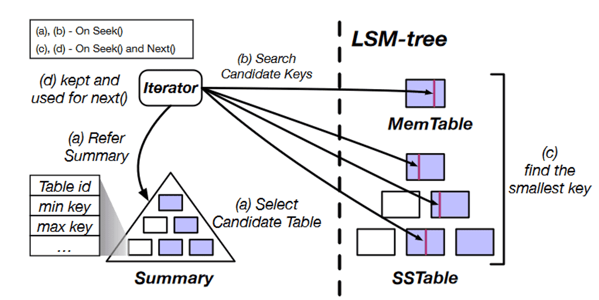
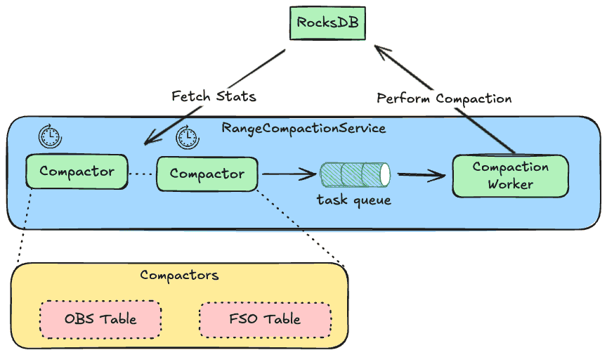

[Pull Request of this Design](https://github.com/apache/ozone/pull/8178/files)

**Author:** Chu-Cheng Li
**Supervising Professor:** Kun-Ta Chung

---

## Introduction

Apache Ozone is a next-generation distributed file system designed to overcome the small file limitations of traditional HDFS by using RocksDB for efficient metadata storage. This project introduces an **SST-based intelligent compaction optimization** to address RocksDB performance issues in Ozone, particularly under heavy delete workloads (tombstones).

### What is Apache Ozone:

- *Ozone Manager (OM)*
  - Manages the namespace (volumes, buckets, keys), thus called the namespace manager.
  - Persists the namespace metadata to the RocksDB.
- *Storage Container Manager (SCM)*
  - Handles block allocation and replication, called the block space manager.
  - Persists the Pipeline, Container, Deleted Blocks, etc. to the RocksDB.
- *Containers*
  - The fundamental replication unit of Ozone, they are managed by the SCM service.
- *Datanodes (DN)*
  - All data are stored on Datanodes (DN).


### What is RocksDB:

- MemTable + SSTables + WAL + Compaction + Block Cache = RocksDB
- Uses iterators to read data, including *MemTableIterator*, *TwoLevelIterator*, *BlockIterator*, *MergingIterator*, etc.


---

## Key Challenge

* **RocksDB suffers from slow iteration performance when many consecutive tombstones accumulate.**

### RocksDB Seek



1. **Candidate Table Selection:**
   The iterator consults the Summary (table min/max key) to quickly narrow down which tables might contain the target key.
2. **Key Search Across Levels:**
   Both MemTable (latest writes) and all levels of SSTables are scanned to find the smallest key ≥ target.
3. **Candidate Key Extraction:**
   The iterator fetches candidate keys from multiple sources in parallel.
4. **Heap Merge:**
   Results from each table are merged using a min-heap to return the next smallest key on every `Next()`.


### RocksDB Seek with Many Tombstone

When a large number of tombstones are skipped, the BlockCache hit rate drops and CPU usage soars because the CPU spends its time repeatedly decompressing data blocks and comparing strings.


---

## Proposed Optimization:

### Scan Key Ranges with High Tombstone Density, then Compact Them

**Approach:**

* **Split the entire table into multiple small ranges** using bucket name prefixes.

  * Initially, each bucket forms a single range.
  * If a range becomes too large, **subdivide** it using SST table boundaries to create smaller, more manageable ranges.
* **Three main benefits:**

  1. Only compact SSTs with high tombstone ratios, reducing unnecessary resource usage.
  2. Compacting small SST ranges significantly lowers the impact on overall system performance.
  3. Enables **customized, optimized splitting logic** tailored to each table's characteristics and access patterns.

### Compaction Workflow


At a high level, the range scanner walks the bucket keyspace and builds small, compactable ranges without touching data blocks:

- **Track accumulated range size**
  - Maintain a running sum of the estimated bytes covered by the current candidate range.
  - The sum is capped by a configurable max range size to keep compactions short and predictable.

- **Get next key range**
  - Start at `nextKey` (persisted progress) and iterate keys in bucket order to propose the next contiguous range.
  - Ranges are aligned to natural boundaries (bucket prefix first) to minimize overlap with unrelated keys.

- **Fetch stats of the range (metadata only)**
  - Query RocksDB table properties and file metadata (smallest/largest key, entries, deletions, data size) across all SSTs and levels that intersect the candidate range.
  - No data blocks are read; this keeps the scanning phase lightweight.

- **Is the range too large?**
  - If the accumulated size would exceed the cap, split the range on the nearest SST boundary and update `nextKey` to the split point.
  - Continue accumulating until the range fits within the limit.

- **Tombstone threshold check**
  - Compute deletion density for the range using per-file statistics: `deleted_entries / total_entries`.
  - Only if the density exceeds the threshold do we consider it a good compaction target.

- **Add range to queue**
  - Enqueue the range for background compaction. A small, non-overlapping range keeps write amplification and IO bounded.
  - The scheduler drains the queue at a controlled rate, prioritizing higher tombstone density or older ranges first.

- **Loop and advance `nextKey`**
  - Repeat the process to cover the table. `nextKey` ensures we resume from the last boundary on the next scan cycle and naturally re-evaluate areas touched by previous compactions.

---

### Architecture Diagram



The service is split into lightweight scanners and a worker that performs compaction, with RocksDB providing both the metadata and the actual compaction machinery:

- **RangeCompactionService**
  - Hosts multiple per-table compactors (e.g., OBS Table, FSO Table) under one coordinator.
  - Provides scheduling, backpressure, and a bounded task queue to decouple scanning from compaction.

- **Compactor (per table)**
  - Periodically scans its table’s keyspace, fetches file-level stats from RocksDB, and identifies ranges with high tombstone density.
  - Splits oversized candidates on SST boundaries, enqueues compactable ranges, and persists `nextKey` to resume after restarts.
  - Runs read-only against metadata, so it is CPU/IO light and safe to run frequently.

- **Task queue**
  - Bounded, prioritized queue (e.g., higher deletion density first; age as a tiebreaker).
  - Applies simple de-duplication for overlapping ranges to avoid redundant work.

- **Compaction Worker**
  - Drains tasks and issues manual compactions to RocksDB over the specified key ranges.
  - Respects concurrency and rate limits to avoid interfering with foreground reads/writes and default background compactions.

- **RocksDB**
  - Exposes table properties and file metadata to scanners.
  - Executes the actual compaction and produces new SSTs with tombstones purged where possible.

- **Isolation and extensibility**
  - New tables can add a compactor without changing the service core.
  - Global limits (queue size, worker concurrency) and per-table knobs (scan interval, max range size, tombstone threshold) control resource usage and fairness.

---

## Experimental Results


* **Enabling range compaction in Apache Ozone yields:**

  * **Read latency improvement:**

    * For a dataset with 10⁷ keys:

      * *Average seek latency reduced by over 158x* (from **35.5ms** to **0.22ms**)
      * *Maximum seek latency drops by 3.7x* (from **8.3ms** to **2.2ms**)
    
    * Performance benefits scale with dataset size:
      * 10⁵ keys: 20x improvement in average latency
      * 10⁶ keys: 27x improvement in average latency
      * 10⁷ keys: 158x improvement in average latency

  * **Write throughput:**

    * Remains unaffected; normal data ingestion rates are maintained.

  * **Compaction resource usage:**

    * **Average compaction time:** Generally decreases or remains similar (5.5s vs 4.4s at 10⁷ keys)
    * **Average compaction write bytes:** Significantly reduced - often near zero for large datasets
    * **Max compaction write bytes:** Interestingly shows 11.2MB vs 7.2MB at 10⁷ keys
      * *Note: The higher max write bytes for range compaction may indicate concurrent compaction operations or insufficient separation between scan and compaction scheduling, requiring further investigation*

## Conclusion

Range compaction provides dramatically improved and scalable read performance with minimal impact on write efficiency. The compaction overhead is actually reduced on average, though peak compaction write activity may be higher due to implementation details that warrant further optimization.

---

## Benchmark Workload

* **Total operations:** 8 × 10⁷

  * **Create:** 68.97%
  * **Delete:** 27.59%
  * **List:** 3.45%

---

## Visualizations


### Bytes Metrics
- 
- 

### Compaction Metrics
- 
- 
- 

### DB Metrics
- 
- 
- 
- 

### DeletedTable Metrics
- 

### Flush Metrics
- 
- 
- 

### KeyTable Metrics
- 

### Number Metrics
- 
- 
- 
- 

### SST Metrics
- 

### Seek Metrics
- 
- 
- 
- 
- 

---

## Acknowledgements

This work was supervised by **Professor Kun-Ta Chung** and carried out as part of ongoing efforts to optimize metadata performance in Apache Ozone.

---

## Appendix

### Benchmark Setup

1. build ozone
2. clean old cluster and 

```bash
export COMPOSE_FILE=docker-compose.yaml:monitoring.yaml:profiling.yaml
OZONE_DATANODES=3 ./run.sh -d
```

#### Run

##### 100M-20:8:1:enable-range-compaction:disable-peridioc-full-compaction

1. append to: `hadoop-ozone/dist/target/ozone-2.1.0-SNAPSHOT/compose/ozone/docker-config`
```
OZONE-SITE.XML_ozone.om.range.compaction.service.enabled=true
OZONE-SITE.XML_ozone.om.range.compaction.service.max.compaction.entries=3000000
```

2. start testing with mixed workload

```bash
ozone sh volume create vol1
ozone sh bucket create /vol1/bucket1 --layout OBJECT_STORE
ozone freon omkeybench -n 100000000 -t 100 --size=0 --volume vol1 --bucket bucket1 --weights create:20,delete:8,list:1 --max-live-keys 25000
```

3. result
```bash
 84.95% |?????????????????????????????      |  84952175/100000000 Time: 14:41:27|  live=25000/25000 created=58592882 deleted=23415201 [LIMIT_REACHED] CREATE: rate 1584 max 1827 DELETE: rate 640 max 765 LIST: rate 67 max 117^C6/10/25, 5:45:13?PM ============================================================

-- Timers ----------------------------------------------------------------------
CREATE
             count = 58593186
         mean rate = 1107.92 calls/second
     1-minute rate = 971.33 calls/second
     5-minute rate = 1092.89 calls/second
    15-minute rate = 1111.86 calls/second
               min = 41.27 milliseconds
               max = 2299.82 milliseconds
              mean = 103.17 milliseconds
            stddev = 222.31 milliseconds
            median = 51.70 milliseconds
              75% <= 56.23 milliseconds
              95% <= 635.08 milliseconds
              98% <= 975.32 milliseconds
              99% <= 1092.38 milliseconds
            99.9% <= 2161.26 milliseconds
DELETE
             count = 23430361
         mean rate = 443.04 calls/second
     1-minute rate = 387.40 calls/second
     5-minute rate = 437.36 calls/second
    15-minute rate = 444.54 calls/second
               min = 17.24 milliseconds
               max = 2133.06 milliseconds
              mean = 47.69 milliseconds
            stddev = 153.30 milliseconds
            median = 24.91 milliseconds
              75% <= 27.03 milliseconds
              95% <= 33.94 milliseconds
              98% <= 595.95 milliseconds
              99% <= 1015.15 milliseconds
            99.9% <= 2133.06 milliseconds
LIST
             count = 2929047
         mean rate = 55.39 calls/second
     1-minute rate = 48.36 calls/second
     5-minute rate = 54.45 calls/second
    15-minute rate = 55.52 calls/second
               min = 2.71 milliseconds
               max = 224.15 milliseconds
              mean = 35.20 milliseconds
            stddev = 11.97 milliseconds
            median = 34.10 milliseconds
              75% <= 37.52 milliseconds
              95% <= 44.80 milliseconds
              98% <= 50.49 milliseconds
              99% <= 53.08 milliseconds
            99.9% <= 218.51 milliseconds


Total execution time (sec): 52888
Failures: 0
Successful executions: 84952642
```

##### 100M-20:8:1:disable-range-compaction:disable-peridioc-full-compaction

1. remove all additional config in: `hadoop-ozone/dist/target/ozone-2.1.0-SNAPSHOT/compose/ozone/docker-config`
2. start testing with mixed workload
```bash
ozone sh volume create vol1
ozone sh bucket create /vol1/bucket1 --layout OBJECT_STORE
ozone freon omkeybench -n 100000000 -t 100 --size=0 --volume vol1 --bucket bucket1 --weights create:20,delete:8,list:1 --max-live-keys 25000
```

3. result

```bash
 86.22% |?????????????????????????????     |  86216505/100000000 Time: 14:57:58|  live=25000/25000 created=59461613 deleted=23765495 [LIMIT_REACHED] CREATE: rate 1362 max 1833 DELETE: rate 519 max 781 LIST: rate 64 max

-- Timers ----------------------------------------------------------------------
CREATE
             count = 59462027
         mean rate = 1103.67 calls/second
     1-minute rate = 1310.73 calls/second
     5-minute rate = 1161.31 calls/second
    15-minute rate = 1105.73 calls/second
               min = 41.91 milliseconds
               max = 1399.99 milliseconds
              mean = 59.52 milliseconds
            stddev = 84.32 milliseconds
            median = 50.06 milliseconds
              75% <= 54.26 milliseconds
              95% <= 62.51 milliseconds
              98% <= 72.90 milliseconds
              99% <= 244.92 milliseconds
            99.9% <= 1356.15 milliseconds
DELETE
             count = 23780956
         mean rate = 441.40 calls/second
     1-minute rate = 524.92 calls/second
     5-minute rate = 464.70 calls/second
    15-minute rate = 442.04 calls/second
               min = 17.94 milliseconds
               max = 1375.04 milliseconds
              mean = 31.57 milliseconds
            stddev = 63.75 milliseconds
            median = 24.31 milliseconds
              75% <= 26.45 milliseconds
              95% <= 30.87 milliseconds
              98% <= 59.64 milliseconds
              99% <= 191.86 milliseconds
            99.9% <= 739.98 milliseconds
LIST
             count = 2974075
         mean rate = 55.20 calls/second
     1-minute rate = 64.50 calls/second
     5-minute rate = 57.72 calls/second
    15-minute rate = 55.15 calls/second
               min = 1.79 milliseconds
               max = 243.03 milliseconds
              mean = 32.84 milliseconds
            stddev = 11.82 milliseconds
            median = 31.56 milliseconds
              75% <= 35.07 milliseconds
              95% <= 42.64 milliseconds
              98% <= 46.73 milliseconds
              99% <= 49.98 milliseconds
            99.9% <= 190.79 milliseconds


Total execution time (sec): 53879
Failures: 0
Successful executions: 86217148
```

##### 100M-20:8:1:disable-range-compaction:enable-peridioc-full-compaction

1. append config to: `hadoop-ozone/dist/target/ozone-2.1.0-SNAPSHOT/compose/ozone/docker-config`
```
OZONE-SITE.XML_ozone.compaction.service.enabled=true
OZONE-SITE.XML_ozone.om.compaction.service.run.interval=1h
```

2. start testing with mixed workload
```bash
ozone sh volume create vol1
ozone sh bucket create /vol1/bucket1 --layout OBJECT_STORE
ozone freon omkeybench -n 100000000 -t 100 --size=0 --volume vol1 --bucket bucket1 --weights create:20,delete:8,list:1 --max-live-keys 25000
```
