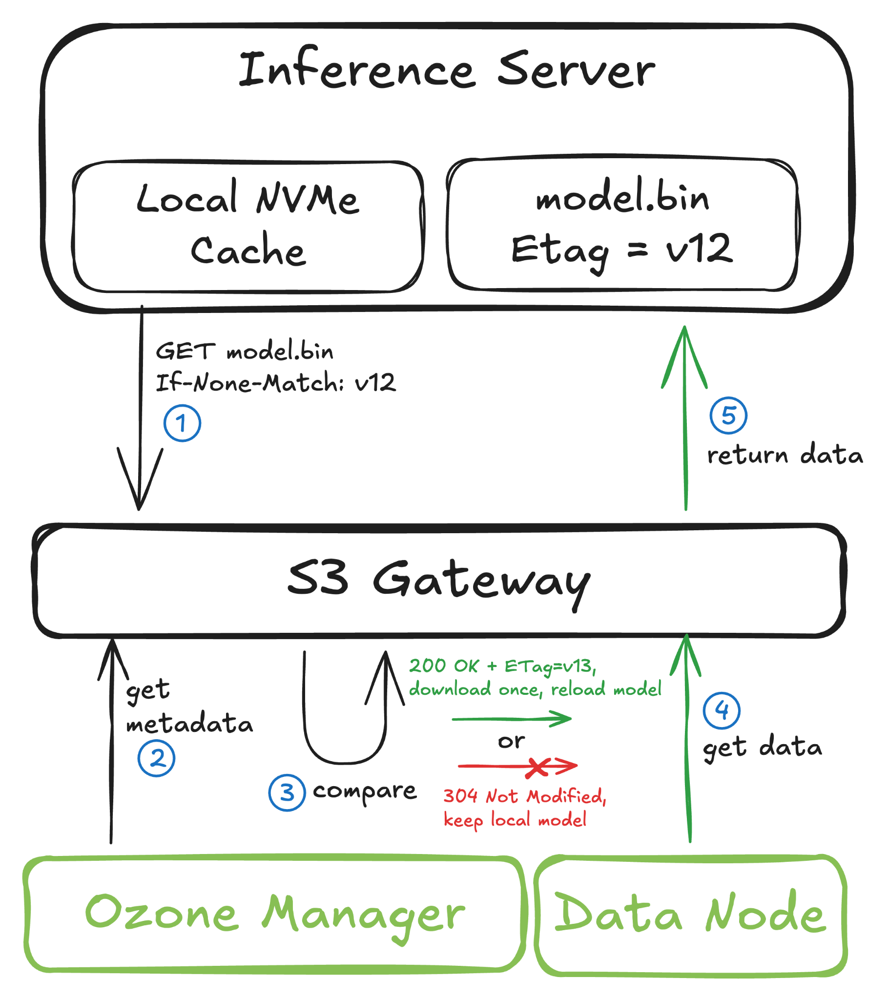
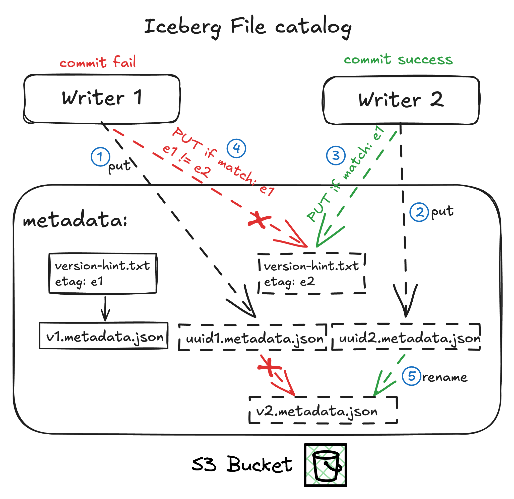
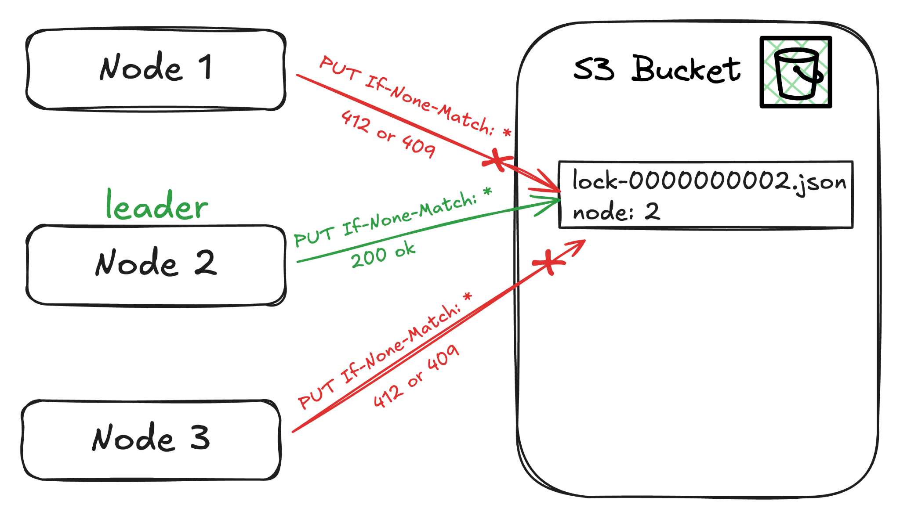
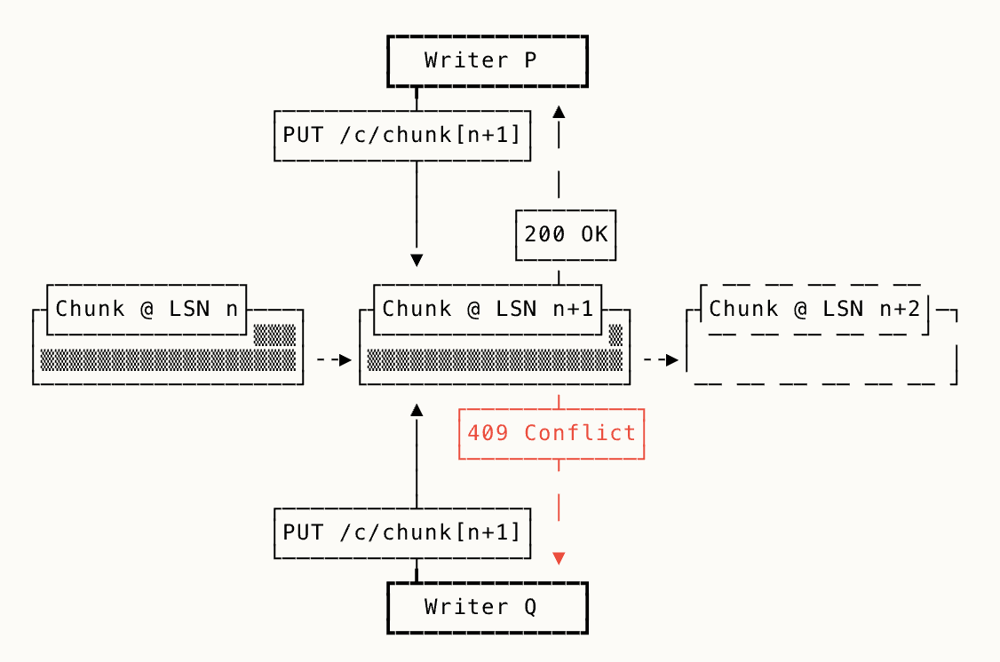
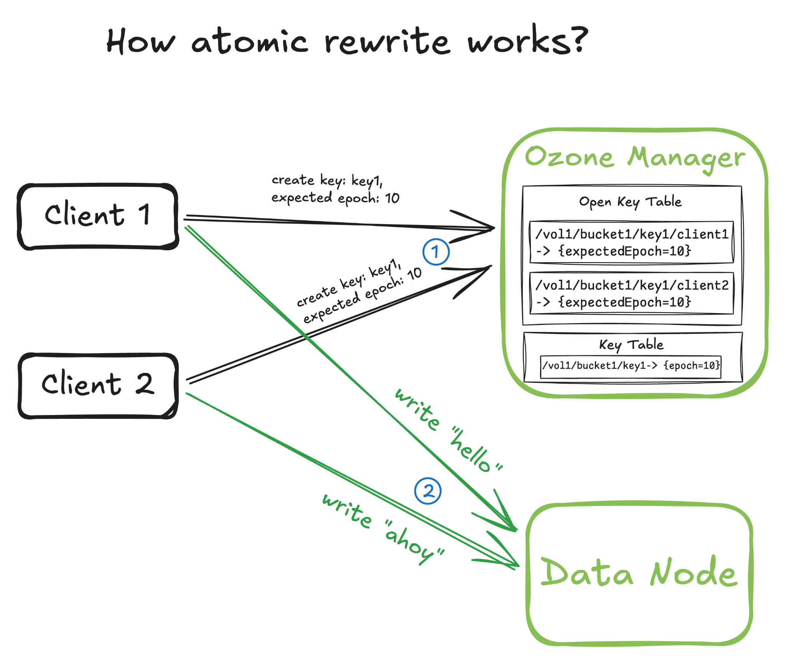
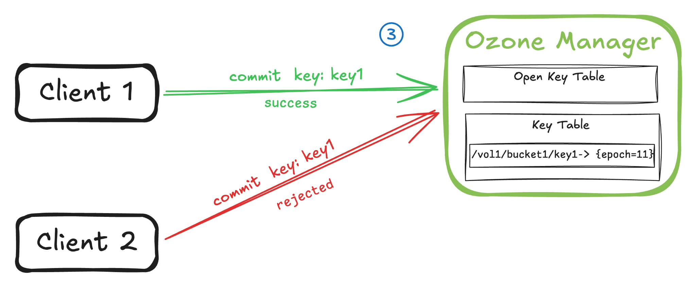
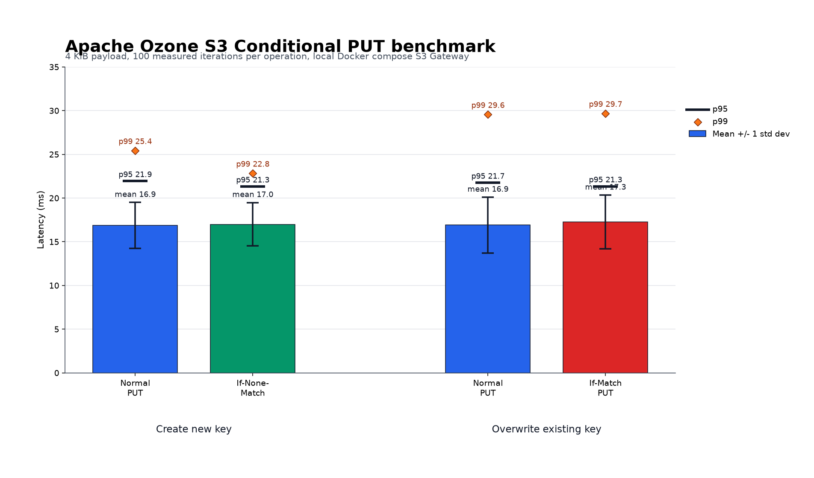

越來越多資料庫系統開始把底層儲存搬到 S3，形成 shared-everything 架構，目的通常是降低成本、減少依賴，並簡化整體架構。在 Hadoop 🐘 時代，我們常用 ZooKeeper 與 HDFS 分別扮演控制平面與資料平面。現在的系統則逐漸把控制平面移到自管的共識群組或 RDBMS-backed catalog，把資料平面移到 AWS S3 或 S3-compatible storage。

Shared-everything 系統通常有兩個痛點：通訊成本與協調。為了降低寫入延遲，系統常使用 inline data write、background flush 與 LSN-based union read。為了降低讀取延遲，它們會加上多層快取，例如自管或作業系統管理的記憶體快取與磁碟快取。但協調更困難：多個 client 可能讀到同一份中繼資料，在本地做出決策，接著嘗試更新同一個物件。若儲存層沒有 compare-and-set primitive，應用程式通常需要額外的 lock service、catalog database 或 consensus system 來避免 lost update。

Apache Ozone 本身有 S3、HCFS、HttpFS 與 Java API，這是它 multi-protocol story 的一部分。因此支援條件式請求對 Ozone 的採用越來越重要。很高興這項工作已經接近完成。

## TL;DR

Apache Ozone 正在為 `PutObject`、`GetObject`、`HeadObject`、`CopyObject`、`DeleteObject` 與 `CompleteMultipartUpload` 等操作加入 S3 conditional request 支援。這讓應用程式可以只在物件狀態符合預期條件時才執行操作，例如「只有物件不存在時才建立」或「只有目前 ETag 仍然相同時才覆寫」。

在底層，Ozone 重用了 atomic rewrite 路徑。對 conditional write 而言，S3 Gateway 會把呼叫端預期的 ETag 傳給 Ozone Manager (OM)。OM 會在接近 metadata write path 的地方驗證它，把匹配到的 generation 存進 open key，並在 commit 時再次驗證。這讓 ETag 檢查靠近真正改變物件狀態的位置，因此 Ozone 可以提供分散式 CAS-style primitive，而且在成功路徑上不需要額外的 gateway-side metadata read。

這讓建立在物件儲存之上的資料系統可以更安全地使用 optimistic concurrency control，包含 metadata catalog、WAL-like workflow、leader election、queue、model-serving cache，以及 object-store-backed database。

## 什麼是 S3 條件式請求？

> [!note]
> You can use conditional requests to add preconditions to your S3 operations. To use conditional requests, you add an additional header to your Amazon S3 API operation. This header specifies a condition that, if not met, will result in the S3 operation failing.
>
> Source: [Amazon S3 conditional requests](https://docs.aws.amazon.com/AmazonS3/latest/userguide/conditional-requests.html)

條件式請求允許 client 對目標物件做 atomic CAS：client 可以透過 S3 object 做協調，而不是向外部仲裁者詢問。使用 S3 conditional request 就像是把一部分協調邏輯移到 storage 端。

AWS 也提到，conditional request [讓客戶可以移除 workaround code 並簡化系統](https://www.allthingsdistributed.com/2025/03/in-s3-simplicity-is-table-stakes.html#:~:text=When%20we%20moved%20S3%20to,similar%20reaction)。同樣的 storage-level feature 也[支撐了 S3 Tables](https://www.allthingsdistributed.com/2025/03/in-s3-simplicity-is-table-stakes.html#:~:text=they%20involve%20a%20complex,storage%2Dlevel%20features)，用來管理 S3 上的表格資料。

常見的條件式請求模式包含：

- **Conditional `PUT`**
  - 使用 `If-None-Match: *`，只有物件不存在時才建立。
  - 使用 `If-Match: <etag>`，只有目前 ETag 仍然是 client 先前觀察到的值時才覆寫。
  - 使用場景：metadata commit、manifest update、distributed lock file，以及 create-only log chunk。
- **Conditional `GET`**
  - 使用 `If-None-Match: <etag>` 或 date-based condition，只有物件變更時才下載。
  - 使用場景：cache validation、dynamic model reload、config refresh，以及避免重複下載大型物件。
- **Conditional `HEAD`**
  - 概念與 conditional `GET` 相同，但只取 metadata。
  - 使用場景：不下載 body 的情況下確認物件是否仍然是最新版本。
- **Conditional `POST` / `CompleteMultipartUpload`**
  - Multipart upload 會把資料分成多個 part 寫入，但目標物件只有在 `CompleteMultipartUpload` 成功後才可見。
  - Conditional completion 讓 client 可以表達：「只有目的物件仍不存在時才完成這個大型物件」或「只有目的物件仍符合這個 ETag 時才完成」。
  - 使用場景：大型物件寫入，其中最後 commit 仍需要 create-only 或 compare-and-swap semantics。
- **Conditional `COPY`**
  - Source-side condition 確保來源物件是 client 預期的版本。
  - Destination-side condition 確保 copy 不會覆寫意外的資料。
  - 使用場景：snapshot promotion、clone/copy workflow，以及 source 與 destination 都需要驗證的 metadata copy。
- **Conditional `DELETE`**
  - 使用 `If-Match: <etag>`，只有物件仍未變更時才刪除。
  - 使用 `If-Match: *`，只有物件存在時才刪除。
  - 使用場景：避免 client 刪除已經被其他 writer 替換掉的物件。

接下來看一些更進階的使用方式，以及現代系統如何使用這些 API。

## 應用場景

到底誰會用到這個功能？

### 動態 AI 模型重新載入

進階 inference server 通常會把巨大的 model weight 快取在本機 NVMe 上。為了保持模型更新，又不想每隔幾分鐘就重新下載一次，它們可以使用 S3 conditional request。例如 inference server 可以帶著目前已持有模型的 ETag 發送 `If-None-Match` 的 `GET` request。

如果 ETag 仍然相同，Ozone 可以回傳 `304 Not Modified`，server 就繼續使用本機快取並跳過下載。如果 ETag 不同，代表模型已更新，server 會下載最新模型，並保存新的 ETag 供下一次檢查使用。感謝 [@amaliujia](https://github.com/amaliujia) 提供這個例子。

*Figure 1. Inference server 使用 `If-None-Match` 避免重複下載未變更的 model weight。*

### Turbopuffer

Turbopuffer 的 object-storage queue 是一個很好的例子：它用小型 metadata object 來協調更大的資料工作。簡化版本中，pusher 會讀取 `queue.json`、附加 job，然後用 CAS 寫回去。worker 也用相同方式 claim 下一個 job。只有當 `queue.json` 自 client 讀取之後沒有改變，CAS write 才會成功；否則 client 需要讀取新的 queue 並重試。

這個設計很簡單，但很多 client 可能會競爭同一個 queue object。Turbopuffer 的改進方式是用 group commit 批次化更新，並把 object-storage interaction 放到 stateless broker 後面。Client 與 broker 溝通，broker 執行一個 group-commit loop，並只在更新後的 queue 被 durable commit 後才 ack work。

*Figure 2. Turbopuffer 的 object-storage queue 透過 broker 批次化具競爭性的 CAS update。來源：[Turbopuffer object storage queue](https://turbopuffer.com/blog/object-storage-queue)。*

### SlateDB

SlateDB 是一個為 object storage 建構的 embedded LSM-tree storage engine。它把 durable state 存成 object-store files：WAL SST、compacted SST，以及 manifest files。和其他 LSM engine 一樣，它大多依賴 immutable file 做資料搬移，但仍然需要安全的協調點來決定哪個 writer 擁有下一段 log。

Conditional object creation 在這裡很有用，因為 SlateDB 可以把 object name 當成 fencing point。Writer 不覆寫共享檔案，而是用 `If-None-Match: *` 建立下一個 manifest 或 WAL object。只有當該 object 尚不存在時，寫入才會成功。

*Figure 3. SlateDB writer 使用 conditional object creation 作為 object-store state 的 fencing point。*

### Iceberg file catalog

Iceberg 也很適合這種協調模式。Iceberg table state 維護在 metadata files 中，每次 commit 都會建立新的 metadata file。Commit 的成功條件是把 table metadata pointer 從舊 metadata file 原子地切換到新的 metadata file。如果另一個 writer 先 commit，這個切換會失敗，writer 會基於新的 table state 重試。

對 object storage 上的 Iceberg-style file catalog 而言，conditional request 可以提供缺少的 compare-and-swap primitive。Catalog 可以儲存一個小型 pointer object，例如 `current.json`，指向最新的 table metadata file。Writer 先用唯一名稱寫入新的 metadata file，接著只有在 current metadata pointer 的 ETag 仍然等於先前讀到的 ETag 時，才更新這個 pointer。

*Figure 4. Iceberg-style file catalog 只有在小型 metadata pointer 的 ETag 仍然匹配時才更新它。*

### Leader election

Leader election 也可以建立在 conditional write 之上。基本想法是讓所有 node 競爭建立下一個 lock file，例如 `lock-0000000002.json`，並使用 `If-None-Match: *`。只有一個 node 能成功建立檔案；該 node 成為這個 epoch 的 leader，其他 node 會收到 precondition failure 並持續觀察。

*Figure 5. 多個 node 競爭建立下一個 epoch lock file；只有一個 writer 會成功。*

但 leader election 本身還不夠。暫停過的舊 leader 可能恢復後仍以為自己持有 lock，這就是 “zombie leader” 問題。解法是把 leader epoch 當成 fencing token。Leader 發出的每個 request 都包含 epoch，下游系統會拒絕比目前已見過最高 epoch 還舊的 request。

*Figure 6. Epoch fencing 可以避免暫停過的舊 leader 在新 leader 接手後繼續寫入。*

Leader 應該定期更新自己取得的 lock file 來表示 liveness。其他 node 可以輪詢 lock，並透過 S3 標準 object metadata 中的 `Last-Modified` 檢查 lock 是否已釋放或過期。

### 使用 OSWALD 做 WAL write/get

OSWALD（Object Storage Write-Ahead Log Device）展示了如何直接在 object storage primitive 上建立 WAL。它的設計有三種 object：manifest object、snapshot 與 log chunk。Manifest 追蹤最新 checkpoint 與 garbage collection progress；chunk 則保存 log content。

Append WAL 可以透過 conditional object creation 完成。Writer 用 `PUT If-None-Match` 建立下一個 chunk。如果另一個 writer 已經為同一個 LSN 建立了該 chunk，寫入會失敗，writer 會透過 tail log 追上進度。建立 chunk 之後，writer 也會用 `GET If-None-Match` 檢查 manifest，確認 garbage collection 尚未移動到自己的 LSN 之後，才 ack 這次寫入。

*Figure 7. OSWALD 使用 manifest、snapshot 與 chunk object 在 object storage 上建立 WAL。來源：[OSWALD](https://github.com/nvartolomei/oswald)。*

接下來看 Ozone 如何讓 S3 conditional request，也就是這個 CAS primitive，保持快速。

## 技術細節

為了把效能開銷降到最低，感謝 [Ivan](https://github.com/ivandika3) 的建議，我們選擇把 “conditional flag” coalesce 到正常的 client-to-server RPC message 中，因此不會引入額外的 RPC round trip。這個特性非常符合 conditional request 的 optimistic path。

在深入 coalescing optimization 之前，先快速看 Ozone 的 atomic rewrite work；這是 S3 conditional request 重用的基礎。

### Atomic rewrite

*Figure 8. Atomic rewrite 的 create 與 write 階段。*

Client 會在 key creation request 中指出目標物件的 expected epoch。Ozone Manager 收到 `createKey` request 後，會先把 expected epoch 與 key table 中的 live key 比對。如果匹配，OM 會把 expected epoch 與 open key record 一起存進 open key table。

在這個階段，兩個 client 可能都成功建立 open key，因此它們都可以開始把檔案資料串流到 datanode pipeline。當 client 認為檔案資料寫入完成後，就會開始 commit key。

> [!note]
> `/vol1/bucket1/key1/{client_id}` 中的 client id 是由 Ozone Manager 產生的。它是一個唯一、非人類可讀的 id，只綁定單次 key creation lifecycle；它不是持久性的 client id。稱為 “session id” 可能更適合，但圖中使用有意義的 id 是為了讓流程更清楚。

到了 commit phase，Ozone Manager 會在同一個 transaction 中比較 client 對應 open key record 裡的 expected epoch，以及 key table 中 live key 的 epoch。如果匹配，OM 會用 open key 覆寫 live key；如果不匹配，OM 會清理 open key table，並回傳 atomic rewrite failure 與 concurrent conflict。

*Figure 9. Atomic rewrite 的 commit 階段。*

### Coalescing conditional flag

在一般工作負載，尤其是在 optimistic concurrency control 下，我們假設 happy path 會更常發生。因此，我們在 key-creation request 的同時驗證 ETag metadata。也就是說，我們不引入額外 request 去取得最新 key epoch，再把該 epoch 接到 atomic rewrite path；相反地，我們擴充 atomic rewrite，使它可以識別 S3 Gateway 傳來的 expected ETag、驗證它、把它轉換成 expected epoch，並把該 epoch 存入 open key table。這樣 atomic rewrite 的 commit path 就能保持不變。

> 更多資訊可以參考 [apache/ozone#9334](https://github.com/apache/ozone/pull/9334#discussion_r2558578333) 的討論。

*Figure 10. 把 conditional flag coalesce 到正常的 Ozone write path 中。*

### 各 API 的實作

相關討論、設計與 patch 都可以在 Apache Jira 與 GitHub 找到：

- Epic ticket: [HDDS-13117](https://issues.apache.org/jira/browse/HDDS-13117)
- Design: [`s3-conditional-requests.md`](https://github.com/apache/ozone/blob/master/hadoop-hdds/docs/content/design/s3-conditional-requests.md)

#### PutObject

Ozone Manager 會用兩階段驗證流程執行 conditional write，並根據狀態不匹配發生的時間點回傳不同 HTTP error code。

在初始 `createKey` request 期間，如果 OM 判斷 caller 提供的 expected ETag 已經與 key 的目前狀態不匹配，就會立即拒絕該 request，並回傳 `412 Precondition Failed`。

如果初始檢查通過，但 upload 期間發生 concurrent modification，OM 會在 `commitKey` phase 偵測到差異。透過比較 open session 中保存的 expected epoch 與 key table 中的 live key record，OM 可以辨識 concurrent update，並回傳 `409 Conflict`。

相關 patch：

- [apache/ozone#10182](https://github.com/apache/ozone/pull/10182)
  - [apache/ozone#10023](https://github.com/apache/ozone/pull/10023)
    - [apache/ozone#9815](https://github.com/apache/ozone/pull/9815)

##### `If-None-Match`

我們擴充既有 atomic rewrite path，使它支援 “generation must match `0`”，這與 GCS semantics 一致。`If-None-Match: *` 接著就可以重用這條 create-if-absent path。


sequenceDiagram
    actor User
    participant GW as S3 Gateway
    participant OM as Ozone Manager

    User->>GW: PUT object with If-None-Match = *
    GW->>OM: createKey(expectedDataGeneration = 0)
    OM->>OM: Reject if key already exists
    OM-->>GW: Open key or KEY_ALREADY_EXISTS
    opt Open key created
        GW->>OM: commitKey()
        OM->>OM: Recheck key absence during commit
        OM-->>GW: Success or generation mismatch
    end
    GW-->>User: 200 OK or 412 Precondition Failed


##### `If-Match`

S3 Gateway 會把 expected ETag 與 `createKey` request 一起帶給 OM。OM 會把它和 live key 比對，轉換成 atomic rewrite 能辨識的 expected epoch，接著重用既有的 commit path。


sequenceDiagram
    actor User
    participant GW as S3 Gateway
    participant OM as Ozone Manager

    User->>GW: PUT object with If-Match ETag
    Note over GW,OM: No pre-read for current ETag/updateID on optimistic path
    GW->>OM: createKey(expectedETag = ETag)
    OM->>OM: Validate expected ETag against live key
    alt ETag already unmatched
        OM-->>GW: ETAG_MISMATCH or KEY_NOT_FOUND
        GW-->>User: 412 Precondition Failed
    else ETag matches
        OM->>OM: Derive updateID and persist expected epoch
        OM-->>GW: Open key with resolved expected epoch
        GW->>OM: commitKey()
        OM->>OM: Compare open session epoch with live key record
        alt Epoch mismatch
            OM-->>GW: GENERATION_MISMATCH
            GW-->>User: 409 ConditionalRequestConflict
        else Epoch matches
            OM->>OM: Commit successful
            OM-->>GW: Success
            GW-->>User: 200 OK
        end
    end


#### GetObject / HeadObject

對 `GetObject` 與 `HeadObject` 而言，S3 Gateway 會從 OM 取得 key metadata，並用該 metadata 評估 conditional headers。

相關 patch：[apache/ozone#10031](https://github.com/apache/ozone/pull/10031)


sequenceDiagram
    actor User
    participant GW as S3 Gateway
    participant OM as Ozone Manager

    User->>GW: GET/HEAD with conditional headers
    GW->>OM: getS3KeyDetails() or headS3Object()
    OM-->>GW: ETag, modificationTime, and key info
    GW->>GW: Evaluate ETag/date precedence rules
    alt Not modified
        GW-->>User: 304 Not Modified
    else Precondition failed
        GW-->>User: 412 Precondition Failed
    else Preconditions pass
        opt GET or ranged GET
            GW->>OM: getKey() or open data stream
            OM-->>GW: Object data
        end
        GW-->>User: 200 OK or 206 Partial Content
    end


#### CopyObject

`CopyObject` 本質上是 `GetObject` 加上 `PutObject`，因為它必須同時對 source 與 destination 執行 conditional logic。在 source phase，gateway 會解析 source object metadata，並在 stream data 前根據該 snapshot 評估 precondition。在 destination phase，gateway 對 destination 執行 conditional write，並重用 `PutObject` 引入的 atomic write API。

相關 patch：[apache/ozone#10207](https://github.com/apache/ozone/pull/10207)。感謝 [@YutaLin](https://github.com/YutaLin)。


sequenceDiagram
    actor User
    participant GW as S3 Gateway
    participant OM as Ozone Manager

    User->>GW: COPY with source and destination conditions
    GW->>OM: Get source key details
    OM-->>GW: Source metadata and bound content stream
    GW->>GW: Evaluate x-amz-copy-source-if-* headers
    alt Source precondition failed
        GW-->>User: 412 Precondition Failed
    else Source passes
        GW->>OM: Create destination key with optional conditions
        OM->>OM: Validate destination state and open key
        OM-->>GW: Open key or 412-mapped error
        opt Destination open key created
            GW->>OM: Commit destination key using source snapshot
            OM->>OM: Revalidate generation for conditional writes
            OM-->>GW: Success or 412-mapped error
        end
        GW-->>User: 200 OK or 412 Precondition Failed
    end


#### CompleteMultipartUpload

`CompleteMultipartUpload` 會在 server side 比較 caller 的 expected ETag 或 create-if-absent condition 與目前 database record。

相關 patch：[apache/ozone#10164](https://github.com/apache/ozone/pull/10164)。感謝 [@YutaLin](https://github.com/YutaLin)。


sequenceDiagram
    actor User
    participant GW as S3 Gateway
    participant OM as Ozone Manager

    User->>GW: CompleteMultipartUpload with optional conditions
    GW->>GW: Parse conditional write headers
    GW->>OM: completeMultipartUpload(keyArgs + partsList)
    OM->>OM: Acquire bucket lock
    OM->>OM: Load current committed key and MPU state
    OM->>OM: Validate destination precondition
    alt Precondition failed
        OM-->>GW: KEY_ALREADY_EXISTS, KEY_NOT_FOUND, or ETAG_* error
        GW-->>User: 412 Precondition Failed
    else Preconditions pass
        OM->>OM: Validate MPU parts and build final key
        OM->>OM: Write key table entry and remove MPU state
        OM-->>GW: Success
        GW-->>User: 200 OK
    end


#### DeleteObject

`DeleteObject` 會在寫入 delete tombstone 前，在 server side 比較 caller 的 expected ETag 與目前 database record。

相關 patch：[apache/ozone#10511](https://github.com/apache/ozone/pull/10511)


sequenceDiagram
    actor User
    participant GW as S3 Gateway
    participant OM as Ozone Manager

    User->>GW: DELETE with optional If-Match
    alt No If-Match
        GW->>OM: deleteKey()
        OM->>OM: Apply existing delete semantics
        OM-->>GW: Success or KEY_NOT_FOUND
        GW-->>User: 204 No Content
    else If-Match present
        GW->>OM: deleteKey(expectedETag or *)
        OM->>OM: Validate current key under lock and write tombstone
        OM-->>GW: Success, KEY_NOT_FOUND, or ETAG_* error
        GW-->>User: 204 No Content or 412 Precondition Failed
    end


## Benchmark

Conditional write 的主要效能問題是：加入 precondition 之後，常見的成功路徑是否會比一般 write 慢。在 Ozone 中，expected ETag 或 create-if-absent flag 會隨正常的 S3 Gateway 到 OM request 一起傳送，並在 OM 的 metadata update path 中驗證。這個設計避免了每次 conditional write 前都需要額外 gateway-side metadata read。

為了 sanity-check 這個假設，我們在 Docker Compose Ozone cluster 上透過 S3 Gateway 跑了一個小型 local benchmark。Benchmark 使用 4 KiB object、15 次 warmup iteration，以及每種 operation 100 次 measured iteration。它比較了四種操作：

- normal `PUT` 建立新 key，
- `PUT If-None-Match: *` 建立新 key，
- normal `PUT` 覆寫既有 key，
- `PUT If-Match: <etag>` 覆寫既有 key。

*Figure 17. Normal `PUT`、`PUT If-None-Match`、normal overwrite 與 `PUT If-Match` 的 local benchmark latency。*

在這個設定中，conditional create 基本上與 normal create 相同：mean latency 只相差約 0.12 ms，而且 p95 略低。Conditional overwrite 也很接近 normal overwrite：mean latency 高約 0.35 ms，而 p95 仍略低，p99 幾乎相同。

## 結論

Object storage 已經悄悄跨過了一條界線。它不再只是系統停放 bytes 的地方，而是系統進行協調的地方。Metadata catalog、write-ahead log、leader election、job queue、model cache：這些場景都需要一個關於「誰最後寫入」的單一事實來源；而且它們越來越希望直接向 storage layer 問這個問題。

透過把 native S3 conditional requests 帶到 Apache Ozone，並且在 happy path 上不增加任何額外 RPC，我們把 Ozone 變成 optimistic concurrency control 的 first-class substrate。Application 可以直接針對它們已經存放的 object 做 compare-and-swap，也就不再需要那些只是為了避免 lost update 而額外維護的 external lock service、catalog database 和 consensus cluster。

結果是一個更簡單的架構：更少 moving parts、少一個需要維運的元件，而且 coordination 就存在於資料所在的地方。

## References

- [Amazon S3 conditional requests](https://docs.aws.amazon.com/AmazonS3/latest/userguide/conditional-requests.html)
- [In S3, simplicity is table stakes](https://www.allthingsdistributed.com/2025/03/in-s3-simplicity-is-table-stakes.html)
- [Protocols for transactional usage](https://www.bitsxpages.com/p/protocols-for-transactional-usage)
- [Leader election with S3 conditional writes](https://www.morling.dev/blog/leader-election-with-s3-conditional-writes/)
- [OSWALD writer-writer conflicts](https://nvartolomei.com/oswald/#writer-writer-conflicts)
- [OSWALD repository](https://github.com/nvartolomei/oswald/tree/main/p/Oswald)
- [An MVCC-like columnar table on S3 with constant-time deletes](https://www.shayon.dev/post/2025/277/an-mvcc-like-columnar-table-on-s3-with-constant-time-deletes/#the-delete-problem-with-immutable-formats)
- [Turbopuffer object storage queue](https://turbopuffer.com/blog/object-storage-queue)
- [SeaweedFS S3 conditional operations](https://github.com/seaweedfs/seaweedfs/wiki/S3-Conditional-Operations)
- [Hacker News discussion on S3 conditional writes](https://news.ycombinator.com/item?id=45493158)
- [Buffer HA pipelines without Kafka](https://www.opendata.dev/blog/buffer-ha-pipelines-without-kafka)
