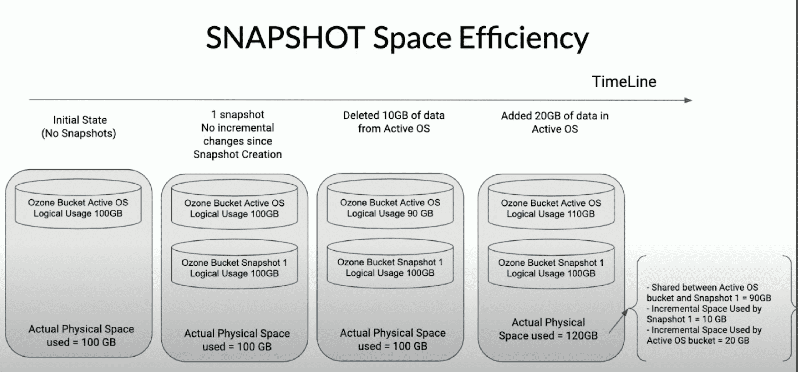


> [**OpenSource4You**](https://www.facebook.com/opensource4you) is an active community in Taiwan contributing to large-scale open source software

> Starting from the following time and location, [chungen](https://www.linkedin.com/in/chung-en-lee-ab7995225/) and I will take turns hosting the **Ozone Chinese Meeting**

> - **Time:** Every Monday 22:00-23:00 (Taiwan Time UTC+8) starting July 14th 2025
> - **Location (Virtual):** https://opensource4you.tw/ozone/meeting
> - **Calendar:** https://calendar.opensource4you.tw

> If you're interested in Ozone technical updates or contributing to Ozone itself
> Welcome to join the Ozone meeting!


## Introduction

This series is expected to have three parts detailing the principles and details of Ozone Snapshot:
- [Part 1](./) introduces Ozone Snapshot's Snapshot Deep Clean & Reclaimable Filter. It mainly explains how Ozone solves the problem of avoiding deletion of user-visible data in snapshots and how the deletion service efficiently removes invisible data from the entire cluster.
- Part 2 will introduce Snapshot Diff, the most important feature in Snapshot. It mainly explains how Snapshot Diff overcomes compaction churn and tracks SST changes to calculate changes between any two snapshots - `+` (add), `-` (delete), `M` (modify), `R` (rename).
- Part 3 will also be related to snapshot cleanup, but while Part 1 focuses on data cleanup on datanodes, this part will explore how to use SST Files Filtering on Ozone Manager to remove data (SST Files) unrelated to each Snapshot, and how Snapshot Deleting Service handles snapshot-aware reclaimable resource cases when deleting snapshots.

### Ozone Basic

[Apache Ozone](https://ozone.apache.org/) is an [open source](https://github.com/apache/ozone) distributed file system


Ozone manages file/object metadata through one of its components called Ozone Manager.
From the client's perspective, the process is:
1. Query Ozone Manager for `red-uncle.png`
2. The client receives a response indicating which blocks compose this file's content
3. The client asks Storage Container Manager about the locations of these blocks on Data Nodes
4. After knowing which Data Nodes to read from, the client requests file content according to the file sequence
5. Perfect

**Storage Container Manager** a.k.a. SCM, is the boss of all Data Nodes, responsible for commanding Data Nodes to work, including deleting data blocks.
As for **Data Node**, it stores a bunch of data blocks, which are the actual file contents. A group of consecutive data blocks forms a unit called Container, not the Linux Container... But that's not today's focus. If you want to learn about this part, feel free to leave a comment asking me to write an article about it haha

Haha, we've covered Ozone's entire architecture in just a few sentences. **Ozone Manager** manages file/key/directory metadata (name, size, data blocks location), **Data Node** stores the actual file data/content scattered across nodes, and **Storage Container Manager** is the boss of all Data Nodes

### Snapshot Brief

Ozone Snapshot is a powerful feature on Ozone Manager. As its name suggests, it captures the state of file metadata at a specific moment. You can query metadata within any Snapshot, and more powerfully, you can specify any two Snapshots and ask Ozone to tell you what changed between them, enabling features like Cross-Region Replication through Ozone Snapshot.

Ozone Snapshot implementation mainly relies on RocksDB's Checkpoint feature.
RocksDB Checkpoint is an efficient data snapshot mechanism provided by RocksDB. Its core principle is: quickly generating a "consistent snapshot" of the database's current state without copying data. This snapshot is essentially a new data directory where most files point to the original SST Files through hard links, making it **extremely fast to create and requiring no additional space**.

### The Challenge

Hey, implementing Ozone Snapshot doesn't sound that hard? But there's no free lunch - supporting Snapshot brings additional complexity and challenges to the system, and modern problems require modern solutions.

Since Snapshot allows users to directly read keys within a snapshot, suppose key1 in a snapshot is still readable, but deletion on [AOS](#aosafs) causes the data on Data Node to be deleted. This would make it unintuitive when users try to read key1 from that snapshot, only to find they can't read its data blocks' content, right?

This brings us to how Ozone handles deleted key/file/directory records on Ozone Manager:
When deleting key/file/directory, Ozone doesn't delete directly but first records them in `deletedTable` and `deletedDirectoryTable` RocksDB column families a.k.a Tables. Then background services - `KeyDeletingService` & `DirectoryDeletingService` - pick up items from those tables storing deleted key/file/dir and tell **Storage Container Manager** to delete the corresponding data blocks.

**This mechanism raises two problems to solve, which are the focus of this article**:
1. Items in `deletedTable/deletedDirectoryTable` within snapshots haven't been cleaned up!! DataNodes still store a bunch of data blocks invisible to clients... This corresponds to [DeletingService / Deep Clean](#deletingservice--deep-clean)
2. When DeletingService looks at data blocks to submit for batch deletion to SCM, it can't blindly submit everything. It needs to be **Snapshot-Aware**, filtering out data blocks owned by **keys/files visible in snapshots** to avoid deleting them, like filtering impurities. This corresponds to [Reclaimable Filter](#reclaimable-filter)


Note: Seeing the first point, you might think: aren't the items in `deletedTable/deletedDirectoryTable` still in the db? Can't we just let DeletingService clean them up?

That's not wrong, but considering the snapshot-aware problem, if DeletingService checks deletedTable/deletedDirectoryTable for keys/files/dirs, it would have to check all snapshots to see if they contain that key/file/dir. That's very inefficient.

So Ozone optimizes this by, at snapshot creation time, cleaning all deleted records from deletedTable/deletedDirectoryTable in the [AOS](#aosafs), leaving only those deleted records in the snapshot itself.\
Then, DeletingService only needs to check each snapshot's `deletedTable/deletedDirectoryTable` and compare with the **previous snapshot** to see if those items are present.

This way, DeletingService doesn't have to scan the entire snapshot each time it cleans up.\
It's like amortizing the process of checking whether a key can be reclaimed across all snapshots.


## Detailed Introduction to Snapshot Feature

The official website teaches you how to use Ozone Snapshot: [Ozone Snapshot](https://ozone.apache.org/docs/edge/feature/snapshot.html)

There are also several articles explaining what Ozone snapshot can do in detail, if you're interested:
- [Introducing Apache Ozone Snapshots](https://medium.com/@prashantpogde/introducing-apache-ozone-snapshots-af82e976142f): Introduces Ozone, the uses of Ozone Snapshot, and mentions Cloudera's own Replication Manager that can leverage Ozone Snapshot for multi-cluster data replication
- [Object Stores: The Case for Snapshots vs Object Versioning](https://medium.com/@prashantpogde/object-stores-the-case-for-snapshots-vs-object-versioning-d0b292742005): Compares Ozone Snapshot with traditional "Object Versioning". While object versioning can preserve multiple versions of each object for easy recovery or rollback, it brings management challenges like Namespace Explosion, GC for Versions, and Referential Integrity and Consistency, especially prone to state inconsistencies when applications have dependencies. Ozone's Snapshot feature creates application-consistent, read-only snapshots of entire object groups (like a bucket) at specific points in time, avoiding issues with excessive versions and maintenance difficulties while naturally ensuring data integrity and application consistency. This makes applications more reliable and simple when restoring historical states while significantly reducing management burden.
- [Exploring Apache Ozone Snapshots](https://medium.com/@prashantpogde/exploring-apache-ozone-snapshots-d7989e1e6281): Briefly introduces Ozone Snapshot features: (1) Supports user snapshot operations at the bucket level, allowing you to quickly freeze and preserve a bucket's state at any moment. (2) Snapshot operations complete instantly and can be accessed directly through dedicated filesystem paths. (3) Users can list all snapshots, **compare differences between snapshots (Snapshot Diff)**, and even restore data from snapshots. (4) Snapshots are read-only, can be deleted independently, and won't be affected by main storage data deletion.

    Space usage grows based on actual differences between snapshots, without duplicating unchanged parts.
- [Apache Ozone Snapshots: Addressing Different Use Cases](https://medium.com/@prashantpogde/apache-ozone-snapshots-addressing-different-use-cases-ba6b98f8b94d): Various Snapshot Use Cases including: **Data Protection** (Failed Transactions, Ransomware, Malware State), **Time Travel**, **Data Replication and Remote Replication**, **Archival and Compliance**, **Incremental Analytics** and **Generative AI** (hmm?)
- [Apache Ozone Using the Snapshot Feature](https://medium.com/@prashantpogde/apache-ozone-using-the-snapshot-feature-7ced5f15b81a): Teaches you how to CRUD Snapshots, Snapshot Rename, and Snapshot Diff in Ozone




## Metadata of Snapshot

### Snapshot Info

Ozone uses [`SnapshotInfo`](https://github.com/apache/ozone/blob/3bfb7affaf860ae0957fea2b2058ab50a85f571d/hadoop-ozone/common/src/main/java/org/apache/hadoop/ozone/om/helpers/SnapshotInfo.java) as metadata for each Snapshot:

The information it contains includes:
- `UUID snapshotId`: UUID of this snapshot
- `String name`: Snapshot name
- `String volumeName`: Volume the snapshot belongs to
- `String bucketName`: Bucket the snapshot belongs to
- `SnapshotStatus snapshotStatus`: Snapshot status (ACTIVE or DELETED)
- `long creationTime`: Creation time
- `long deletionTime`: Deletion time
- `UUID pathPreviousSnapshotId`: Previous snapshot under the same path (bucket prefix), related to [Snapshot Chain](#snapshot-chain)
- `UUID globalPreviousSnapshotId`: Global previous snapshot, also related to [Snapshot Chain](#snapshot-chain)
- `String checkpointDir`: RocksDB checkpoint directory
- `long dbTxSequenceNumber`: RocksDB sequence number
- `boolean deepClean`: Whether deep cleaning has been performed
- `boolean sstFiltered`: Whether SST files have been filtered
- `long referencedSize`: Data size of this snapshot (in bytes), referring to data blocks' size, not the RocksDB checkpoint's disk size on OM
- `long referencedReplicatedSize`: Same as above but considering actual storage space after replication or Erasure Coding. This space size is estimated, not calculated based on each key's actual data size & replication policy (too slow otherwise)
- `long exclusiveSize`: "Exclusive" data size of this snapshot (in bytes), meaning data that belongs only to this snapshot and no other snapshots. This "exclusive" concept will be mentioned in [Reclaimable Filter](#reclaimable-filter)
- `long exclusiveReplicatedSize`: Same as above but considering actual storage space after replication or Erasure Coding. For example, with three replicas `exclusiveSize=1000`, `exclusiveReplicatedSize=3000`.
- `boolean deepCleanedDeletedDir`: Whether deletedDirectoryTable within the snapshot has been deep cleaned

### Snapshot Chain

Ozone uses two types of snapshot chains to manage snapshots:

```java
public class SnapshotChainManager {
    // global snapshot chain: all snapshots connected in chronological order
    private Map<String, SnapshotChainInfo> globalSnapshotChain; // synchronizedMap
    
    // path snapshot chain: each volume/bucket maintains its own snapshot chain (connected in chronological order)
    private ConcurrentMap<String, LinkedHashMap<UUID, SnapshotChainInfo>>
      snapshotChainByPath;
}
```

[`SnapshotChainInfo`](https://github.com/apache/ozone/blob/3bfb7affaf860ae0957fea2b2058ab50a85f571d/hadoop-ozone/ozone-manager/src/main/java/org/apache/hadoop/ozone/om/SnapshotChainInfo.java) has `previousSnapshotId` and `nextSnapshotId` to maintain bidirectional links in the snapshot chain.


## Snapshot Creation Process

### Pre-creation Validation

1. Validate snapshot name legality
2. Check user permissions (only bucket owner and admin can create)
3. Check snapshot count limit
4. Generate snapshot ID (UUID)

### RocksDB Checkpoint Creation


This is the core step of snapshot creation, utilizing RocksDB's checkpoint feature:


1. Manually flush WAL and MemTable to disk
    Since Checkpoint is achieved by creating hard links to current SST Files, we need to force flush WAL and MemTable to disk to ensure SST Files contain the latest data.

```java
// Flush the DB WAL and mem table.
db.flushWal(true);
db.flush();

checkpoint.createCheckpoint(checkpointPath);
``` 


2. Clean up deleted data within snapshot scope
    When Ozone deletes key or file, it doesn't delete directly but records them in `deletedTable` and `deletedDirectoryTable`. During snapshot creation, since the contents of `deletedTable` and `deletedDirectoryTable` are already recorded in the snapshot, these two tables can be cleared. This makes subsequent DeletingService/ReclaimableFilter easier to handle GC/Deep Clean, as each snapshot's `deletedTable`/`deletedDirectoryTable` contents will never overlap.

```java
// Clean up active DB's deletedTable right after checkpoint is taken,
// There is no need to take any lock as of now, because transactions are flushed sequentially.
deleteKeysFromDelKeyTableInSnapshotScope(omMetadataManager,
    snapshotInfo.getVolumeName(), snapshotInfo.getBucketName(), batchOperation);
// Clean up deletedDirectoryTable as well
deleteKeysFromDelDirTableInSnapshotScope(omMetadataManager,
    snapshotInfo.getVolumeName(), snapshotInfo.getBucketName(), batchOperation);
```

### Lock Protection

Locks are needed to protect against data races: Read Lock on Bucket Lock to protect the bucket from deletion, and Write Lock on Snapshot Lock to protect the path snapshot chain.

```java
// Lock bucket so it doesn't
//  get deleted while creating snapshot
mergeOmLockDetails(
    omMetadataManager.getLock().acquireReadLock(BUCKET_LOCK,
        volumeName, bucketName));
acquiredBucketLock = getOmLockDetails().isLockAcquired();

mergeOmLockDetails(
    omMetadataManager.getLock().acquireWriteLock(SNAPSHOT_LOCK,
        volumeName, bucketName, snapshotName));
acquiredSnapshotLock = getOmLockDetails().isLockAcquired();
```

Also, snapshot creation must ensure atomicity to avoid partial success. 

Since snapshot creation involves multiple components (Snapshot Chain Manager, Snapshot Info Table), if errors occur during the process, all changes need to be rolled back.

#### OzoneManagerLock

We use a custom lock manager [OzoneManagerLock](https://github.com/apache/ozone/blob/9b713d0b6594785872090cd78798a0931779f630/hadoop-ozone/common/src/main/java/org/apache/hadoop/ozone/om/lock/OzoneManagerLock.java) for locking.

It consists of Striped Lock + Level Lock.

Striped Lock can manage locks for different keys individually, providing fine-grained locks to protect specific resources (like bucket prefix(`volume1/bucket1`), key prefix(`volume1/bucket1/key1`), etc.)

```java
Striped<ReadWriteLock> stripedLock;
```

#### Level Lock

While Stripe Lock can provide fine-grained locks based on various bucket prefix/key prefix, this only solves **concurrency issues between different resources**. There's another important issue to solve: **operation order within the same thread and Resource Level Constraints**.

For instance, for the prefix `/volume1/bucket1`, a thread might operate on multiple resource levels simultaneously:
- **Bucket level**: Modify bucket configuration, ACL, etc.
- **Key level**: Read/write keys within the bucket
- **Snapshot level**: Create or delete snapshots

Without level constraints, problems might arise:
```java
// Wrong operation order: operate on key first, then bucket
lock.acquireWriteLock(KEY_PATH_LOCK, "volume1", "bucket1", "key1");
// Attempting to modify bucket config at this point might cause data inconsistency
lock.acquireWriteLock(BUCKET_LOCK, "volume1", "bucket1");  // Should throw exception
```

So we need **Level Lock** to determine which resources can successfully acquire locks within the same thread based on resource priority. Ozone's defined resource priorities:

```java
// For S3 Bucket need to allow only for S3, that should be means only 1.
S3_BUCKET_LOCK((byte) 0, "S3_BUCKET_LOCK"), // = 1

// For volume need to allow both s3 bucket and volume. 01 + 10 = 11 (3)
VOLUME_LOCK((byte) 1, "VOLUME_LOCK"), // = 2

// For bucket we need to allow both s3 bucket, volume and bucket. Which
// is equal to 100 + 010 + 001 = 111 = 4 + 2 + 1 = 7
BUCKET_LOCK((byte) 2, "BUCKET_LOCK"), // = 4

// For user we need to allow s3 bucket, volume, bucket and user lock.
// Which is 8  4 + 2 + 1 = 15
USER_LOCK((byte) 3, "USER_LOCK"), // 15

S3_SECRET_LOCK((byte) 4, "S3_SECRET_LOCK"), // 31
KEY_PATH_LOCK((byte) 5, "KEY_PATH_LOCK"), //63
PREFIX_LOCK((byte) 6, "PREFIX_LOCK"), //127
SNAPSHOT_LOCK((byte) 7, "SNAPSHOT_LOCK"); // = 255
```

Level Lock is implemented using **bit mask**, each thread has its own independent lock state, and level constraints between different threads are mutually independent.

Through this design, we can ensure resource acquisition order is correct within the same thread, preventing deadlocks.

## DeletingService / Deep Clean

Ozone's Deep Clean mechanism mainly relies on two background services: `KeyDeletingService` and `DirectoryDeletingService`. These services periodically scan OM metadata to safely reclaim and physically delete keys and directories that are marked for deletion but not yet reclaimed, based on snapshot chain status.

### Deep Clean for Snapshots

Ozone's Deletion Service (including `KeyDeletingService` and `DirectoryDeletingService`) **performs deep clean for every snapshot**, not just the active DB (AOS). This is one of the core designs of Ozone's snapshot space reclamation mechanism.

For example, the `getTasks()` method of `DirectoryDeletingService` automatically creates a background task for each snapshot:

```java
@Override
public BackgroundTaskQueue getTasks() {
  BackgroundTaskQueue queue = new BackgroundTaskQueue();
  queue.add(new DirDeletingTask(null)); // For active object store (AOS)
  if (deepCleanSnapshots) {
    Iterator<UUID> iterator = snapshotChainManager.iterator(true);
    while (iterator.hasNext()) {
      UUID snapshotId = iterator.next();
      queue.add(new DirDeletingTask(snapshotId)); // For each snapshot
    }
  }
  return queue;
}
```

First, `DirDeletingTask(null)` is added to the queue for DeletingService to deep clean the active DB, then deep clean is performed for each snapshot (in snapshot chain order).

Similarly for `KeyDeletingService`.

The benefit of this design is: **Each snapshot can perform deep clean independently, ensuring safe and efficient space reclamation even with long snapshot chains and complex data references between snapshots**. Each snapshot's deep clean status (like `deepCleanedDeletedDir`, `deepCleanedDeletedKey`) is tracked individually, and only marked as deep clean complete when all deleted directories or keys in that snapshot have been safely reclaimed.

> This also means Ozone's Deletion Service is not a "global one-time" cleanup but "individual processing for each snapshot", which is a critical design for snapshot management in large-scale object storage systems.

### KeyDeletingService

It traverses snapshotRenamedTable and deletedTable, filters reclaimable keys using [reclaimable filter](#reclaimable-filter), then sends them to SCM for physical deletion.


1. Traverse snapshotRenamedTable and deletedTable, filter reclaimable keys using reclaimable filter:

```java
List<String> renamedTableEntries =
    keyManager.getRenamesKeyEntries(volume, bucket, null, renameEntryFilter, remainNum).stream()
        .map(Table.KeyValue::getKey)
        .collect(Collectors.toList());
remainNum -= renamedTableEntries.size();

// Get pending keys that can be deleted
PendingKeysDeletion pendingKeysDeletion = currentSnapshotInfo == null
    ? keyManager.getPendingDeletionKeys(reclaimableKeyFilter, remainNum)
    : keyManager.getPendingDeletionKeys(volume, bucket, null, reclaimableKeyFilter, remainNum);
```

Note the `remainNum` parameter here, used for pagination to avoid filtering too many keys at once.

2. Send to SCM for physical deletion (tell SCM which data blocks can be truly deleted, after deletion the entire file (metadata + data/content) truly disappears from the ozone cluster):
	1. Tell SCM which blocks can be deleted
	2. After SCM reports success, send purge keys request to OM, then keys are truly deleted from OM DB

```java
Pair<Integer, Boolean> processKeyDeletes(List<BlockGroup> keyBlocksList, Map<String, RepeatedOmKeyInfo> keysToModify, List<String> renameEntries, String snapTableKey, UUID expectedPreviousSnapshotId) throws IOException {
	...
	// Tell SCM which blocks can be deleted
	List<DeleteBlockGroupResult> blockDeletionResults = scmClient.deleteKeyBlocks(keyBlocksList);
	...
	// After SCM reports success, send purge keys request to OM, then keys truly disappear from OM DB
	purgeResult = submitPurgeKeysRequest(blockDeletionResults,
	     keysToModify, renameEntries, snapTableKey, expectedPreviousSnapshotId);
	...
	return purgeResult;
}
```

3. When all keys in a snapshot have been safely reclaimed, update that snapshot's deep clean marker:

```java
if (currentSnapshotInfo != null) {
  setSnapshotPropertyRequests.add(OzoneManagerProtocolProtos.SetSnapshotPropertyRequest.newBuilder()
      .setSnapshotKey(snapshotTableKey)
      .setDeepCleanedDeletedKey(true)
      .build());
}
submitSetSnapshotRequests(setSnapshotPropertyRequests);
```

This indicates that snapshot's keys have completed deep clean and space can be safely released later.

### DirectoryDeletingService

`DirectoryDeletingService` is responsible for reclaiming deleted directories (and all subdirectories and files within). It works similarly to `KeyDeletingService`, but with additional logic for recursively processing directory trees.

In Ozone Manager (OM)'s FSO (File System Optimized) mode,
files and directories are actually mapped as tree structures in RocksDB tables.
When a user deletes a directory, OM first writes the "deleted directory itself" to DeletedDirectoryTable,
while the subdirectories and files underneath are not immediately moved away — this leaves the orphan directory cleanup problem.

`DirectoryDeletingService` is the background service specifically designed to handle these orphan directories:

- **Recursive traversal and deletion**: Traverse down to the leaves (subdirectories, subfiles),
then delete the "empty directory" itself. (Here empty directory means a directory with no subdirectories or subfiles)
- **Snapshot compatible**: Ensures that **any nodes still referenced by snapshots** won't be cleaned up prematurely.
- **Batched and rate-limited**: Also uses `ratisByteLimit` for pagination.

Recursive expansion process:
1. List subdirectories → Put them back into DeletedDirectoryTable
    (Waiting for next round of processing, forming BFS-style expansion)
2. List subfiles → Put them into DeletedTable
3. If current directory has no child nodes →
Add the "parent directory itself" to the deletion list, to be deleted together later.

## Reclaimable Filter

### What is Reclaimable Filter?

As mentioned in the introduction:
> When DeletingService submits data blocks for batch deletion to SCM, it can't blindly submit everything. It needs to be **Snapshot-Aware**, filtering out data blocks owned by **keys/files visible in snapshots** to avoid deleting them, like filtering impurities

Reclaimable Filter is designed for this purpose - it filters which keys or directories can be reclaimed while DeletingService submits for batch deletion to SCM.

~~Actually there wasn't originally a Reclaimable Filter, but the code here was really ugly, so Reclaimable Filter was used to encapsulate the Snapshot-Aware logic of DeletingService~~


### ReclaimableFilter Abstract Class

[`ReclaimableFilter`](https://github.com/apache/ozone/blob/9b713d0b6594785872090cd78798a0931779f630/hadoop-ozone/ozone-manager/src/main/java/org/apache/hadoop/ozone/om/snapshot/filter/ReclaimableFilter.java) provides a general framework for filtering reclaimable resources by snapshot.

You can specify checking N snapshots before the current snapshot, and `ReclaimableFilter` will automatically lock these snapshots and ensure [snapshot chain](#snapshot-chain) consistency during each judgment. The specific reclamation judgment logic is implemented by various subclasses, while `ReclaimableFilter` itself only handles snapshot data preparation, locking, and resource management (explicitly close).

### Logic of Various Reclaimable Filter Subclasses

`ReclaimableFilter` has laid a good foundation for us. Now we just need to write the corresponding reclaimable logic for each type of resource.

#### ReclaimableKeyFilter
Used to filter reclaimable file keys, needs to check the previous two snapshots:

```java
public class ReclaimableKeyFilter extends ReclaimableFilter<OmKeyInfo> {
    public ReclaimableKeyFilter(/* ... */) {
        super(/* ... */, 2); // Need to check previous 2 snapshots
    }
}
```

- If this key cannot be found in the previous snapshot, it will be marked as "reclaimable".
- If found in the previous snapshot, it will further check the "snapshot before the previous one" to confirm whether this key only exists in the previous snapshot, and count its size in the previous snapshot's exclusive size statistics.


#### ReclaimableDirFilter
Used to filter reclaimable directories, only needs to check the previous snapshot:

(Directory is one of Ozone's Object Layouts - FileSystem Optimized. FSO layout has more efficient rename and delete performance. For details, see [Prefix based File System Optimization](https://ozone.apache.org/docs/edge/feature/prefixfso.html))

```java
public class ReclaimableDirFilter extends ReclaimableFilter<OmKeyInfo> {
    public ReclaimableDirFilter(/* ... */) {
        super(/* ... */, 1); // Only need to check previous 1 snapshot
    }
}
```

- If the previous snapshot doesn't exist (e.g., snapshot has been deleted), this directory can be reclaimed directly.
- If the previous snapshot exists, query this directory's info (`OmDirectoryInfo`) in the previous snapshot:
   - If the directory cannot be found, it means the directory no longer exists in the previous snapshot and can be reclaimed.
   - If found but with different `objectID`, it means the directory has been overwritten or changed in the previous snapshot and can also be reclaimed.
   - Only when the previous snapshot has a directory with the same `objectID` can it not be reclaimed.

#### ReclaimableRenameEntryFilter
Used to filter reclaimable snapshot rename entries

- What is rename entry?

    When you rename a key/dir, if the bucket is within snapshot scope, to enable subsequent Snapshot Diff, GC/Deep Clean operations to correctly track this object's history, a record is added to snapshotRenamedTable with the structure:

    - `Key`: `/volumeName/bucketName/objectID` (`objectID` represents the unique ID of the renamed key or dir)
    - `Value`: Key/dir path before rename

```java
public class ReclaimableRenameEntryFilter extends ReclaimableFilter<String> {
    public ReclaimableRenameEntryFilter(/* ... */) {
        super(/* ... */, 1); // Only need to check previous 1 snapshot
    }
}
```

- If this objectId cannot be found in the previous snapshot, it means no one references this rename entry and can be reclaimed.
- If found, it means a snapshot still references this objectId and cannot be reclaimed.

### Summary

Killua

Actually, various Reclaimable Filters mainly just look at the previous snapshot's data to determine if it's reclaimable.

Only [ReclaimableKeyFilter](#reclaimablekeyfilter) needs to look at one more snapshot to calculate the correct exclusive size.

Also, when you saw me mention above that as long as the key/dir/rename entry exists in the snapshot it cannot be reclaimed,
you might think this implementation seems time-consuming, like checking each snapshot one by one,
but if you think carefully using induction, you'll realize we only need to look at the previous snapshot's data to know which resources can be reclaimed and which cannot.


## Conclusion

Deep Clean is just a small part of Ozone Snapshot management. Actually, looking at the mechanisms mentioned in this article, they all seem like workarounds, giving the feeling that Ozone had to make compromises to implement snapshot features.

## Reference
- [Snapshots for an Object Store](https://www.youtube.com/watch?v=7_FrTClCUag)
- [Improving Snapshot Scale](https://docs.google.com/document/d/1Xw1AtKAlDm97UiLXd8egjeLIaYq4rpClv1xD7x5Xvww/edit?tab=t.0#heading=h.c9lecgual3zk)
- [Ozone Snapshot Deletion & Garbage Collection](https://issues.apache.org/jira/browse/HDDS-7730)
- [Design: Ozone Snapshot Deletion Garbage Collection based on key deletedTable](https://fossil-i.notion.site/Design-Ozone-Snapshot-Deletion-Garbage-Collection-based-on-key-deletedTable-2a624480dc7c4bc3ad608cbf86a25541)

## Appendix

### AOS/AFS

AOS stands for Active Object Store, AFS stands for Active File System. They actually refer to the normal RocksDB DB instance. This term exists mainly to distinguish from Snapshots.