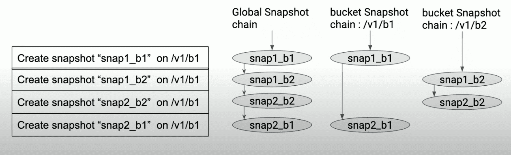
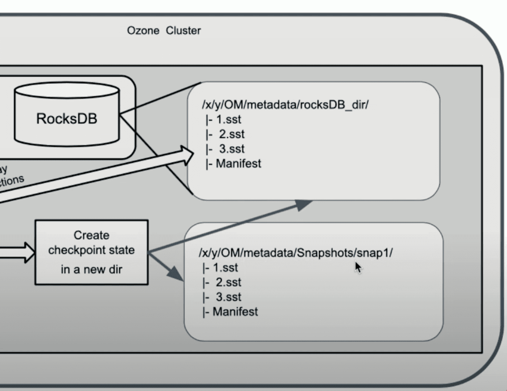


> [**源來是你**](https://www.facebook.com/opensource4you) 是在台灣積極貢獻大型開與軟體的社群

> 接下來我會在以下時間地點跟 [chungen](https://www.linkedin.com/in/chung-en-lee-ab7995225/) 輪流主持 **Ozone 中文會議**

> - **時間：** 2025 年 7 月 14 日起每週一晚上 22:00-23:00 (台灣時區 UTC+8)
> - **地點(Virtual):** https://opensource4you.tw/ozone/meeting
> - **行事曆:** https://calendar.opensource4you.tw

> 如果你也對 Ozone 的技術新知或對貢獻 Ozone 本身感興趣
> 歡迎來 Ozone 會議共襄盛舉！


## 前言

這個系列預計會有兩篇在詳細介紹 Ozone Snapshot 的原理與細節
- [第一篇](./)會先介紹 Ozone Snapshot 的基本結構以及 Snapshot Deep Clean & Reclaimable Filter。主要在講 Ozone 怎麼解決避免刪除掉 user 在 snapshot 中的可見資料以及 deletion service 是如何 efficient 的把不可見的資料從整個 cluster 中刪掉
- 第二篇會介紹 Snapshot Diff, 也是 Snapshot 裡面最重要的功能。主要在講 Snapshot Diff 是怎麼克服 compaction churn 並追蹤 SST 的變化, 計算出任意兩個 snapshot 間的變更 - `+` (add), `-` (delete), `M` (modify), `R` (rename)。
- 第三篇也會也是跟 snapshot 相關的清理相關, 不過第一篇主要是 focus datanode 上資料的清理, 這篇會探討在 Ozone Manager 上怎麼用 SST Files Filtering 來把與各 Snapshot 不相關的資料(SST Files)去蕪存清, 以及 Snapshot Deleting Service 在刪除 snapshot 時, 怎麼處理 snapshot aware reclaimable resource 的 cases

### Ozone Basic

[Apache Ozone](https://ozone.apache.org/) 是個 [open source](https://github.com/apache/ozone) 的 distributed file system

Ozone 是透過他的其中一個叫 Ozone Manager 管理檔案/object 的 metadata 的。
對於客戶端來說, 流程就是, 
1. 跟 Ozone Manager query `red-uncle.png.png`,
2. 客戶端就會收到回覆說這個檔案的內容是由哪些 blocks 組成
3. 客戶端會問 Storage Container Manager 說這些 blocks 在哪些 Data Nodes 身上
4. 然後客戶端知道要往哪些 Data Nodes 讀之後就根據檔案順序開始跟他們請求檔案內容
5. 完美

**Storage Container Manager** aka. SCM, 是所有 Data Nodes 的老大, 會負責叫 Data Nodes 們幹活, 包括刪除 data blocks。
至於 **Data Node** 上則是儲存著一堆 data blocks, 也就是真實的檔案內容, 並且一群連續的 data blocks 會再組成一個叫 Container 的單位, 不是那個 Linux Container..。 但那不是今天的重點, 總之想了解這塊的話也可以留言叫我寫一篇介紹那部分的文章ㄏㄏ

哈哈我們短短幾句就講完 Ozone 的全部架構了, **Ozone Manager** 管 file/key/directory 的 metadata(name, size, data blocks location), **Data Node** 上散佈著真實的檔案資料/內容, 然後 **Storage Container Manager** 是所有 Data Node 的老大

### Snapshot Brief

Ozone Snapshot 是個在 Ozone Manager 上很 powerful 的功能, 如其名, 就是把某個瞬間的 file metadata 的長相拍下來。並且可以讓你在任意 Snapshot 裡 query metadata, 更強的是你可以指定任意兩個 Snapshot, 叫 Ozone 回答你這兩個 snapshot 之間有哪些變更, 讓我們可以透過 Ozone Snapshot 實現 Cross-Region Replication 等功能

Ozone Snapshot 的實作主要依賴 RocksDB 的 Checkpoint 功能。
RocksDB Checkpoint 是 RocksDB 提供的一種高效資料 Snapshot 機制。它的核心原理是：在不複製資料的情況下，快速產生一份資料庫當前狀態的「一致性 Snapshot 」。這個 Snapshot 本質上是一個新的資料目錄，裡面大多數檔案都是透過 hard link 指向原本的 SST Files，因此**建立速度極快且不佔用額外空間**。

### The Challenge

誒聽起來 Ozone Snapshot 感覺不難實現啊？ 誒但是沒免費午餐, 要支援 Snapshot 也讓系統帶來額外的複雜度及問題, 現代問題也會需要一些現代手段來處理。

因為 Snapshot 允許使用者直接讀取 snapshot 裡的 key, 所以假設某個 snapshot 裡面的 key1 還可以被讀到, 但 [AOS](#aosafs) 上的刪除造成該 key1 在 Data Node 上的資料被刪除, 這樣會讓使用者在讀取該 snapshot 的 key1 時, 發現根本讀不到他的 data blocks 的資料, 很不直覺吧?

這時候就要談到 Ozone 是怎麼處理 Ozone Manager 上 deleted key/file/directory record 的:
Ozone 在刪除 key/file/directory 的時候不會直接刪除, 而是會先將其記錄在 `deletedTable` 和 `deletedDirectoryTable` 這兩個 RocksDB column family aka Table 中, 然後會由另外的 Background Service - `KeyDeletingService` & `DirectoryDeletingService` 去從那些儲存 deleted key/file/dir 的 table 中 pick up 一些出來然後去叫 **Storage Container Manager** 把對應的 data blocks 刪掉

**這種機制引出兩個問題要解決, 也是這篇文章的重點**：
1. Snapshot 裡面的 `deletedTable/deletedDirectoryTable` 裡的東西還沒被清乾淨!! DataNode 還存著一堆對於客戶端來說是看不見的 data blocks 佔著 datanode 上的空間... 這部分對應到 [DeletingService / Deep Clean](#deletingservice--deep-clean)
2. DeletingService 在看要提交給 SCM 要批次刪除的 data blocks 時, 不能盲目的亂給, 需要 **Snapshot-Aware**, 需要**過濾 snapshot 裡可見的 key/file** 他們所擁有的 data blocks, 避免他們被刪掉, 就像過濾雜質一樣。 這部分對應到 [Reclaimable Filter](#reclaimable-filter)


Note: 看到第一點你可能會想說: `deletedTable/deletedDirectoryTable` 裡的東西不是都還在 db 裡面嗎？ 那就讓 DeletingService 去清不就好了？

其實這樣想沒錯 但是考慮到 snapshot-aware 的問題, 如果 DeletingService 在清理 deletedTable/deletedDirectoryTable 的 key/file/dir 的時候, 需要把所有 snapshot 都翻出來看他們有沒有包含那個 key/file/dir。這樣很浪費時間

所以 Ozone 在這件事上做的優化就是 - 在建立 snapshot 的時候, 把在 [AOS](#aosafs) 上的 deletedTable/deletedDirectoryTable 的 deleted records 都清乾淨, 只讓那些在 deleted records 留在 snapshot 裡\
然後就變成, DeletingService 會去檢查每個 snapshot 的 `deletedTable/deletedDirectoryTable` 裡的東西, 然後去對照**前一個 snapshot** 裡有沒有包含那些東西

這樣 DeletingService 在清理的時候就不用再翻完整個 snapshot 了。\
就是一種把檢查 key 能不能被回收的這個過程均攤到所有 snapshot 上的感覺


## Snapshot Feature 的詳細介紹

官網有教你怎麼使用 Ozone Snapshot: [Ozone Snapshot](https://ozone.apache.org/docs/edge/feature/snapshot.html)

然後還有好幾篇詳細說明 ozone snapshot 可以做什麼的文章, 有興趣可以點進去看看：
- [Introducing Apache Ozone Snapshots](https://medium.com/@prashantpogde/introducing-apache-ozone-snapshots-af82e976142f)：介紹 Ozone, Ozone Snapshot 的用處, 還提到 Clodera 自己出的 Replication Manager 可以利用 Ozone Snapshot 來做多 cluster 的資料 replication
- [Object Stores: The Case for Snapshots vs Object Versioning](https://medium.com/@prashantpogde/object-stores-the-case-for-snapshots-vs-object-versioning-d0b292742005)：比較 Ozone Snapshot 與傳統"物件版本管理"(Object Versioning)的不同。物件版本管理雖然能保留每個物件的多個版本，方便恢復誤刪或回溯，但會帶來 Namespace Explosion、版本垃圾回收(GC for Versions)、參照一致性(Referential Integrity and Consistency
)等管理難題，尤其在 Application 彼此之間有依賴關係時容易出現狀態不一致。Ozone 的 Snapshot 功能則針對整個物件群組（如一個 bucket）在特定時間點做應用一致性、只讀的 Snapshot ，避免版本數量過多、維護困難的問題，同時天然保障資料完整性和應用一致性。這讓應用程式在需要還原歷史狀態時更可靠、簡單，並大幅降低管理負擔。
- [Exploring Apache Ozone Snapshots](https://medium.com/@prashantpogde/exploring-apache-ozone-snapshots-d7989e1e6281)：粗略介紹 Ozone Snapshot 有哪些功能：(1. 支援使用者在 bucket 層級進行 Snapshot 操作，讓你可以在任意時刻快速凍結、保存 bucket 當下的狀態。(2.  Snapshot 操作即時完成，並可透過專屬的檔案系統路徑直接存取 Snapshot 內容。(3. 使用者可列出所有 Snapshot 、**比對不同 Snapshot 間的差異(Snapshot Diff)**，甚至從 Snapshot 還原資料。(4. Snapshot 為唯讀、可獨立刪除，也不會因主存儲區資料被刪除而失效。

    空間用量則會根據 Snapshot 間實際差異而增長，並不會重複儲存沒有變動的部分。
- [Apache Ozone Snapshots: Addressing Different Use Cases](https://medium.com/@prashantpogde/apache-ozone-snapshots-addressing-different-use-cases-ba6b98f8b94d)：各種 Snapshot Use Case, 包括：**Data Protection**(Failed Transactions, Ransomware, Malware State), **Time Travel**, **Data Replication and Remote Replication**, **Archival and Compliance**, **Incremental Analytics** and **Generative AI**(嗯？)
- [Apache Ozone Using the Snapshot Feature](https://medium.com/@prashantpogde/apache-ozone-using-the-snapshot-feature-7ced5f15b81a)：教你怎麼在 Ozone 裡 CRUD Snapshot, Snapshot Rename 還有 Snapshot Diff


## Ozone Snapshot Basic

### Metadata of Snapshot

#### Snapshot Info

Ozone 用 [`SnapshotInfo`](https://github.com/apache/ozone/blob/3bfb7affaf860ae0957fea2b2058ab50a85f571d/hadoop-ozone/common/src/main/java/org/apache/hadoop/ozone/om/helpers/SnapshotInfo.java) 作為每個 Snapshot 的 metadata：

裡面含有的資訊有:
- `UUID snapshotId`：這個 snapshot 的 uuid
- `String name`：snapshot 名稱
- `String volumeName`：snapshot 所屬的 volume
- `String bucketName`：snapshot 所屬的 bucket
- `SnapshotStatus snapshotStatus`：snapshot 狀態（ACTIVE 或 DELETED）
- `long creationTime`：建立時間
- `long deletionTime`：刪除時間
- `UUID pathPreviousSnapshotId`：同路徑（bucket prefix）下的前一個 snapshot, 與 [Snapshot Chain](#snapshot-chain) 有關
- `UUID globalPreviousSnapshotId`：全域的前一個 snapshot, 也與 [Snapshot Chain](#snapshot-chain) 有關
- `String checkpointDir`：RocksDB checkpoint 目錄
- `long dbTxSequenceNumber`：RocksDB 序列號
- `boolean deepClean`：是否已執行深度清理
- `boolean sstFiltered`：是否已過濾 SST 檔案
- `long referencedSize`：這個 snapshot 的資料大小（以 bytes 為單位), 資料指的是 data blocks 的資料大小, 不是這個 rocksdb checkpoint 在 OM 的 Disk 上佔的大小
- `long referencedReplicatedSize`：同上，但考慮了 replication 或 Erasure Coding 後的實際儲存空間, 但這個空間大小是估計的, 並沒有實際根據每個 key 的 data size & replication policy 去計算, 不然太慢了
- `long exclusiveSize`：這個 snapshot「獨佔」的資料大小（以 bytes 為單位），也就是只屬於這個 snapshot、其他 snapshot 都沒有的資料量。這個"獨佔"的概念在 [Reclaimable Filter](#reclaimable-filter) 中會提到
- `long exclusiveReplicatedSize`： 同上，但考慮了 replication 或 Erasure Coding 後的實際儲存空間。例如，三副本下 `exclusiveSize=1000`，`exclusiveReplicatedSize=3000`。
- `boolean deepCleanedDeletedDir`：是否已經 deep clean 過 snapshot 裡的 deletedDirectoryTable

#### Snapshot Chain

Ozone 使用兩種 snapshot chain 來管理 snapshot：

```java
public class SnapshotChainManager {
    // global snapshot chain：所有 snapshot 按時間順序連接
    private Map<String, SnapshotChainInfo> globalSnapshotChain; // synchronizedMap
    
    // path snapshot chain：每個 volume/bucket 維護自己的 snapshot chain (按照時間順序連接)
    private ConcurrentMap<String, LinkedHashMap<UUID, SnapshotChainInfo>>
      snapshotChainByPath;
}
```

[`SnapshotChainInfo`](https://github.com/apache/ozone/blob/3bfb7affaf860ae0957fea2b2058ab50a85f571d/hadoop-ozone/ozone-manager/src/main/java/org/apache/hadoop/ozone/om/SnapshotChainInfo.java) 裡有 `previousSnapshotId` 和 `nextSnapshotId` 來維護 snapshot chain 的雙向連結。



### Snapshot 建立流程

#### 建立前的驗證

1. 驗證 Snapshot 名稱合法性
2. 檢查使用者權限（只有 bucket owner 和 admin 可以建立）
3. 檢查 Snapshot 數量限制
4. 產生 snapshot ID (UUID)

#### RocksDB Checkpoint 建立



這是 Snapshot 建立的核心步驟，利用 RocksDB 的 checkpoint 功能：


1. manually flush WAL 和 MemTable 到磁碟
    因為 Checkpoint 是透過對當前 SST Files 建立 hard link 來達成，所以需要先強制刷新 WAL 和 MemTable 到磁碟，確保 SST Files 是有包含最新的資料。

```java
// Flush the DB WAL and mem table.
db.flushWal(true);
db.flush();

checkpoint.createCheckpoint(checkpointPath);
``` 


2. 清理 Snapshot 範圍內的已刪除資料
    Ozone 在刪除 key or file 的時候不會直接刪除, 而是會先將其記錄在 `deletedTable` 和 `deletedDirectoryTable` 中, 在建立 Snapshot 時, 因為 `deletedTable` 和 `deletedDirectoryTable` 的內容都已經被紀錄到該 snapshot 中, 所以可以把這兩個 table 都清空, 這也讓後續的 DeletingService/ReclaimableFilter 可以更輕鬆的處理 GC/Deep Clean, 因為每個 snapshot 的 `deletedTable`/`deletedDirectoryTable` 的內容一定不會重複。

```java
// Clean up active DB's deletedTable right after checkpoint is taken,
// There is no need to take any lock as of now, because transactions are flushed sequentially.
deleteKeysFromDelKeyTableInSnapshotScope(omMetadataManager,
    snapshotInfo.getVolumeName(), snapshotInfo.getBucketName(), batchOperation);
// Clean up deletedDirectoryTable as well
deleteKeysFromDelDirTableInSnapshotScope(omMetadataManager,
    snapshotInfo.getVolumeName(), snapshotInfo.getBucketName(), batchOperation);
```

#### Lock Protection

需要鎖來保護 data race: 在 Bucket Lock 上 Read Lock 來保護 bucket 不被刪除, 以及 Snapshot Lock 上 Write Lock 來保護 snapshot chain 的 path snapshot chain。

```java
// Lock bucket so it doesn't
//  get deleted while creating snapshot
mergeOmLockDetails(
    omMetadataManager.getLock().acquireReadLock(BUCKET_LOCK,
        volumeName, bucketName));
acquiredBucketLock = getOmLockDetails().isLockAcquired();

mergeOmLockDetails(
    omMetadataManager.getLock().acquireWriteLock(SNAPSHOT_LOCK,
        volumeName, bucketName, snapshotName));
acquiredSnapshotLock = getOmLockDetails().isLockAcquired();
```

還有 Snapshot 的建立過程必須保證原子性，避免部分成功的情況, 

因為 Snapshot 建立時, 會涉及多個元件(Snapshot Chain Manager, Snapshot Info Table)所以如果過程中發生錯誤, 需要把變更的資料都還原。

##### OzoneManagerLock

我們是用一個自己寫的 lock manager [OzoneManagerLock](https://github.com/apache/ozone/blob/9b713d0b6594785872090cd78798a0931779f630/hadoop-ozone/common/src/main/java/org/apache/hadoop/ozone/om/lock/OzoneManagerLock.java) 來上鎖

它是由 Striped Lock + Level Lock 組成

Striped Lock 可以對 stripe lock 可以管理不同的 key 各自的鎖 提供小顆粒度的鎖, 是用來保護具體的資源(如 bucket prefix(`volume1/bucket1`)、key prefix(`volume1/bucket1/key1`) 等) 

```java
Striped<ReadWriteLock> stripedLock;
```

##### Level Lock

雖然 Stripe Lock 已經可以根據各種 bucket prefix/key prefix 來提供細粒度的鎖，但這只是解決了**不同資源之間的並發問題**。還有一個重要的問題需要解決：**同一 thread 內的操作順序和 Resource Level Constraint**。

比方說，對於 `/volume1/bucket1` 這個 prefix，一個線程可能會同時操作多種不同層級的資源：
- **Bucket 層級**：修改 bucket 的配置、ACL 等
- **Key 層級**：讀寫 bucket 內的 key
- **Snapshot 層級**：創建或刪除 snapshot

如果沒有 level constraint，可能會出現問題：
```java
// 錯誤的操作順序：先操作 key，再操作 bucket
lock.acquireWriteLock(KEY_PATH_LOCK, "volume1", "bucket1", "key1");
// 此時如果嘗試修改 bucket 配置，可能會導致數據不一致
lock.acquireWriteLock(BUCKET_LOCK, "volume1", "bucket1");  // 應該 throw exception
```

所以我們需要 **Level Lock** 來根據資源的優先級（priority）來決定同一線程內哪些資源可以成功獲取鎖。Ozone 定義的資源優先級：

```java
// For S3 Bucket need to allow only for S3, that should be means only 1.
S3_BUCKET_LOCK((byte) 0, "S3_BUCKET_LOCK"), // = 1

// For volume need to allow both s3 bucket and volume. 01 + 10 = 11 (3)
VOLUME_LOCK((byte) 1, "VOLUME_LOCK"), // = 2

// For bucket we need to allow both s3 bucket, volume and bucket. Which
// is equal to 100 + 010 + 001 = 111 = 4 + 2 + 1 = 7
BUCKET_LOCK((byte) 2, "BUCKET_LOCK"), // = 4

// For user we need to allow s3 bucket, volume, bucket and user lock.
// Which is 8  4 + 2 + 1 = 15
USER_LOCK((byte) 3, "USER_LOCK"), // 15

S3_SECRET_LOCK((byte) 4, "S3_SECRET_LOCK"), // 31
KEY_PATH_LOCK((byte) 5, "KEY_PATH_LOCK"), //63
PREFIX_LOCK((byte) 6, "PREFIX_LOCK"), //127
SNAPSHOT_LOCK((byte) 7, "SNAPSHOT_LOCK"); // = 255
```

Level Lock 使用 **bit mask** 實作，每個線程都有自己獨立的鎖狀態，不同線程之間的 level 的 constraint 是相互獨立的。

透過這種設計, 我們可以確保在同一個 thread 內, 資源的獲取順序是正確的, 不會出現死鎖的問題。

## DeletingService / Deep Clean

Ozone 的 Deep Clean 機制，主要依賴兩個背景服務：`KeyDeletingService` 與 `DirectoryDeletingService`。這兩個服務會定期掃描 OM metadata，將已標記刪除但尚未真正回收的 key 與目錄，根據 snapshot chain 的狀態進行安全的回收與物理刪除。

### Deep Clean for Snapshots

Ozone 的 Deletion Service（包含 `KeyDeletingService` 與 `DirectoryDeletingService`）**會針對每一個 snapshot 都做 deep clean**，而不是只針對 active DB（AOS）進行。這是 Ozone snapshot 空間回收機制的核心設計之一。

舉例來說，`DirectoryDeletingService` 的 `getTasks()` 方法會自動為每個 snapshot 建立一個 background task：

```java
@Override
public BackgroundTaskQueue getTasks() {
  BackgroundTaskQueue queue = new BackgroundTaskQueue();
  queue.add(new DirDeletingTask(null)); // 針對 active object store (AOS)
  if (deepCleanSnapshots) {
    Iterator<UUID> iterator = snapshotChainManager.iterator(true);
    while (iterator.hasNext()) {
      UUID snapshotId = iterator.next();
      queue.add(new DirDeletingTask(snapshotId)); // 針對每個 snapshot
    }
  }
  return queue;
}
```

一開始先把 `DirDeletingTask(null)` 放進 queue 是為了讓 DeletingService 對 active DB 進行 deep clean, 之後再針對每個 snapshot 也放進 queue 等待進行 deep clean(依照 snapshot chain 的順序)。

同理，`KeyDeletingService` 也是這樣

這種設計的好處是：**每個 snapshot 都能獨立進行 deep clean，確保即使 snapshot chain 很長、snapshot 之間的資料參照複雜，也能安全且高效地回收空間**。而且每個 snapshot 的 deep clean 狀態（如 `deepCleanedDeletedDir`、`deepCleanedDeletedKey`）都會被單獨追蹤，只有當該 snapshot 的所有 deleted directory 或 key 都被安全回收後，才會標記為 deep clean 完成。

> 這也意味著，Ozone 的 Deletion Service 並不是「全域一次性」的清理，而是「針對每個 snapshot 逐一進行」的細緻回收，這對於大規模物件儲存系統的 snapshot 管理來說，是非常關鍵的設計。

### KeyDeletingService

就是遍歷 snapshotRenamedTable 和 deletedTable, 然後用 [reclaimable filter](#reclaimable-filter) 過濾出可以回收的 key, 然後再發送給 SCM 進行物理刪除。


1. 遍歷 snapshotRenamedTable 和 deletedTable, 然後用 reclaimable filter 過濾出可以回收的 key：

```java
List<String> renamedTableEntries =
    keyManager.getRenamesKeyEntries(volume, bucket, null, renameEntryFilter, remainNum).stream()
        .map(Table.KeyValue::getKey)
        .collect(Collectors.toList());
remainNum -= renamedTableEntries.size();

// Get pending keys that can be deleted
PendingKeysDeletion pendingKeysDeletion = currentSnapshotInfo == null
    ? keyManager.getPendingDeletionKeys(reclaimableKeyFilter, remainNum)
    : keyManager.getPendingDeletionKeys(volume, bucket, null, reclaimableKeyFilter, remainNum);
```

可以注意到這裡有個 `remainNum` 的參數，這是為了避免一次過濾太多 key, 拿來做 pagination 的。

2. 發送給 SCM 進行物理刪除 (跟 SCM 說可以把哪些 data blocks 真的刪掉, 他刪完之後整個檔案(metadata + data/content 才是真正意義上的從 ozone cluster 裡消失))：
	1. 跟 SCM 說哪些 blocks 可以被刪除
	2. SCM 回報成功後, 再發送 purge keys request 給 OM, 然後 keys 才會真正從 OM DB 中刪除

```java
Pair<Integer, Boolean> processKeyDeletes(List<BlockGroup> keyBlocksList, Map<String, RepeatedOmKeyInfo> keysToModify, List<String> renameEntries, String snapTableKey, UUID expectedPreviousSnapshotId) throws IOException {
	...
	// 跟 SCM 說哪些 blocks 可以被刪除
	List<DeleteBlockGroupResult> blockDeletionResults = scmClient.deleteKeyBlocks(keyBlocksList);
	...
	// SCM 回報成功後, 再發送 purge keys request 給 OM, 然後 keys 才會真正從 OM DB 中消失
	purgeResult = submitPurgeKeysRequest(blockDeletionResults,
	     keysToModify, renameEntries, snapTableKey, expectedPreviousSnapshotId);
	...
	return purgeResult;
}
```

3. 當一個 snapshot 的所有 key 都被安全回收後, 更新該 snapshot 的 deep clean 標記：

```java
if (currentSnapshotInfo != null) {
  setSnapshotPropertyRequests.add(OzoneManagerProtocolProtos.SetSnapshotPropertyRequest.newBuilder()
      .setSnapshotKey(snapshotTableKey)
      .setDeepCleanedDeletedKey(true)
      .build());
}
submitSetSnapshotRequests(setSnapshotPropertyRequests);
```

這代表該 snapshot 的 key 已經完成 deep clean，後續可以安全地釋放空間。

### DirectoryDeletingService

`DirectoryDeletingService` 則負責回收已刪除的目錄（以及其下的所有子目錄與檔案）。它的運作方式與 `KeyDeletingService` 類似, 只是多了遞迴處理目錄樹的邏輯

在 Ozone Manager（OM）的 FSO （File System Optimized）模式下，
file 與 directory 其實都被映射成 RocksDB 表中的樹狀結構。
當使用者刪除一個目錄時，OM 先把「被刪目錄本身」寫入 DeletedDirectoryTable，
而目錄底下的子檔案、子目錄並不會立即搬走—— 這留下了 orphan directory 的清理問題。

`DirectoryDeletingService` 就是專門處理這批 orphan directory 的 background service：

- **遞迴遍歷並刪除**：一路往下收斂到樹葉（子目錄、子檔案），
然後再把「空目錄」本身刪掉。(這裡的空目錄指的是沒有任何子目錄或子檔案的目錄)
- **與 Snapshot 相容**：確保**任何仍被快照引用**的節點都不會被提早清走。
- **分批、限速**：然後也有 `ratisByteLimit` 來做 pagination.

遞迴展開流程:
1. 列出子目錄 → 重新放回 DeletedDirectoryTable
    （等待下一輪處理，形成 BFS 式展開）
2. 列出子檔案 → 放入 DeletedTable
3. 若目前目錄已無任何子節點 →
把「父目錄自身」也加進刪除的 list 裡，待會一起刪掉。

## Reclaimable Filter

### 什麼是 Reclaimable Filter？

如同前言裡提到：
> DeletingService 在看要提交給 SCM 要批次刪除的 data blocks 時, 不能盲目的亂給, 需要 **Snapshot-Aware**, 需要**過濾 snapshot 裡可見的 key/file** 他們所擁有的 data blocks, 避免他們被刪掉, 就像過濾雜質一樣

Reclaimable Filter 正是為了這個目的而設計的, 它會在 DeletingService 提交給 SCM 批次刪除的同時, 去過濾哪些 key 或 directory 可以被回收。

~~其實原本沒有 Reclaimable Filter 這個東西, 只是這邊的 code 實在太醜了, 所以才用 Reclaimable Filter 去把 DeletingService Snapshot-Aware 的邏輯們封裝起來~~


### ReclaimableFilter Abstract Class

[`ReclaimableFilter`](https://github.com/apache/ozone/blob/9b713d0b6594785872090cd78798a0931779f630/hadoop-ozone/ozone-manager/src/main/java/org/apache/hadoop/ozone/om/snapshot/filter/ReclaimableFilter.java) 提供了一個通用的 filter reclaimable resource by snapshot 框架。

你可以指定要檢查當前 snapshot 之前的 N 個 snapshot，`ReclaimableFilter` 會自動鎖定這些 snapshot，並在每次判斷時確保 [snapshot chain](#snapshot-chain) 的一致性。具體的回收判斷邏輯則由各種 Subclass 實作，而 `ReclaimableFilter` 本身只負責 snapshot 資料的準備、 lock 跟資源管理(explicitly close)。

### 各種 Reclaimable Filter 的 Subclass 的邏輯

`ReclaimableFilter` 已經幫我們打下很好的基礎了, 我們現在只需要針對每種資源去寫下對應的 reclaimable 邏輯即可。

#### ReclaimableKeyFilter
用於過濾可回收的檔案 key，需要檢查前兩個 snapshot：

```java
public class ReclaimableKeyFilter extends ReclaimableFilter<OmKeyInfo> {
    public ReclaimableKeyFilter(/* ... */) {
        super(/* ... */, 2); // 需要檢查前 2 個 snapshot
    }
}
```

- 如果這個 key 在前一個 snapshot 中找不到，就會被標記為「可回收」。
- 如果在前一個 snapshot 中找得到，則會進一步檢查「前前一個 snapshot」，以確認這個 key 是否只存在於前一個 snapshot，並將其大小計入前一個 snapshot 的 exclusive size 統計。


#### ReclaimableDirFilter
用於過濾可回收的目錄，只需要檢查前一個 snapshot：

(Directory 是 Ozone 的其中一種 Object Layout - FileSystem Optimized 的其中一員, FSO layout 具有更高效的 rename, delete 的效能, 詳細可以參考 [Prefix based File System Optimization](https://ozone.apache.org/docs/edge/feature/prefixfso.html))

```java
public class ReclaimableDirFilter extends ReclaimableFilter<OmKeyInfo> {
    public ReclaimableDirFilter(/* ... */) {
        super(/* ... */, 1); // 只需要檢查前 1 個 snapshot
    }
}
```

- 如果前一個 Snapshot 不存在（例如 Snapshot 已被刪除），那這個目錄就可以直接回收。
- 如果前一個 Snapshot 存在，會去查詢這個目錄在前一個 snapshot 中的資訊（`OmDirectoryInfo`）：
   - 如果查不到這個目錄, 代表這個目錄在前一個 snapshot 中已經不存在, 可以回收。
   - 如果查得到, 但 `objectID` 不同, 代表這個目錄在前一個 snapshot 中已經被覆蓋或變更, 也可以回收。
   - 只有當前一個 snapshot 中有相同 `objectID` 的目錄時, 才不能回收。

#### ReclaimableRenameEntryFilter
用來 filter reclaimable 的 snapshot rename entry

- What is rename entry?

    當你對一個 key/dir 執行 rename 時，如果該 bucket 處於 snapshot scope，為了後續的 Snapshot Diff, GC/Deep Clean 等操作能夠正確追蹤這個物件的歷史, 則會在 snapshotRenamedTable 裡新增一筆紀錄, 其結構是：

    - `Key`：`/volumeName/bucketName/objectID`（`objectID` 代表被 rename 的 key 或 dir 的 unique ID）
    - `Value`：rename 前的 key/dir 路徑

```java
public class ReclaimableRenameEntryFilter extends ReclaimableFilter<String> {
    public ReclaimableRenameEntryFilter(/* ... */) {
        super(/* ... */, 1); // 只需要檢查前 1 個 snapshot
    }
}
```

- 如果在前一個 Snapshot 中查不到這個 objectId，代表已經沒有人參照這個 rename entry，可以回收。
- 如果查得到，代表還有 Snapshot 參照這個 objectId，不能回收。

### 小結

奇犽

其實各種 Reclaimable Filter 主要都只是看前一個 snapshot 的資料, 來決定是否 reclaimable

只有 [ReclaimableKeyFilter](#reclaimablekeyfilter) 需要再多看一個 snapshot, 去把正確的 exclusive size 計算出來。

還有就是, 你可能在上面看到我說只要 snapshot 裡面有這個 key/dir/rename entry 就代表不能回收這件事的時候，
覺得這要實作感覺很費時, 感覺就要一個一個 snapshot 去檢查,
但實際上你仔細用應該是歸納法想想就會發現, 其實只要看前一個 snapshot 的資料, 就可以知道哪些資源可以回收, 哪些資源不能回收。


## 結語

Deep Clean 只是 Ozone Snapshot 管理中的一小部分, 其實看下來這篇文章裡提到的機制都蠻像 work around 的, 有一種 Ozone 為了要實現 snapshot 的特性, 而不得不做的 compromises 的感覺.

## Reference
- [Snapshots for an Object Store](https://www.youtube.com/watch?v=7_FrTClCUag)
- [Improving Snapshot Scale](https://docs.google.com/document/d/1Xw1AtKAlDm97UiLXd8egjeLIaYq4rpClv1xD7x5Xvww/edit?tab=t.0#heading=h.c9lecgual3zk)
- [Ozone Snapshot Deletion & Garbage Collection](https://issues.apache.org/jira/browse/HDDS-7730)
- [Design: Ozone Snapshot Deletion Garbage Collection based on key deletedTable](https://fossil-i.notion.site/Design-Ozone-Snapshot-Deletion-Garbage-Collection-based-on-key-deletedTable-2a624480dc7c4bc3ad608cbf86a25541)

## Appendix

### AOS/AFS

AOS 是 Active Object Store 的縮寫, AFS 是 Active File System 的縮寫, 其實就是指正常 RocksDB 的 DB instance, 會有這個名詞主要是和 Snapshot 做出區分。
